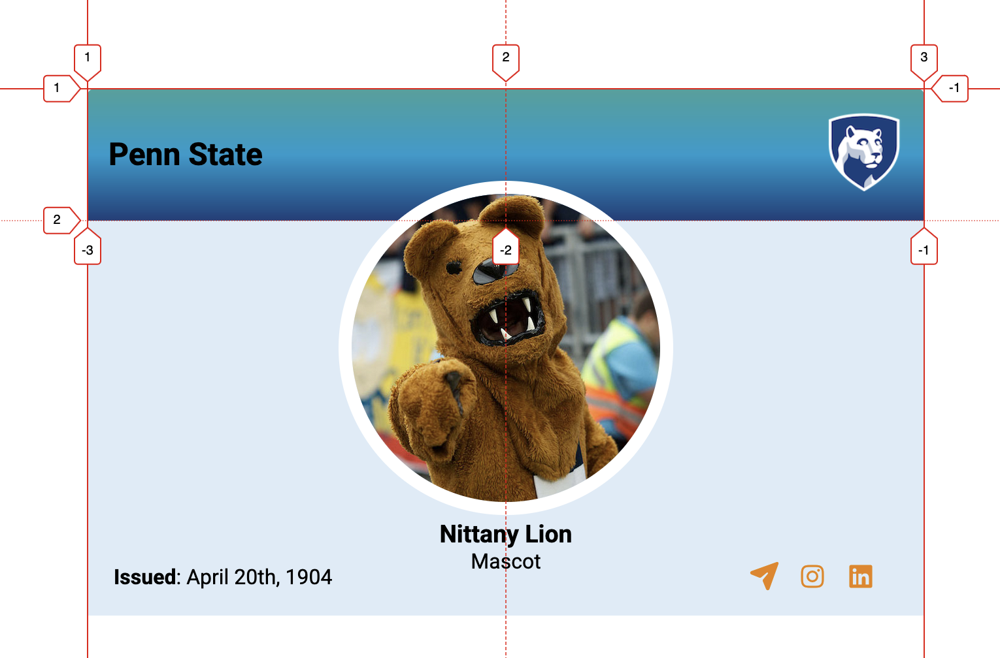

<section>
## Description

For this assignment, you will create a Penn State profile card. A key goal here is to make sure that the profile works for different screen widths. Please use the starter file in Canvas (Files → Assignments → [Assignment-02](https://psu.instructure.com/courses/2416260/files/folder/Assignments/Assignment-02)). You will **only** update the CSS rules for the assignment (i.e., no need to change `index.html`)

The completed assignments should look something similar to:

::::{.columns}
:::{.column width="100%"}
{ style="max-inline-size: 100%; block-size: auto; object-fit: cover;" }
:::
::::
</section>

<section>
## Deliverables
Please upload the following files (as a zip file):

* **Two screenshots** of the profile on:
	* a non-mobile device (from a laptop/desktop)
	* an iPad (with 810 x 1080 display). You can use responsive design mode to simulate mobile devices in [Chrome](https://developer.chrome.com/docs/devtools/device-mode/) and [Firefox](https://firefox-source-docs.mozilla.org/devtools-user/responsive_design_mode/index.html) as shown in the class. We want to compare the layout consistency across different screen sizes.

* Your **code folder**. For grading, we will open the `index.html` in a browser. The uploaded folder must be self-contained — please make sure that there is no error when loading `index.html` in a browser

</section>

<section>
## Requirements & Rubrics

* The profile looks consistent in both mobile and non-mobile devices (**3 pts**)

* The header and the footer each occupy approximately 25% of the profile. (**2 pts**)

* In the header, the title "Penn State" and the logo are aligned to the left and the right ends, respectively. (**2 pts**)

* The profile image is horizontally centered. (**2 pts**)

* The profile name and description ("Nittany Lion", "Mascot") are horizontally centered. (**2 pts**)

* The profile image overlaps with the header (say, around 12%). (**2 pts**)

* The text (issued) and icons are aligned to the left and the right ends. (**2 pts**)

</section>

<section>
## Implementation suggestions

### Layout

Please use `Grid` and `Flexbox` for the assignment. Note that you can have another `Grid` or `Flexbox` within a `Grid` cell or `Flexbox` item. Before starting to code, it will be important for you to identify different components in the layout. What are the parent containers? What are the alignments of different elements within the parent containers?  The `index.html` file provides some hints about potential components.

For example, the profile has three major components — header, content, and footer. Within the header, there are two sub-components — title and logo. And so on. Start with the major components and then work your way in. You can create a one-column grid with three rows for header, content, and footer (note: you can also use Flexbox). Then, you can create a grid with 2 columns for the header components as shown below (again, you can choose to use Flexbox here too):

::::{.columns}
:::{.column width="100%"}
{ style="max-inline-size: 100%; block-size: auto; object-fit: cover;" }
:::
::::

### Profile image overlapping with the header
The profile image is within the content component. But, it overlaps with the header section. Note that you can use [relative positioning](https://hcdd-340.github.io/Fall-2025/slides/hcdd340-slides-2025-09-09/hcdd340-slides-2025-09-09.html#/34) to move elements.

### DevTools 
DevTools can help you to identify potential layout issues as you work on the assignment. Furthermore, you can use DevTools to quickly explore different alignments for [Flexbox](https://developer.chrome.com/docs/devtools/css/flexbox/#modify) and [Grid](https://developer.chrome.com/docs/devtools/css/grid#grid-editor). Please consider using these tools as necessary:

* Firefox
	* [Flexbox](https://firefox-source-docs.mozilla.org/devtools-user/page_inspector/how_to/examine_flexbox_layouts/index.html)
	* [Grid](https://firefox-source-docs.mozilla.org/devtools-user/page_inspector/how_to/examine_grid_layouts/index.html)
* Chrome
	* [Flexbox](https://developer.chrome.com/docs/devtools/css/flexbox/)
	* [Grid](https://developer.chrome.com/docs/devtools/css/grid)

</section>
