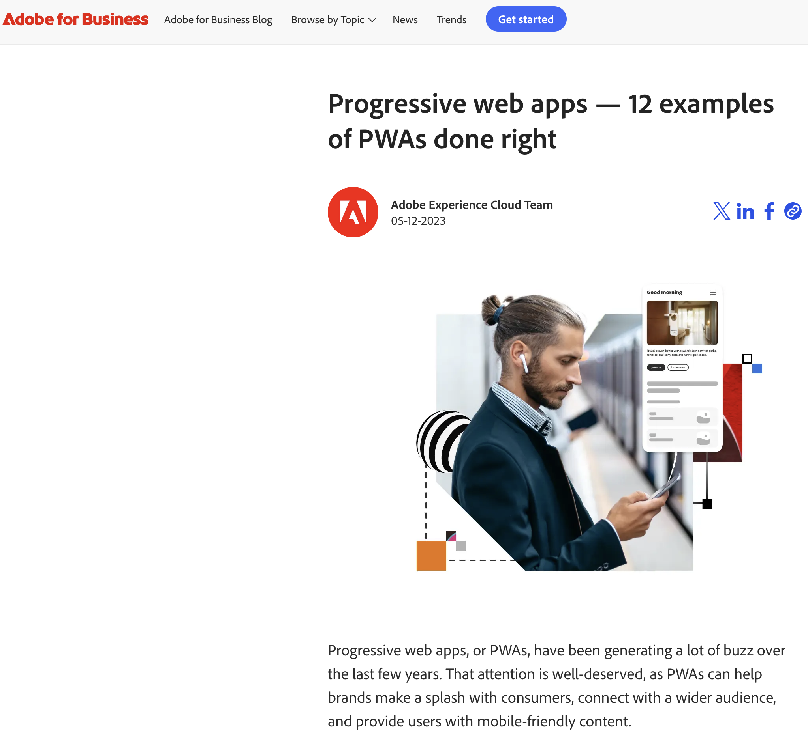
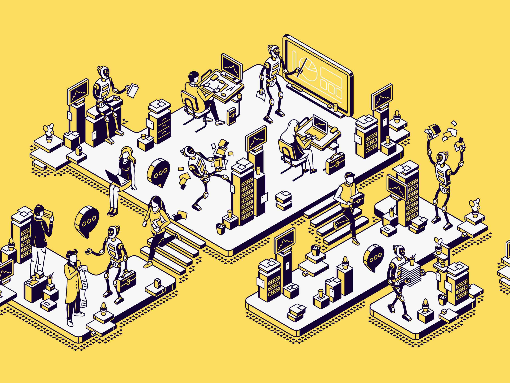
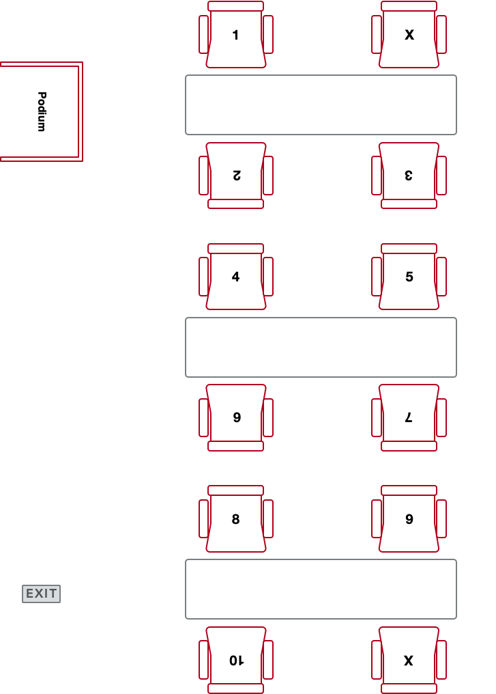

## HCDD 340
### Human-Centered Design for Mobile Computing
::: {.t-left}
Saeed Abdullah (saeed@psu.edu)
:::

---

### Introduction
* Associate Professor in IST

* Research
	- Digital Health
	- Human Computer Interaction (HCI)
	- Human-centered AI

* Wellbeing & Health Innovation [(WHI)](https://whilab.org/) lab

---

### Teaching Assistant
{ width=25% }

---

### Course Logistics
+ Yash Mahajan
	+ Monday and Wednesday: 12:00 - 1:30pm

+ Saeed Abdullah
	+ Friday 2:00 – 3:00pm

---

### We will use Zoom for office hours
+ Reserve your slots [here](https://outlook.office365.com/owa/calendar/HCDD340OfficeHours@PennStateOffice365.onmicrosoft.com/bookings/)

+ All slots are booked for a given day? 🤯
	+ Please send us an email and we will try to schedule a meeting with you.

---

#### Human-Centered Design (HCD) for Mobile Computing
* What is mobile computing?
	* Sub-domain in human-computer interaction (HCI)

* Key attribute: “Information at your fingertips”
	* Portable, Connected, Interactive, and Personal devices
		* Phones, wearables, …

---

### This course will focus on progressive web apps ([PWA]{.t-salmon})

---

### What is a progressive web app?
* Built using web platform technologies

* User experience like a platform-specific app
	* Windows, macOS, Android apps

---

### Why PWAs?
#### Best of both worlds? (Web and app specific platforms)

* Web platform is widely available
	* Accessible development and distribution

* Increasingly better integration with platform

---

### Why PWAs?
[{ width=40% }][forbes-pwa]

::: {.t-ref}
[Source][forbes-pwa]
:::

---

### Why PWAs?

[{ width=40% }][adobe-pwa]

::: {.t-ref}
[Source][adobe-pwa]
:::

---

### Learning Objectives

- Become familiar with processes and tools for PWA design and
  development

- Understand HCD design requirements and guidelines

- Translate design ideas into functional prototypes

- Learn to use generative AI tools for design and development

---

### Learning-by-doing

* Class activities, assignments, and final project
	- CSS and Javascript programming

* Design guidelines

---

### Learning Objectives

- Become familiar with processes and tools for PWA design and
  development

- Understand HCD design requirements and guidelines

- Translate design ideas into functional prototypes

- [**Learn to use generative AI tools**]{.t-salmon} for design and development

---

## [[AI Upskilling]{.t-salmon}: A Key Objective]{.r-big-text}

---

### [A transformative shift in workforce]{.t-clover}

{ .r-strech style="max-width: 80%"}

---

### AI Upskilling: : A Key Objective
* Preparation for a transformative shift in workforce
* Critical assessment of strength and limitations of AI

---

### AI Upskilling: : A Key Objective

* You are ~~allowed~~ ([**encouraged**]{.t-clover}) to **use AI for all class deliverables**
	- assignments, final project 
* We will have class activities focusing on GenAI use for design and implementation
 
---

### Learning Objectives

- Become familiar with processes and tools for PWA design and
  development

- Understand HCD design requirements and guidelines

- Translate design ideas into functional prototypes

- Learn to use generative AI tools for design and development

---

### My hope: this class will help you get a [**job**]{.t-salmon} {.r-big-text}

* Enhancing your CV
	* Concrete development and design skills
	* GenAI skills

* A portfolio for potential employer
	* Final project

---

### Course feedback
#### Feedback = ❤️
* Help me make the class better
	* For you and for your fellow students next year!

---

### Resources

* Slides will point to relevant resources. E.g.,:
	* [Progressive web apps from MDN Web Docs](https://developer.mozilla.org/en-US/docs/Web/Progressive_web_apps)
	* [Lean PWA](https://web.dev/learn/pwa)
	* [Eloquent JavaScript](https://eloquentjavascript.net/)

---

### Resources: LLM

* You will need access to an LLM (whatever is free/cheap for you)
	* ChatGPT, Gemma, Claude

---

### Resources: Development

* Editing html, css, and javascript files
	* [VS Code](https://code.visualstudio.com/download) is a good option
* Testing
	* [Google Chrome](https://www.google.com/chrome/)
	* [Firefox](https://www.firefox.com/en-US/)

 ---
 
### Course Structure

---

### Grading

:::{.l-double}

::: start
- A: 100–93%
- A-: 92–90%
- B+: 89–87%
- B: 86-83%
- B-: 82–80%
:::

::: End
- C+: 79–77%
- C: 76–70%
- D: 69–60%
- F: \<60%
:::
:::

Cutoff point for each grade is the lower number **without rounding** (e.g., 89.9% will result in B+)

---

### Grading

* Assignment — 48%
* Final Project — 45%
* Attendance and Class Participation — 7%

---

### Assignments — 48%
+ Assignment 1: 16 points
+ Assignment 2: 16 points
+ Assignment 3: 16 points
 
 ---
 
### Grading

* Assignment — 48%
* **Final Project — 45%**
* Attendance and Class Participation — 7%

---

### Final Project — 45%
* Will be done in ~3 person groups
* See your group in Canvas -> People -> Group
* Excellent opportunity for learning by doing

---

### Final project topic
* Considerable flexibility in terms of topic
	* develop a chatbot interface?
	* redesign an existing app (e.g., Penn State Go app, Apple Music)?
	
---

### Final project topic
* Focus on your portfolio
	* Showcasing it in your job/internship applications?
* Maybe prototype for broader reach?
	* [Nittany AI Challenge](https://nittanyai.psu.edu/alliance-programs/nittany-ai-challenge/)
	* [IdeaMakers Challenge](https://pennstateideamakers.weebly.com/)

---

### Final project topic: Start thinking about it!
#### We are happy to discuss options!

---

### Final project — 2 presentations & 3 submissions
+ Proposal submission:  5 points
+ Proposal Presentation: 8 points
+ Final presentation: 10 point
+ Code and documentation: 20 point
+ Mandatory group review: 2 points

---

### Mandatory group review
* Due at the end of the class
* Report evaluating performance of each group member (including yourself)
* Will also be used to [**adjust project grades**]{.t-salmon}
* **Be fair, courteous, and respectful** to your group member

---

### Final project: Details in the syllabus

---

### Grading

* Assignment — 48%
* Final Project — 45%
* **Attendance and Class Participation — 7%**

---

### Attendance is critical
* Key approach: Learning by doing
* Classes will involve activities
	- Helping to understand concept
	- Very relevant for assignments and final project

---

### Attendance and Class Participation — 7%

* We will take attendance on **random days**
* **Each missed class** will lead to [**1% grade deduction**]{.t-salmon}

---

### Need to skip a class? Let me know [**beforehand**]{.t-salmon}
* We will allow skipping classes for
	* "[University-sanctioned activity](https://aappm.psu.edu/policy/e-11-class-attendance)" 
	* Health reasons 🤧
* You must communicate to us [**before the class**]{.t-clover}

---

### Late submissions: Points deduction

- 25% up to 12 hours
- 50% up to 24 hours
- 100% after 48 hours

---

### Grade Disputes
* You must get in touch within one week
* No point change at the end of the semester

---

### Academic Integrity

* You are responsible to read and follow the [Code of Conduct][code-of-conduct]
	* When in doubt, talk to us
* I am [**required**]{.t-salmon} to report any academic integrity violation in the class

---

### For this course: Code is similar to writing
* Similar academic integrity rules apply in this course
* Assignments must consist of your individual efforts
	* No copying code from other students
* It is ok to help others, but do not share code directly
	* A good rule of thumb: **close your laptop as you help others**

---

### Is this a violation?
* Sahiti and Hee Jeong are working on the first assignment. Hee Jeong is having difficulty with using appropriate layout parameters.

* Sahiti suggested that Hee Jeong should look at a specific slide from the class (“slide 19 from Monday”)

---

### Is this a violation? No
* Sahiti and Hee Jeong are working on the first assignment. Hee Jeong is having difficulty with using appropriate layout parameters.

* Sahiti suggested that Hee Jeong should look at a specific slide from the class (“slide 19 from Monday”)
	* No violation here

---

### Is this a violation?
* Sahiti and Hee Jeong are working on the first assignment. Hee Jeong is having difficulty with using appropriate layout parameters. 

* Sahiti looked at her own code and suggested: “use a border margin of 20 pixels.” And, Hee Jeong updated it accordingly.

---

### Is this a violation? [Yes]{.t-salmon}
* Sahiti and Hee Jeong are working on the first assignment. Hee Jeong is having difficulty with using appropriate layout parameters. 

* Sahiti looked at her own code and suggested: “use a border margin of 20 pixels”. And, Hee Jeong updated it accordingly.

* Who would be responsible for violation here?

::: {.fragment .fade-in}
**Both violated academic integrity**
:::

---

### Is this a violation?
* Hee Jeong has completed the second assignment. But, Sahiti’s code is not working as expected and she asked for help.

* Hee Jeong looked at her code and helped her to debug: “add a log statement here and let’s see what is the value of the variable”

---

### Is this a violation? No
* Hee Jeong has completed the second assignment. But, Sahiti’s code is not working as expected and she asked for help.

* Hee Jeong looked at her code and helped her to debug: “add a log statement here and let’s see what is the value of the variable”

* No violation here (no code sharing)

---

### Is this a violation?
* Hee Jeong has completed the second assignment. But, Sahiti’s code is not working as expected and she asked for help.

* Hee Jeong looked at her code and read the corresponding lines to Sahiti: “this is how I did it”

---

### Is this a violation? [Yes]{.t-salmon}

* Hee Jeong has completed the second assignment. But, Sahiti’s code is not working as expected and she asked for help.

* Hee Jeong looked at her code and read the corresponding lines to Sahiti: “this is how I did it”

* **Both violated academic integrity**

---

### What’s the recommended sanction for copying code?

* Hee Jeong knows that Sahiti took the same class semester. She asked Sahiti to take a look at her submitted final project from last year. Hee Jeong then used Sahiti’s code for her own final project.

* Given [the IST guideline](https://ist.psu.edu/sites/default/files/undergrad-grad-studies/ist-ai-sanction-guidelines.pdf), what sanction would you recommend?

---

### Academic Integrity: Please be mindful
* I am [**required**]{.t-salmon} to report any academic integrity violation in the class

---

### Disability Accommodation: [Please let me know]{.t-clover}

---

### Counseling and psychological services
* Your overall wellbeing is important
* Counseling and Psychological Services at University Park
* Don’t hesitate to get in touch if I can help

---

### Fixed seating arrangement for groups
{ style="max-width: 35%" }

---

### Fixed seating arrangement for groups: Why?

* Leads to better group communications
* Fostering supportive and constructive interactions as members do class activities together

---

### Fixed seating arrangement for groups
{ style="max-width: 35%" }

---

### Todo
* Install Visual Studio Code
* Install [Live Preview extension from Microsoft](https://marketplace.visualstudio.com/items?itemName=ms-vscode.live-server)
	* Settings -> Extensions
	* Search for "Live Preview"

---

### Todo: Class activity

* Download [activity-01](https://github.com/hcdd-340/Activity-Fall-2025/archive/refs/tags/activity-01.0.zip)
* Unzip the file
* Open the folder in VS Code
	* File --> Open Folder
* Click on Show Preview
	* Top right corner

---

### Todo: Class activity
* Open `index.html` in Chrome or Firefox
* Open Developer Tools
	* Right-click and Inspect
	* (Firefox) Tools --> Browser Tools --> Web Developer Tools 
	* (Chrome) View --> Developer --> Developer Tools

---

### Todo: Class activity
* Check computed value for the `<h2>` tag
	* Why is `Learn` in different color?

---

### HCDD 340: Goals
::: {.t-left}
[**Learn**]{.t-clover} about exciting things. Get your  [**CV & portfolio**]{.t-clover} shining. Have  **[fun]{.t-salmon}**!
:::

---

### Check out NotebookLM
* Course syllabus in [NotebookLM]()
	* You can create your own using [the markdown source](https://www.dropbox.com/scl/fi/gzuxxltxfn5hkldfbwsmh/syllabus-hcdd340-2025-08-10.markdown?rlkey=6xdphumfvwxc9138uys5ldyqn&dl=0)
* Can you get it to make an error in answering questions?

* What do you think about the podcast format? 

---

### HCDD 340: Goals
::: {.t-left}
[**Learn**]{.t-clover} about exciting things. Get your  [**CV & portfolio**]{.t-clover} shining. Have  **[fun]{.t-salmon}**!
:::

---

[forbes-pwa]: https://www.forbes.com/sites/forbestechcouncil/2018/03/09/why-progressive-web-apps-will-replace-native-mobile-apps/
[adobe-pwa]: https://business.adobe.com/blog/basics/progressive-web-app-examples
[code-of-conduct]: https://ist.psu.edu/current-students/current-undergraduate-students/academic-advising/academic-integrity

