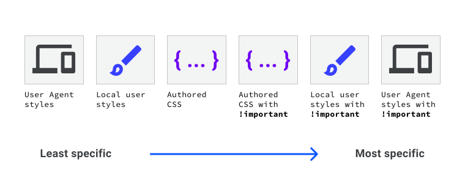

## HCDD 340
### CSS Intro

---

### Fixed seating arrangement for groups
{ style="max-width: 35%" }

---


## HCDD 340
### CSS Intro

---

### Cascading Style Sheets (CSS)
*  Defines how different HTML elements look
    * styling texts
    * creating layouts (grids, multiple columns, ...)
    * create animation

---

### CSS rules for styling

### [`styles.css` from last class](https://github.com/hcdd-340/Activity-Fall-2025/blob/activity-01/styles.css)

```css
section {
    position: absolute;
    top: 50%;
    left: 50%;
    margin-right: -50%;
    transform: translate(-50%, -50%);
}

.orange {
    color: #f0a202
}
```

---

### Linking to CSS rules

### [`index.html` from last class](https://github.com/hcdd-340/Activity-Fall-2025/blob/activity-01/index.html)

```html { data-line-numbers="3" }
<head>
    ...
    <link rel="stylesheet" href="styles.css" />
    <title>Welcome to HCDD 340!</title>
</head>
```

---

### CSS rules contain selectors and declarations

* Select a specific items
* Apply the style (declaration) to the selected items
    - [property: value]{.t-salmon} pairs

---

### CSS rules contain selectors and declarations

{width=70%}


::: {.t-ref}
[Source](https://web.dev/learn/css/selectors#the_parts_of_a_css_rule)
:::

---


### CSS rules contain [selectors]{.t-salmon} and declarations

```css {data-line-numbers="1"}
section {
    position: absolute;
    top: 50%;
    left: 50%;
    margin-right: -50%;
    transform: translate(-50%, -50%);
}
```

---

### CSS rules contain selectors and [declarations]{.t-salmon}

```css {data-line-numbers="2-6"}
section {
    position: absolute;
    top: 50%;
    left: 50%;
    margin-right: -50%;
    transform: translate(-50%, -50%);
}
```

---

### Selectors
#### Different "patterns" to identify match elements

---

### Universal selector ([**\***]{.t-salmon}) matches all elements

```css {data-line-numbers="1"}
* {
    margin: 0;
    padding: 0;
    box-sizing: border-box;
}
```

---

### Type selector matches corresponding HTML elements

```css {data-line-numbers="1"}
section {
    position: absolute;
    top: 50%;
    left: 50%;
    margin-right: -50%;
    transform: translate(-50%, -50%);
}
```

Matches all **`<section>`** elements

---

### Type selector matches corresponding HTML elements

```css
h4 {
    font-size: 1em;
}
```

:::{.fragment .fade-in}
Matches all **`<h4>`** elements
:::

---

### Class selector matches elements with a given class

```css {data-line-numbers="1"}
.orange {
 color: #f0a202
}
```
<small>styles.css</small>

```html { data-line-numbers="1" }
<h1 class="orange">HCDD 340</h1>
<h1>Goals</h1>

```
<small>index.html</small>

::: {.fragment .fade-in}
**[.]{.t-salmon}** is in CSS rules, but **not** in html
:::

---

### An element can have multiple classes
#### What happens in this case? 🤔

```css {data-line-numbers="1"}
.orange {
 color: #f0a202
}
```
<small>styles.css</small>

```html { data-line-numbers="1" }
<h1 class="orange another-class some-other-class">HCDD 340</h1>
<h1>Goals</h1>

```
<small>index.html</small>


::: {.fragment .fade-in}
Still matches (all elements _containing_ the given class)
:::


---

### ID selector matches elements with the given id

```css {data-line-numbers="1"}
#penn-state {
    border: 1px solid #96BEE6;
}
```
<small>styles.css</small>

```html {data-line-numbers="1"}
<div id="penn-state">
We are!
</div>
```
<small>index.html</small>

::: {.fragment .fade-in}
**[#]{.t-salmon}** is in CSS rules, but **not** in html
:::

---

### Attribute selector matches elements with a given attribute or a value
#### Select element if a given attribute is present

```css {data-line-numbers="1"}
[data-college] {
    color: #96BEE6;
}
```
<small>styles.css</small>


```html {data-line-numbers="1,2"}
<div data-college="IST">Information Sciences and Technology</div>
<div data-college="HHD">Health and Human Development</div>
```
<small>index.html</small>

::: {.fragment .fade-in}
**Both** `<div>`s will match (i.e., attribute "college" is present)
:::


---

### Attribute selector matches elements with a given attribute or a value
#### Select element if the attribute has a given value

```css {data-line-numbers="1"}
[data-college="IST"] {
    color: #96BEE6;
}
```
<small>styles.css</small>


```html {data-line-numbers="1,2"}
<div data-college="IST">Information Sciences and Technology</div>
<div data-college="HHD">Health and Human Development</div>
```
<small>index.html</small>

What happens here?

::: {.fragment .fade-in}
Only the **first** `<div>` will be selected
:::

---

### You can do complex attribute matching

* prefix and suffix matching (regular expression)
* case insensitive
* See more details [here](https://developer.mozilla.org/en-US/docs/Web/CSS/Attribute_selectors)


---

### Pseudo-classes

---

### Pseudo-classes
#### Select a specific [state]{.t-salmon} of a given element ([:]{.t-salmon})

```css
h2:hover {
  color: blue;
}
```

Change outline when `<h2>` is `hovered`

---

### Pseudo-classes
#### Select a specific [state]{.t-salmon} of a given element ([:]{.t-salmon})

```css
p:nth-child(even) {
  background: blue;
}
```

All **even** paragraphs will have `blue` background

---

### Many pseudo-classes available
* `:first-child`
* `:last-child`
* `:visited`

:::{.t-ref}
[Source](https://developer.mozilla.org/en-US/docs/Web/CSS/Pseudo-classes)
:::


---

### Pseudo-elements

---

### Pseudo-elements
#### Specific part of a selected element ([::]{.t-salmon})

```css
p::first-letter {
  color: goldenrod;
  font-weight: bold;
}
```

Changes the **first letter** of each paragraph — [check it out](https://codepen.io/web-dot-dev/pen/JjEJmOx)

---


### Pseudo-elements
#### [::before]{.t-salmon} and [::after]{.t-salmon} for inserting elements

```css
.exciting-text::after {
  content: " <- EXCITING!";
  color: darkgreen;
  font-weight: bolder;
}

.boring-text::after {
  content: " <- BORING";
  color: darkviolet;
  font-weight: bolder;
}
```

Check out [the example](https://developer.mozilla.org/en-US/play?uuid=dcc94b29-c181-4bb0-b383-f631f740d3a4&state=fVDBTsMwDP0VkzMt91B2YCDYgSEhDhxySVu3DaROlXgwNO3fcTs6MSHtFMfv%2BT0%2F71THvVdaFQNU3qZ0Y1QZoqM2Y9yyUYtHjAguQQo9wuCtIwi%2BhgMJRlJeXA0LQ8VwyqUQe%2BsnBnBneQQIHXcY52mhAG4rx%2FI5qhz3mJF5k2Ugjq7c8GQc4OluPWqiTd9gqYZmQ78i6lJVKUmq%2FERDa9uwuO8MAVSihsQajIIig%2Fu35ep1tX64MOr6APsQNdQ2frQRkaZmIzPZF7q2k7lSzoBR%2BntDhvI%2FVzvnc%2Fv8Ii7%2FTT5d8MjnXSTW%2B5hKXrlij1L6kaX2Pw%3D%3D&srcPrefix=%2Fen-US%2Fdocs%2FWeb%2FCSS%2F%3A%3Aafter%2F)

---

### Grouping selectors
#### Apply same rule to multiple selectors

```css {data-line-numbers="1"}
h1, h2, h3, h4, h5 {
    margin: 0 0 20px 0;
    line-height: 1.2;
    font-weight: bold;
}
```

Separated by **commas**

---

### Combinators
#### Combine selectors to select elements in relation to others

* Descendant
* Child
* Next-sibling
* Subsequent-sibling

---

### Descendant combinator
#### Parent and descendant selectors separated by a space

```css
p strong {
  color: red;
}
```

All `<strong>` elements within `<p>` elements will have [red]{style="color: red;"} color

---

### What happens here?

```css
li {
  list-style-type: disc;
}

li li {
  list-style-type: circle;
}

```
<small>css</small>

```html
<ul>
  <li>Item 1
    <ul>
      <li>Subitem A</li>
      <li>Subitem B</li>
    </ul>
  </li>
```
<small>html</small>

:::{.t-ref}
[Source](https://developer.mozilla.org/en-US/play?uuid=c8c2eb4c-86cc-4c5e-a5da-3c366ec5c6da&state=tY8xC8IwEIX%2FSshsCTrWUNDN2TWTaTAnlyDmKpTS%2F%2B4lpqKgo9O93PvyHjdJTwFlK%2FWAnYlCaIQyWfVw7w7kglhrlXVdV7Boho%2FDCTK00%2Br19dPZvzlaLT3L7lvh5n%2BF9S1X0qbEdyOIKdsIiZpEI7qGxqtrRQ%2FJbk2cTTSRoZ%2BchZtF9yQ59ZJDeZJ3wZX8syc5PwA%3D&srcPrefix=%2Fen-US%2Fdocs%2FWeb%2FCSS%2FDescendant_combinator%2F)
:::

---

### Child combinator
#### Parent and children selectors separated by a >

```
div > p {
    color: red;
}
```

Only the direct children will be selected (more restrictive than descendant combinator)

---

### What happens here?

```css
span {
  background-color: aqua;
}

div > span {
  background-color: yellow;
}
```
<small>styles.css</small>

```html
<div>
  <span>
    Span #1, in the div.
    <span>Span #2, in the span that's in the div.</span>
  </span>
</div>
<span>Span #3, not in the div at all.</span>
```
<small>index.html</small>

:::{.fragment .fade-in}
Check [it out!](https://developer.mozilla.org/en-US/play?uuid=d0785ab2-031a-484d-ba0d-bfc651e75029&state=fY7BDoIwDIZfpZkHLyhRb7jwEl53qUAALZ2yoTGEd7djCXLytC%2F7%2F37tqBrfkcqULttXbhhAuwfyTAAXQdgcEmgZfFOBdPYxia2YH5c8fAqg37r1iE4X54I6jQvXolMCbP1qEtADEv0EKlGFc3LuvGkMxisW97q3A5e7wpLtM8DngGfDk2HDQZLDv%2FanIrLv2Bf9LdjllQu6SpDauvFq%2BgI%3D&srcPrefix=%2Fen-US%2Fdocs%2FWeb%2FCSS%2FChild_combinator%2F)
:::

---

### Next sibling combinator
#### An element immediately follows another element within same parent (+)

```css
img + p {
  font-weight: bold;
}
```

A paragraph that immediately follows an image (within same parent) will have **bold** text

---

### Subsequent sibling combinator
#### An element ~~immediately~~ follows another element within same parent (~)

```css
img ~ p {
}
```

Any paragraph that ~~immediately~~ follows an image (within same parent) will have **bold** text

---


### Which ones are red: S1, S3, S4?

```css
p ~ span {
  color: red;
}
```
<small>styles.css</small>

```html
<article>
    <span>S1</span>
    <p>P1</p>
    <code>C1</code>
    <span>S2</span>
    <p>P3</p>
    <h1>H1</h1>
    <span>S3</span>
</article>
<span>S4</span>
```
<small>index.html</small>

:::{.fragment .fade-in}
Check [it out!](https://developer.mozilla.org/en-US/play?uuid=69d9bb84-61c6-4fb5-afc6-be05804ba936&state=dVLNboMwDH4Vi8suqGjXDnHqYQ8waZdeXDAkK%2FlRkg5VVffsswMbY9okJJz44%2FuxuRUqmbHYFzWGpNuRmqMFqKNH27woHYEf6xIE6uBELV4igU6A3hOGyFe9CwRor%2BAx4BDQq11d5c8zkW%2BeiQHMghuEn9ut6%2BgbEZ0hkBvu58ZqRSqAbEjOgv7HEfaJAiRFq1wJ9E6W79xlUNIKNPMh6zo5c8SOOKtlxjQR2V2W3uR4VZiYJ4iYwSsjSzgTeYhGj9oOayj12BwCoYGTHuqKT79zHBxF%2ByA0ScwqN3HJI3QBJlaBs7YduH5xJS5XZyXgOOYhROiDMzOj5I1ocmiyaZnCj5FnFh7ZNlhdrVtfDW7G%2FMfyu8V%2BVEKKX5qTTmqzZeFfSIuyaGPk38zDx0x9E6XWjS7shf%2FpaO8Z9iYofnMiQ1yOelCpuH8C&srcPrefix=%2Fen-US%2Fdocs%2FWeb%2FCSS%2FSubsequent-sibling_combinator%2F)
:::

---

### Class activity

#### We will play [CSS Diner](https://flukeout.github.io/)

* Work as a group
* Feel free to use AI
* How many levels can you complete?

---

### How do the CSS rules work?

---


### What happens if there are no CSS rules for a given page? 🤔

::: {.fragment .fade-in}
A browser will apply [default styles]{.t-salmon}
:::

---


### What happens when multiple rules apply?
#### Handling conflicts

```css
h1 {
  color: red;
}
h1 {
  color: blue;
}
```

---


### Handling conflicts
#### Cascading determines which rules actually apply

* Position and order
* Specificity
* Origin
* Importance

:::{.t-ref}
[Source](https://web.dev/learn/css/the-cascade#resources)
:::

---

### Handling conflicts
#### Cascading determines which rules actually apply

* Position and order
    + Immediate rule gets precedence
* Specificity
* Origin
* Importance

---

### Position and order
#### Immediate rule gets precedence

```css {data-line-numbers="4-6"}
h1 {
  color: red;
}
h1 {
  color: blue;
}
```

The color will be **blue**

---

### Immediate rule gets precedence
#### What's the color of the button's background?

:::{.l-double}

:::{style="width:100%"}
```{ .css width="max-content" }
button {
  background: yellow;
}
```
<small>styles.css</small>
:::

:::{style="width:100%"}
```{.html width=100%}
...
<link rel="stylesheet"
    href="/styles.css" />
...
...
<button> I am a button </button>
<style>
    button { background: pink; }
</style>
</body>
```
<small>index.html</small>
:::
:::

:::{.fragment .fade-in}
**pink** — embedded `style` is more immediate

:::{.t-ref}
[Source](https://web.dev/learn/css/the-cascade#using_devtools_to_find_out_why_some_css_is_not_applying)
:::
:::

---

### Handling conflicts
#### Cascading determines which rules actually apply

* Position and order
* [**Specificity**]{.t-salmon}
* Origin
* Importance

---

### Handling conflicts
#### Cascading determines which rules actually apply

* Position and order
* [**Specificity**]{.t-salmon}
    + More specific selectors gets precedence
* Origin
* Importance

---

### More specific selectors gets precedence
#### A > B > C

{width=60%}


::: {.t-ref}
[Source](https://web.dev/learn/css/specificity)
:::

---

### More specific selectors gets precedence
#### What's the button color?
```css
.branding {
  color: blue;
}

button {
  color: red;
}
```

```html
<button class="branding">
    Hello, Specificity!
</button>
```
:::{.fragment .fade-in}
**Blue** — check [it out!](https://codepen.io/web-dot-dev/pen/YzNKMXm)
:::

---

### More specific selectors gets precedence
#### A > B > C

{width=60%}


::: {.t-ref}
[Source](https://web.dev/learn/css/specificity)
:::


---

### Handling conflicts
#### Cascading determines which rules actually apply

* Position and order
* Specificity
* [**Origin**]{.t-salmon}
    + More specific origin takes precedence
* Importance

---

### Origin
#### More specific origin takes precedence

{width=60%}


::: {.t-ref}
[Source](https://web.dev/learn/css/specificity)
:::


---

### Handling conflicts
#### Cascading determines which rules actually apply

* Position and order
* Specificity
* Origin
* [**Importance**]{.t-salmon}
    + You can use `!important` to change importance

---

### Why my CSS rule is not applying? 🤯

---

### Why my CSS rule is not applying? 🤯
#### Use Developer Tools
:::{.l-double}

:::{width=max-content}
* Firefox DevTools
    + Computed
* Chrome DevTools
    + Styles
:::


:::{width=100%}
{width=95%}
:::
:::

::: {.t-ref}
[Source](https://web.dev/learn/css/the-cascade)
:::

---


### Class activity
#### Starter files [here](https://github.com/hcdd-340/Activity-Fall-2025/archive/refs/tags/activity-02.0.zip)

* Unzip the file
* Open the folder in VS Code
	* File --> Open Folder
* Click on Show Preview
	* Top right corner
* Also, open `index.html` in Chrome/Firefox

---

### Todos

:::::::::::::: {.columns}

::: {.column width="65%"}
* Only change `styles.css`
* Paragraph directly after an `<h2>`:
	* bold
	* the first line: red
* Even rows in a table
	* background color: `#333333` 
:::

::: {.column width="35%"}
{width=100%}
:::

::::::::::::::

---

### Class activity
#### Hints
* Paragraph directly after an `<h2>`:
	* Which combinator to use?
	* bold
	* the first line: red
		* pseudo element [::first-line](https://developer.mozilla.org/en-US/docs/Web/CSS/::first-line)
* Even rows in a table
	* pseudo-class [:nth-child](https://developer.mozilla.org/en-US/docs/Web/CSS/:nth-child)

---


