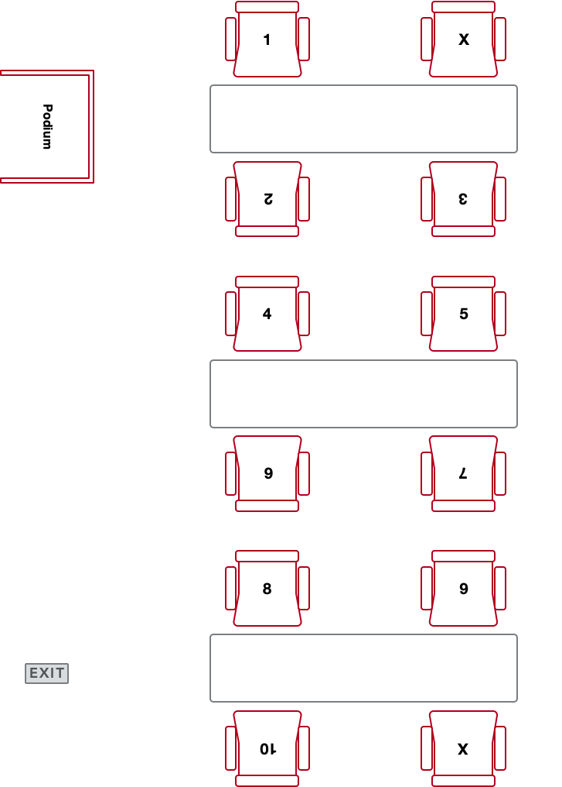
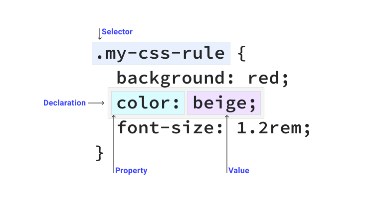
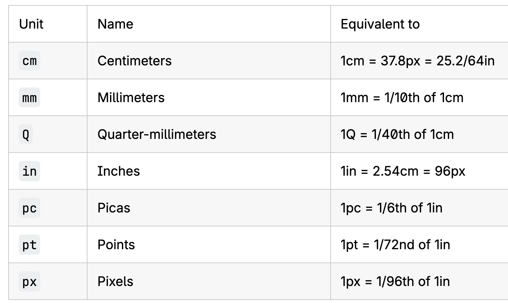
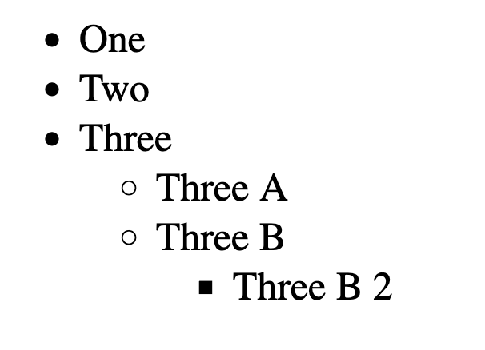
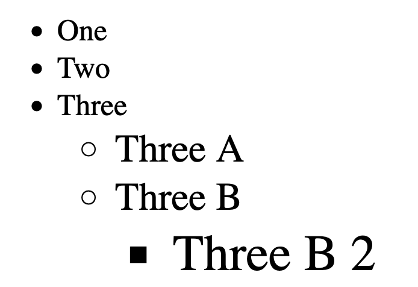
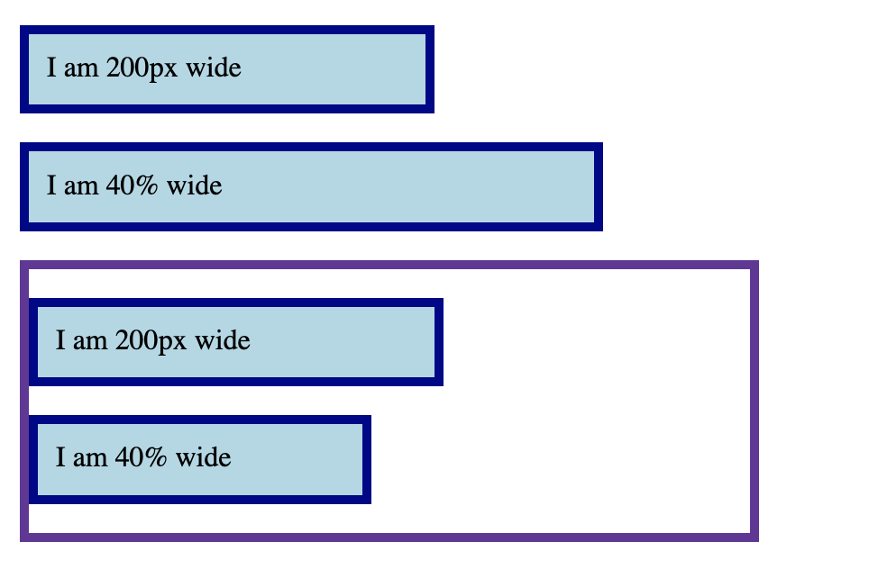

## HCDD 340
### CSS Intro

---

### Fixed seating arrangement for groups
{ style="max-width: 35%" }

---

## Recap from last class

---


### CSS rules contain selectors and declarations

{width=70%}


::: {.t-ref}
[Source](https://web.dev/learn/css/selectors#the_parts_of_a_css_rule)
:::

---


### Selectors
#### Different "patterns" to identify match elements

---

### Universal selector ([**\***]{.t-salmon}) matches all elements

```css {data-line-numbers="1"}
* {
    margin: 0;
    padding: 0;
    box-sizing: border-box;
}
```

---

### Type selector matches corresponding HTML elements

```css {data-line-numbers="1"}
section {
    position: absolute;
    top: 50%;
    left: 50%;
    margin-right: -50%;
    transform: translate(-50%, -50%);
}
```

Matches all **`<section>`** elements

---

### Type selector matches corresponding HTML elements

```css
h4 {
    font-size: 1em;
}
```

:::{.fragment .fade-in}
Matches all **`<h4>`** elements
:::

---

### Class selector matches elements with a given class

```css {data-line-numbers="1"}
.orange {
 color: #f0a202
}
```
<small>styles.css</small>

```html { data-line-numbers="1" }
<h1 class="orange">HCDD 340</h1>
<h1>Goals</h1>

```
<small>index.html</small>

::: {.fragment .fade-in}
**[.]{.t-salmon}** is in CSS rules, but **not** in html
:::


---

### ID selector matches elements with the given id

```css {data-line-numbers="1"}
#penn-state {
    border: 1px solid #96BEE6;
}
```
<small>styles.css</small>

```html {data-line-numbers="1"}
<div id="penn-state">
We are!
</div>
```
<small>index.html</small>

::: {.fragment .fade-in}
**[#]{.t-salmon}** is in CSS rules, but **not** in html
:::

---

### Attribute selector matches elements with a given attribute or a value
#### Select element if a given attribute is present

```css {data-line-numbers="1"}
[data-college] {
    color: #96BEE6;
}
```
<small>styles.css</small>


```html {data-line-numbers="1,2"}
<div data-college="IST">Information Sciences and Technology</div>
<div data-college="HHD">Health and Human Development</div>
```
<small>index.html</small>

**Both** `<div>`s will match (i.e., attribute "college" is present)


---

### Attribute selector matches elements with a given attribute or a value
#### Select element if the attribute has a given value

```css {data-line-numbers="1"}
[data-college="IST"] {
    color: #96BEE6;
}
```
<small>styles.css</small>


```html {data-line-numbers="1,2"}
<div data-college="IST">Information Sciences and Technology</div>
<div data-college="HHD">Health and Human Development</div>
```
<small>index.html</small>

Only the **first** `<div>` will be selected

---

### Pseudo-classes

---

### Pseudo-classes
#### Select a specific [state]{.t-salmon} of a given element ([:]{.t-salmon})

```css
h2:hover {
  color: blue;
}
```

Change outline when `<h2>` is `hovered`

---

### Pseudo-classes
#### Select a specific [state]{.t-salmon} of a given element ([:]{.t-salmon})

```css
p:nth-child(even) {
  background: blue;
}
```

All **even** paragraphs will have `blue` background

---

### Many pseudo-classes available
* `:first-child`
* `:last-child`
* `:visited`

:::{.t-ref}
[Source](https://developer.mozilla.org/en-US/docs/Web/CSS/Pseudo-classes)
:::


---

### Pseudo-elements

---

### Pseudo-elements
#### Specific part of a selected element ([::]{.t-salmon})

```css
p::first-letter {
  color: goldenrod;
  font-weight: bold;
}
```

Changes the **first letter** of each paragraph — [check it out](https://codepen.io/web-dot-dev/pen/JjEJmOx)

---


### Pseudo-elements
#### [::before]{.t-salmon} and [::after]{.t-salmon} for inserting elements

```css
.exciting-text::after {
  content: " <- EXCITING!";
  color: darkgreen;
  font-weight: bolder;
}

.boring-text::after {
  content: " <- BORING";
  color: darkviolet;
  font-weight: bolder;
}
```

Check out [the example](https://developer.mozilla.org/en-US/play?uuid=dcc94b29-c181-4bb0-b383-f631f740d3a4&state=fVDBTsMwDP0VkzMt91B2YCDYgSEhDhxySVu3DaROlXgwNO3fcTs6MSHtFMfv%2BT0%2F71THvVdaFQNU3qZ0Y1QZoqM2Y9yyUYtHjAguQQo9wuCtIwi%2BhgMJRlJeXA0LQ8VwyqUQe%2BsnBnBneQQIHXcY52mhAG4rx%2FI5qhz3mJF5k2Ugjq7c8GQc4OluPWqiTd9gqYZmQ78i6lJVKUmq%2FERDa9uwuO8MAVSihsQajIIig%2Fu35ep1tX64MOr6APsQNdQ2frQRkaZmIzPZF7q2k7lSzoBR%2BntDhvI%2FVzvnc%2Fv8Ii7%2FTT5d8MjnXSTW%2B5hKXrlij1L6kaX2Pw%3D%3D&srcPrefix=%2Fen-US%2Fdocs%2FWeb%2FCSS%2F%3A%3Aafter%2F)

---

### Grouping selectors
#### Apply same rule to multiple selectors

```css {data-line-numbers="1"}
h1, h2, h3, h4, h5 {
    margin: 0 0 20px 0;
    line-height: 1.2;
    font-weight: bold;
}
```

Separated by **commas**

---

### Combinators
#### Combine selectors to select elements in relation to others

* Descendant
* Child
* Next-sibling
* Subsequent-sibling

---

### Descendant combinator
#### Parent and descendant selectors separated by a space

```css
p strong {
  color: red;
}
```

All `<strong>` elements within `<p>` elements will have [red]{style="color: red;"} color

---

### Child combinator
#### Parent and children selectors separated by a >

```
div > p {
    color: red;
}
```

Only the direct children will be selected (more restrictive than descendant combinator)

---

### Next sibling combinator
#### An element immediately follows another element within same parent (+)

```css
img + p {
  font-weight: bold;
}
```

A paragraph that immediately follows an image (within same parent) will have **bold** text

---

### Subsequent sibling combinator
#### An element ~~immediately~~ follows another element within same parent (~)

```css
img ~ p {
}
```

Any paragraph that ~~immediately~~ follows an image (within same parent) will have **bold** text

---
### How do the CSS rules work?

---


### What happens if there are no CSS rules for a given page? 🤔

::: {.fragment .fade-in}
A browser will apply [default styles]{.t-salmon}
:::

---


### What happens when multiple rules apply?
#### Handling conflicts

```css
h1 {
  color: red;
}
h1 {
  color: blue;
}
```

---


### Handling conflicts
#### Cascading determines which rules actually apply

* Position and order
* Specificity
* Origin
* Importance

:::{.t-ref}
[Source](https://web.dev/learn/css/the-cascade#resources)
:::

---


### Class activity
#### Starter files [here](https://github.com/hcdd-340/Activity-Fall-2025/archive/refs/tags/activity-02.0.zip)

* Unzip the file
* Open the folder in VS Code
	* File --> Open Folder
* Click on Show Preview
	* Top right corner
* Also, open `index.html` in Chrome/Firefox

---

### Todos

:::::::::::::: {.columns}

::: {.column width="65%"}
* Only change `styles.css`
* Paragraph directly after an `<h2>`:
	* bold
	* the first line: red
* Even rows in a table
	* background color: `#333333` 
:::

::: {.column width="35%"}
{width=100%}
:::

::::::::::::::

---

### Class activity
#### Hints
* Paragraph directly after an `<h2>`:
	* Which combinator to use?
	* bold
	* the first line: red
		* pseudo element [::first-line](https://developer.mozilla.org/en-US/docs/Web/CSS/::first-line)
* Even rows in a table
	* pseudo-class [:nth-child](https://developer.mozilla.org/en-US/docs/Web/CSS/:nth-child)

---

## Today

* Nesting selectors
* Dimensions
* Assignment 01

---


## Nesting selectors
### Organizing hierarchical rulesets

```css
.feature button {
  color: blue;
}

.feature .link {
   color: red;
}

.feature .text {
   font-size: 1.3em;
}
```

:::{.t-ref}
[Source](https://web.dev/learn/css/nesting)
:::

---

## Nesting selectors
### Organizing hierarchical rulesets

:::::::::::::: {.columns}

::: {.column width="50%"}


```css {data-line-numbers="1–12"}
.feature {
  button {
    color: blue;
  }

  .link {
    color: red;
  }

  .text {
    font-size: 1.3em;
  }
}
```
:::

::: {.column width="50%"}
```css {data-line-numbers="0"}
.feature button {
  color: blue;
}

.feature .link {
   color: red;
}

.feature .text {
   font-size: 1.3em;
}
```

:::

:::

:::{.t-ref}
[Source](https://web.dev/learn/css/nesting)
:::

---

## Can have multiple levels nested

```css
.feature {
  .heading {
    color: blue;

    a {
      color: green;
    }
  }
}
```

:::{.t-ref}
[Source](https://web.dev/learn/css/nesting)
:::

---

## What happens here?

```css {data-line-numbers="1-4"}
.feature {
  + .heading {
    color: blue;
  }


  > p {
    font-size: 1.3em;
  }
}
```

::: {.fragment .fade-in}
Selects `.headings` that are immediate sibling of `.feature`
:::

:::{.t-ref}
[Source](https://web.dev/learn/css/nesting)
:::

---

## What happens here?

```css {data-line-numbers="1, 3-4"}
.feature {
  + .heading {
    color: blue;
  }

  > p {
    font-size: 1.3em;
  }
}
```

::: {.fragment .fade-in}
Selects `<p>` that are direct children of `.feature`
:::

:::{.t-ref}
[Source](https://web.dev/learn/css/nesting)
:::

---

## `&` = parent selector when nesting

:::::::::::::: {.columns}

::: {.column width="45%"}

```css
.feature {
 & button {
    color: blue;
  }
}
```
:::

::: {.column width="10%"}
#### = 
:::

::: {.column width="45%"}

```css
.feature button {
  color: blue;
}
```

:::
::::::::::::::

:::{.t-ref}
[Source](https://web.dev/learn/css/nesting)
:::

---

## Today

* Nesting selectors
* [**Dimensions**]{.t-salmon}
* Assignment 01

---

## Absolute units

```css {data-line-numbers="2, 3"}
div {
  width: 10cm;
  height: 5cm;
  background: black;
}
```

:::{.fragment .fade-in}
A 10x5 **cm** rectangle
:::

:::{.t-ref}
[Source](https://web.dev/learn/css/sizing)
:::


---


## Absolute units

{ style="max-width: 640px" }

:::{.t-ref}
[Source](https://developer.mozilla.org/en-US/docs/Learn_web_development/Core/Styling_basics/Values_and_units)
:::

---


## Absolute units
### More useful for print 

* These lengths are "perceptual"
    - "16px looks roughly the same on a phone, laptop, or TV screen at typical viewing distance"
* `1px` might not be equal one physical device pixel
    - can correspond to multiple pixels on HD displays 
* `1cm` might be longer than actual centimeter

:::{.t-ref}
[Source](https://developer.mozilla.org/en-US/docs/Learn_web_development/Core/Styling_basics/Values_and_units)
:::


---

## Dimensions: [relative]{.t-salmon} units
### Calculated in relation to a base value

* `em`
    - Historically, the height of the capital letter "M"
    - "parent element's font-size", if used for font-size
    - "own font-size", for everything else

* `rem`
    - root element's font size

---

## How would this look?

:::::::::::::: {.columns}

::: {.column width="50%"}
```css
html {
  font-size: 16px;
}

.ems li {
  font-size: 1.3em;
}

.rems li {
  font-size: 1.3rem;
}
```
:::


::: {.column width="50%"}
```html
<ul class="rems">
  <li>One</li>
  <li>Two</li>
  <li>
    Three
    <ul>
      <li>Three A</li>
      <li>
        Three B
        <ul>
          <li>Three B 2</li>
        </ul>
      </li>
    </ul>
  </li>
</ul>
```
:::

::::::::::

---

## Using `rem`s

{ style="max-width: 440px" }


---

## How would this look?

:::::::::::::: {.columns}

::: {.column width="50%"}
```css
html {
  font-size: 16px;
}

.ems li {
  font-size: 1.3em;
}

.rems li {
  font-size: 1.3rem;
}
```
:::


::: {.column width="50%"}
```html
<ul class="ems">
  <li>One</li>
  <li>Two</li>
  <li>
    Three
    <ul>
      <li>Three A</li>
      <li>
        Three B
        <ul>
          <li>Three B 2</li>
        </ul>
      </li>
    </ul>
  </li>
</ul>
```
:::

::::::::::

---

## Using `em`s

{ style="max-width: 440px" }


---

## Effective font-size?
#### For `Three B 2` (in pixels)

:::{.fragment .fade-in}
Check [it out](https://developer.mozilla.org/en-US/play?uuid=2f9af54e-b3c4-4da1-834d-c21f2044ed85&state=3VHNCsIwDH6VkLNuqOBhzoF7AS879iKj2krbSTtRHHt3U2z3g%2FgCnvLly5cvJOlQtFphhvldQa1Ozu0Zcu0YFswA5EoWR8PzlGLMq0czy30EqITl%2FAPJKpChwZfgMDRFPuLQDOVITC3mNiWsZ0ZUS6fzxtrABy7kBCar2r%2FeFRdYO0ff9U%2BGzgvOjWmXTr54Bqvt7bljpvc3SegOoOS3JtlwPYjsb5WNMpp59SMptoJrTlDJi2ixfwM%3D&srcPrefix=%2Fen-US%2Fdocs%2FLearn_web_development%2FCore%2FStyling_basics%2FValues_and_units%2F) using Dev Tool
:::

---

## Using `rem` and `em`
### Set the effective font-size `Three B 2` to be 30px

---


## Dimensions: [relative]{.t-salmon} units
### Can lead to more responsive designs

* We will use relative units (specifically for font sizes)
* Relative units allows adapting to device sizes and user preferences

---


## Dimensions: [percentage]{.t-salmon}
### Relative to some other dimensions

```css
div {
  width: 300px;
  height: 100px;
}

div p {
  width: 50%;
}
```

`<p>`: 50% width of the parent div

---

## What happens here?

:::::::::::::: {.columns}

::: {.column width="50%"}
```css
.box {
  background-color: lightblue;
  border: 5px solid darkblue;
  margin: 1em 0;
}
.wrapper {
  width: 400px;
  border: 5px solid;
}
.px {
  width: 200px;
}
.percent {
  width: 40%;
}
```
:::

::: {.column width="50%"}
```html
<div class="box px">
  I am 200px wide
</div>
<div class="box percent">
  I am 40% wide
</div>
<div class="wrapper">
  <div class="box px">
    I am 200px wide
  </div>
  <div class="box percent">
    I am 40% wide
  </div>
</div>
```
:::

::::::

---

## Percentage width is calculated from the parent

{ style="max-width: 440px" }

:::{.fragment .fade-in}
Check [it out](https://developer.mozilla.org/en-US/play?uuid=6135c271-bb03-4738-8efe-b83bf0285a09&state=lVDJTsMwEP2VkaXeSkkruIS2d%2F7BF8ceJabeNHZopKr%2FzmQpEhSEOI01781bfBFd8U7UYm%2FsO2incj5I0cQB0iDF8RWUh11VpQHO1uD%2BkVlHGe7JSBpDuV08Vavf%2BWdSifnMlQHgX74%2F0f9wXqZYC50z99yMR5dRqlH61FLsg3nQ0UWqwdm2K43r8WXCIxnk7TOHyNFZA0bR6RNOyhgb2hq2nHLaeEWtDbxADxVvrjJslrKzIwcrXc0Zbxf3FoQNaq1ST8nhrMEqafgisFsEFnD%2BgW8Wqxnn3m9jbZ6lQ4%2F8nFqK6wc%3D&srcPrefix=%2Fen-US%2Fdocs%2FLearn_web_development%2FCore%2FStyling_basics%2FValues_and_units%2F)!
:::

---

## Todo
### Make the inner box width same as the `wrapper`

{ style="max-width: 440px" }

---

## Todo
### Check out the [interactive example](https://2019.wattenberger.com/blog/css-percents)
How does percentage value for `margin-top` work?

---

## Today

* Nesting selectors
* Dimensions
* [**Assignment 01**]{.t-salmon}

---

## Assignment 01
### [See description](../../assignments/assignment-01/hcdd-340-assignment-01-2025-09-02.html)

{ style="max-width: 240px"}

---
