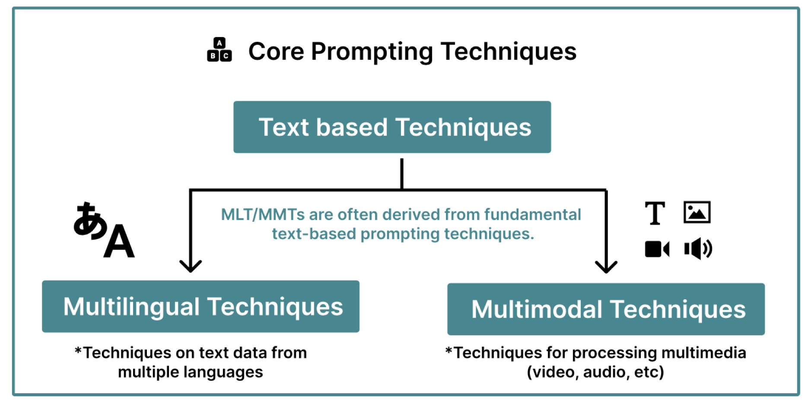
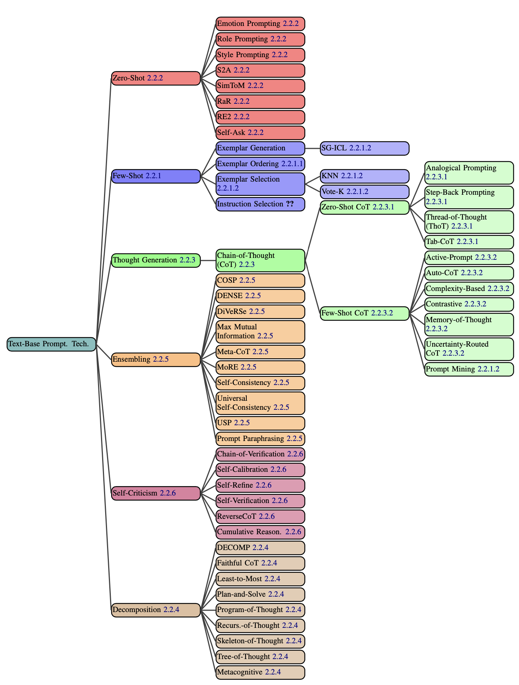

## HCDD 340
### CSS Intro & Using GenAI

---

## Recap from last class

* Nesting selectors
* Dimensions

---

## Nesting selectors
### Organizing hierarchical rulesets

:::::::::::::: {.columns}

::: {.column width="45%"}


```css {data-line-numbers="1–12"}
.feature {
  button {
    color: blue;
  }

  .link {
    color: red;
  }

  .text {
    font-size: 1.3em;
  }
}
```
:::


::: {.column width="10%"}

## =

:::

::: {.column width="45%"}
```css {data-line-numbers="0"}
.feature button {
  color: blue;
}

.feature .link {
   color: red;
}

.feature .text {
   font-size: 1.3em;
}
```

:::

::::::

:::{.t-ref}
[Source](https://web.dev/learn/css/nesting)
:::

---

## Can have multiple levels nested

```css
.feature {
  .heading {
    color: blue;

    a {
      color: green;
    }
  }
}
```

:::{.t-ref}
[Source](https://web.dev/learn/css/nesting)
:::

---


## Nesting

```css {data-line-numbers="1-4"}
.feature {
  + .heading {
    color: blue;
  }


  > p {
    font-size: 1.3em;
  }
}
```

Selects `.headings` that are immediate sibling of `.feature`

:::{.t-ref}
[Source](https://web.dev/learn/css/nesting)
:::

---

## Nesting

```css {data-line-numbers="1, 5-8"}
.feature {
  + .heading {
    color: blue;
  }

  > p {
    font-size: 1.3em;
  }
}
```

Selects `<p>` that are direct children of `.feature`

:::{.t-ref}
[Source](https://web.dev/learn/css/nesting)
:::

---

## `&` = parent selector when nesting

:::::::::::::: {.columns}

::: {.column width="45%"}

```css
.feature {
 & button {
    color: blue;
  }
}
```
:::

::: {.column width="10%"}
#### = 
:::

::: {.column width="45%"}

```css
.feature button {
  color: blue;
}
```

:::
::::::::::::::

:::{.t-ref}
[Source](https://web.dev/learn/css/nesting)
:::

---

## Recap from last class

* Nesting selectors
* [**Dimensions**]{.t-salmon}

---

## Absolute units

```css {data-line-numbers="2, 3"}
div {
  width: 10cm;
  height: 5cm;
  background: black;
}
```

:::{.fragment .fade-in}
A 10x5 **cm** rectangle
:::

:::{.t-ref}
[Source](https://web.dev/learn/css/sizing)
:::


---


## Absolute units

{ style="max-width: 640px;" }

:::{.t-ref}
[Source](https://developer.mozilla.org/en-US/docs/Learn_web_development/Core/Styling_basics/Values_and_units)
:::

---


## Absolute units
### More useful for print 

* These lengths are "perceptual"
    - "16px looks roughly the same on a phone, laptop, or TV screen at typical viewing distance"
* `1px` might not be equal one physical device pixel
    - can correspond to multiple pixels on HD displays 
* `1cm` might be longer than actual centimeter

:::{.t-ref}
[Source](https://developer.mozilla.org/en-US/docs/Learn_web_development/Core/Styling_basics/Values_and_units)
:::


---

## Dimensions: [relative]{.t-salmon} units
### Calculated in relation to a base value

* `em`
    - Historically, the height of the capital letter "M"
    - "parent element's font-size", if used for font-size
    - "own font-size", for everything else

* `rem`
    - root element's font size

---

## Dimensions: [relative]{.t-salmon} units
### Can lead to more responsive designs

* We will use relative units (specifically for font sizes)
* Relative units allows adapting to device sizes and user preferences

---

## Today

* Dimension: Percentage
* Using GenAI

---

## Dimensions: [percentage]{.t-salmon}
### Relative to some other dimensions

```css
div {
  width: 300px;
  height: 100px;
}

div p {
  width: 50%;
}
```

`<p>`: 50% width of the parent div

---

## What happens here?

:::::::::::::: {.columns}

::: {.column width="50%"}
```css
.box {
  background-color: lightblue;
  border: 5px solid darkblue;
  margin: 1em 0;
}
.wrapper {
  width: 400px;
  border: 5px solid;
}
.px {
  width: 200px;
}
.percent {
  width: 40%;
}
```
:::

::: {.column width="50%"}
```html
<div class="box px">
  I am 200px wide
</div>
<div class="box percent">
  I am 40% wide
</div>
<div class="wrapper">
  <div class="box px">
    I am 200px wide
  </div>
  <div class="box percent">
    I am 40% wide
  </div>
</div>
```
:::

::::::

---

### Percentage width is calculated from the parent

{ style="max-width: 440px;" }

:::{.fragment .fade-in}
Check [it out](https://developer.mozilla.org/en-US/play?uuid=6135c271-bb03-4738-8efe-b83bf0285a09&state=lVDJTsMwEP2VkaXeSkkruIS2d%2F7BF8ceJabeNHZopKr%2FzmQpEhSEOI01781bfBFd8U7UYm%2FsO2incj5I0cQB0iDF8RWUh11VpQHO1uD%2BkVlHGe7JSBpDuV08Vavf%2BWdSifnMlQHgX74%2F0f9wXqZYC50z99yMR5dRqlH61FLsg3nQ0UWqwdm2K43r8WXCIxnk7TOHyNFZA0bR6RNOyhgb2hq2nHLaeEWtDbxADxVvrjJslrKzIwcrXc0Zbxf3FoQNaq1ST8nhrMEqafgisFsEFnD%2BgW8Wqxnn3m9jbZ6lQ4%2F8nFqK6wc%3D&srcPrefix=%2Fen-US%2Fdocs%2FLearn_web_development%2FCore%2FStyling_basics%2FValues_and_units%2F)!
:::

---

## Todo
### Make the inner box width same as the `wrapper`

{ style="max-width: 440px;" }

---

## Todo
### Check out the [interactive example](https://2019.wattenberger.com/blog/css-percents)
How does percentage value for `margin-top` work?

---

## Today

* Dimension: Percentage
* [**Using GenAI**]{.t-salmon}

---

## Prompting

---

## What's a prompt?

* An input to a GenAI model to generate output
    - text, image, sound, ...

---

## What's a prompt?

{ style="max-width: 440px;"}

:::{.t-ref}
[Source](https://arxiv.org/abs/2406.06608)
:::

---

## Great paper on prompting

[The Prompt Report: A Systematic Survey of Prompting Techniques](https://arxiv.org/abs/2406.06608)

---

## Text based prompting

{ style="max-height: 440px;"}

:::{.t-ref}
[Source](https://arxiv.org/abs/2406.06608)
:::

---


## Prompt components

* Directives
* Examples/Shots/Exemplars
* Output Formatting
* Style
* Role

---

## Directives
### What's to be done?

* Explicit
    + "Write a poem"

* Implicit
    + "Good morning: buen día. Good night: ?"

---

### Examples/Exemplars/Shots

Demonstrations that guide the GenAI to accomplish a task

---


### Examples/Exemplars/Shots

* Zero shot
    - No examples
    - "Write a poem"

* 1-shot
    + "Good morning: buen día. Good night: ?"

* 2-shot
    + "2 + 2: four. 4 + 5: nine. 8 + 0: ?"


---

## Output Formatting
### Structured output?

* Non-structured output (free-form text)
    + For human viewing
    + e.g., ChatGPT responses

* Structured output (e.g., `JSON`)
    + For further processing in applications

---

## Style
### Desired output style

* "Be concise"
* "Respond in songs"

---

## Role
### Assign a role

* “You are a great poet”
* “You are an expert financial advisor”

---

## Emotion prompting

* Including phrases of "psychological relevance to human"

    + "This is very important to my career"

:::{.t-ref}
[Source](https://arxiv.org/pdf/2312.11111)
:::

---

## Emotion prompting

* Including phrases of "psychological relevance to human"

    + "Are you sure that's your final answer? Believe in your abilities and strive for excellence. Your hard work will yield remarkable results"
        - Social Cognitive Theory

:::{.t-ref}
[Source](https://arxiv.org/pdf/2312.11111)
:::

---

## Have you used emotion prompting?

---

### System prompt from Anthropic
#### Fascinating look into prompting

* Please take a look at the [system prompt for Claude](https://docs.anthropic.com/en/release-notes/system-prompts#august-5-2025)
* What it "does not" do?


---


## Potential GenAI use

* Explain code and topics
* Fix errors
* Generate `html` and `css` code


---

### Potential GenAI use


[{ style="max-width: 440px;" }](https://cookbook.openai.com/examples/gpt-5/gpt-5_prompting_guide#frontend-app-development)

:::{.t-ref}
[GPT 5 prompting](https://cookbook.openai.com/examples/gpt-5/gpt-5_prompting_guide#frontend-app-development)
:::

---

## Explain code and topics
### Using ChatGPT (or any other LLM)

---

## Prompt
### Assign a role

> Act as a web developer. Be concise in your response. Ask followup questions, if necessary.

---

## Explain code and topics

> What does the following CSS code do (delimited in triple quotes). Please explain your answer: 


```css
"""
section {
    position: absolute;
    top: 50%;
    left: 50%;
    margin-right: -50%;
    transform: translate(-50%, -50%);
}
"""
```

---

## Todo
### Ask it to explain the rem and em examples from last class

---

### Todo: Use LLM to answer
#### How would this look?

:::::::::::::: {.columns}

::: {.column width="50%"}
```css
html {
  font-size: 16px;
}

.ems li {
  font-size: 1.3em;
}

.rems li {
  font-size: 1.3rem;
}
```
:::


::: {.column width="50%"}
```html
<ul class="rems">
  <li>One</li>
  <li>Two</li>
  <li>
    Three
    <ul>
      <li>Three A</li>
      <li>
        Three B
        <ul>
          <li>Three B 2</li>
        </ul>
      </li>
    </ul>
  </li>
</ul>
```
:::

::::::::::

---

## Did it work?
### Answer


{ style="max-width: 440px" }

---

### Todo: Use LLM 
#### To explain the rem and em examples from last class

---

### Todo: Use LLM to answer
#### How would this look?

:::::::::::::: {.columns}

::: {.column width="50%"}
```css
html {
  font-size: 16px;
}

.ems li {
  font-size: 1.3em;
}

.rems li {
  font-size: 1.3rem;
}
```
:::


::: {.column width="50%"}
```html
<ul class="ems">
  <li>One</li>
  <li>Two</li>
  <li>
    Three
    <ul>
      <li>Three A</li>
      <li>
        Three B
        <ul>
          <li>Three B 2</li>
        </ul>
      </li>
    </ul>
  </li>
</ul>
```
:::

::::::::::

---

## Answer

{ style="max-width: 440px" }

---

### Todo: Use LLM 
#### To calculate the effective font-size for `Three B 2` (in pixels)

---

### Todo: Use LLM

#### To set the effective font-size `Three B 2` to be 30px

::: {.fragment .fade-out}
Using `rems` class
:::

:::{.fragment .fade-in}
Using `ems` class
:::

---


## Potential GenAI use

* Explain code and topics
* Fix errors
* Generate `html` and `css` code

---

### Todo: Use LLM to generate code

#### Starter files [here](https://github.com/hcdd-340/Activity-Fall-2025/archive/refs/tags/activity-02.0.zip)


{style="max-width: 300px;"}

---

### Todo: Use LLM to generate code

:::::::::::::: {.columns}

::: {.column width="65%"}
* Only change `styles.css`
* Paragraph directly after an `<h2>`:
	* bold
	* the first line: red
* Even rows in a table
	* background color: `#333333` 
    * text color: white
:::

::: {.column width="35%"}
{width=100%}
:::

::::::::::::::

You can **upload files** to ChatGPT

---

### Did it work?
#### Use LLM to generate code


{style="max-width: 300px;"}


---

### Use LLM to generate code
#### [Here is the prompt I used](https://chatgpt.com/share/68b8d8aa-9734-8003-b85f-44b4d68bf937)
{style="max-width: 300px;"}


---

## Overall impression so far?

---

### How about using LLM for Assignment 01?
#### [See description](../../assignments/assignment-01/hcdd-340-assignment-01-2025-09-02.html)

{ style="max-width: 240px"}


---


