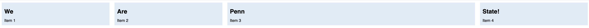
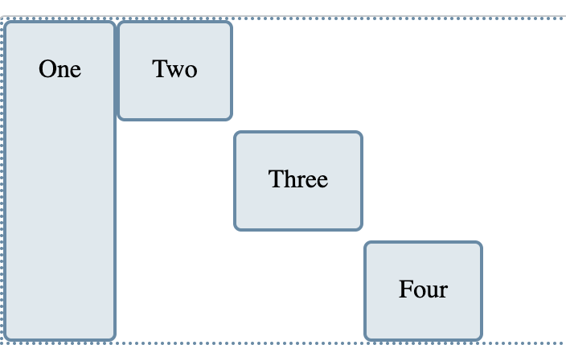

## HCDD 340
### Flexbox

---


## Recap from last class

* Box model
* Layout flow
* Float
* Positioning
* Flexbox

---

### Everything displayed in CSS is a [box]{.t-salmon}!

---

### The Box Model

* Each element has a rectangular box
    - text
    - elements that looks circular


---

### How does the box model work?
#### It is all box stacking

* Putting boxes together to show the page

* Outer display type
    - How boxes are laid out in relation to other boxes

* Inner display type
    - How elements within the box are laid out

---

### [Block]{.t-salmon} boxes
#### `<h1>`, `<p>`, ...

* The box will break into a new line
* If width is not specified
    - will use up available space within parent

---

### [Inline]{.t-salmon} boxes
#### `<span>`, `<a>`, ...

* The box will **not** break into a new line
* `width` and `height` can't be set
* If there is no space, then the overflow will continue to a new line

---

### [Inline Block]{.t-salmon} boxes
* The box will **not** break into a new line
* But, you can set `width` and `height`

---


### Box model areas

{style="max-width:500px"}

:::{.t-ref}
[Source](https://web.dev/learn/css/box-model)

:::

---

### Controlling the box areas

::::{.columns}

:::: {.column width="70%"}
* `height` and `width`
    - applies to `content` box
* `padding` and `border`
    - adds to `content` box sizes
* `margin` does **not** count to box size
    - it is the outside space
:::


:::: {.column width="30%"}

:::
::::

:::{.t-ref}
[Source](https://web.dev/learn/css/box-model)
:::

---


#### What's the total height and width here?

```css
.box {
  width: 350px;
  height: 150px;
  margin: 10px;
  padding: 25px;
  border: 5px solid black;
}
```
:::{.t-ref}
[Source](https://developer.mozilla.org/en-US/docs/Learn_web_development/Core/Styling_basics/Box_model#the_standard_css_box_model)
:::

---

#### What's the total height and width here?

::::{.columns}

:::: {.column width="60%"}
```css
.box {
  width: 350px;
  height: 150px;
  margin: 10px;
  padding: 25px;
  border: 5px solid black;
}
```
:::


:::: {.column width="40%"}

:::
::::

* Width: 410px
    - 350 + 25 * 2 + 5 * 2
* Height: 210px
    - 150 + 25 * 2 + 5 * 2


:::{.t-ref}
[Source](https://developer.mozilla.org/en-US/docs/Learn_web_development/Core/Styling_basics/Box_model#the_standard_css_box_model)
:::

---

### This default rule is 👎🏾
#### Inconvenient to add padding and border to get actual box size

---

### Alternative box model
#### `box-sizing: border-box;`
* Height and width applies to **the box**
    - instead of the content

* Border and padding get _pushed in_
    - content = box - (border + height)

* More predictable

---


### What's the total height and width here?

::::{.columns}

:::: {.column width="60%"}
```css{line-numbers="2"}
.box {
  box-sizing: border-box;
  width: 350px;
  height: 150px;
  margin: 10px;
  padding: 25px;
  border: 5px solid black;
}
```
:::


:::: {.column width="40%"}

:::
::::

* Width = 350px
* Height = 150px

---

#### Alternative box model is more common

```css
html {
  box-sizing: border-box;
}

*,
*::before,
*::after {
  box-sizing: inherit;
}
```


:::{.t-ref}
* [CSS Tricks](https://css-tricks.com/inheriting-box-sizing-probably-slightly-better-best-practice/)
* [Resets](https://piccalil.li/blog/a-more-modern-css-reset/)
:::

---

## Recap from last class

* Box model
* Layout flow
* [**Float**]{.t-salmon}
* Positioning
* Flexbox

---

## Float

* Takes an element out of the normal box stacking flow
* Places it left or right side of the parent
* Other inline elements will "float" ("wrap") around it
    - Mostly for image and text

---

## Recap from last class
* Box model
* Layout flow
* Float
* [**Positioning**]{.t-salmon}
* Flexbox

---

## Positioning

* Mostly for elements out of the normal flow. E.g.,
    - Adding a caption on top of an image
    - Fixed tab header
    - Image that overlays over other elements

* Options
    - static (default), absolute, fixed, sticky

---

## [Relative]{.t-salmon} Position

* Element placed following the normal flow
* You can move the final position
    - `top`, `bottom`, `left`, `right` values

---


## [Absolute]{.t-salmon} Position
* Element moves **out** of the normal flow
* Sits on a separate flow
    - great for isolated UI features
        + tab controls, menus, ...

* `top`, `bottom`, `left`, `right` values
    - placement within the `container` element

---

## [Absolute]{.t-salmon} Position
### What's the container element

* Any ancestor element with their `position` [**explicitly defined**]{.t-salmon}
    - Default is the `<html>` element

---

## [Fixed]{.t-salmon} Position
### Fixed in relation to the viewport

* Persistent element always visible

---

## Recap from last class
* Box model
* Layout flow
* Float
* Positioning
* [**Flexbox**]{.t-salmon}

---

### Flexible Box Layout model
### Modern approach to layout

```css {data-line-numbers="2"}
section {
  display: flex;
}
```

---

## Flexbox

* Single dimension layout
* Arrange items in rows or columns

---

## Flex model
::::{.columns}
:::{.column width="60%"}
* Main axis
    - Direction of how items are laid out
    - row or column
* Cross axis
    - The other direction
* Parent element
    - with `display: flex`
:::

:::{.column width="40%"}

:::

::::

:::{.t-ref}
[Source](https://developer.mozilla.org/en-US/docs/Learn_web_development/Core/CSS_layout/Flexbox)
:::

---

## Main axis direction
### Default is row

```css
/* Set main axis to column */
flex-direction: column;
```

---

## Wrapping
### Items overflow by default

{ style="max-width: 540px"}

Not good for most cases

:::{.t-ref}
[Source](https://web.dev/learn/css/flexbox#wrapping_flex_items)
:::

---

## Wrapping to next line
### `flex-wrap: wrap;`

::::{.columns}

:::{.column width="50%"}


:::

:::{.column width="50%"}

:::
::::

:::{.t-ref}
[Source](https://web.dev/learn/css/flexbox#wrapping_flex_items)
:::

---

## flex-flow shorthand

::::{.columns}

:::{.column width="45%"}
```css
flex-direction: row;
flex-wrap: wrap;
```

:::

:::{.column style="width:10%; align-self: flex-end;"}
## =
:::
:::{.column style="width:45%; align-self: flex-end;"}
```css
flex-flow: row wrap;
```
:::
::::

:::{.t-ref}
[Source](https://developer.mozilla.org/en-US/docs/Learn_web_development/Core/CSS_layout/Flexbox#flex-flow_shorthand)
:::

---

## Flexible sizing of items
### A key advantage!

* Allows responsive design

---

## Flexible sizing of items
### `flex`: proportion values

* How much available space an item will take
    - **compared** to other flex items
    - along the main axis

---

## Flexible sizing of items
### Allows setting minimum sizes

```css
/* at least 100 px */
flex: 1 100px;
```

---

### `flex: auto`

* Absorbs available space
* Shrinks to minimum size when necessary

:::{.t-ref}
[Source](https://developer.mozilla.org/en-US/docs/Web/CSS/flex#examples)
:::

---

## Todo from last class

* In Activity-04
* Make [**Penn**]{.t-salmon} take 1/3 of all space
    - Each item should be at least 150px wide

---

### Todo from last class





---

### Two steps

::::{.columns }
:::{.column width="50%"}
```css {data-line-numbers="1,2"}
article {
    flex: 1 150px;
}
```
Set minimum width for all
:::

:::{.column width="50%"}
```css
article:nth-of-type(3) {
    flex: 3 150px;
}

```
Update `flex` for 3rd item
:::

::::

---

## Today
* Aligning flex items
* Chrome Dev Tool for flexbox

---

### Aligning flex items
#### Across [cross]{.t-salmon} or main axis

:::{ style="background-color: #fdf6e3"}

{style="max-width: 640px"}

:::

:::{.t-ref}
[Source](https://developer.mozilla.org/en-US/docs/Web/CSS/CSS_flexible_box_layout/Aligning_items_in_a_flex_container)
:::

---

### Aligning flex items on cross axis
#### `align-items`

* applies to all flex items as a group

* `stretch`: fills the parent
* `center`: centers the items
* Other options
    - `flex-start`, `flex-end`, `start`, `end`, ...

---

## Todo
* Go [here](https://developer.mozilla.org/en-US/play?uuid=4d653c42-c21b-46fe-8e01-189ee491eed1&state=bZA%2Fb8IwEMW%2FyilSF9Q0MFC1aYTUdu2WoQuLE1%2FiA8dG%2FlOSIr57LwSqDEy23%2FN7%2FvlOiQqdTvKkkPSz2RqAooohWLMpO9JYZNfT3PkSsVV3nW8y%2B7tGqVxs7zofOvp5WZFNIMljUnvPYJWVA5zGSGNNSBvBXEMOXhifenTUvI3ekWRQObwuHy7HTvTpTXpeHvqr6FoyOaxYABGDZfW8Nfze1K%2BQWhVG%2F5aorJPoWOGAt5okVFrU%2Byk3Ic%2FQPP0i3325hjUZTP87n9ZzztX6YSrJFvAuJQw2Omg09pXt4bMsoUJtj0zkEBbZjFGSP2jB%2Fx8vXxqFptakFLDzOdRoArqLvos%2BUDOkNaOxyhM7iBpT4Ww0cnqcZ7wbR8xrUNghb%2FWIm5z%2FAA%3D%3D&srcPrefix=%2Fen-US%2Fdocs%2FLearn_web_development%2FCore%2FCSS_layout%2FFlexbox%2F)
* Update `align-items`
    - `stretch`, `center`, `start`, and `end`


:::{.fragment .fade-in}
* Now set `flow-direction` to be [`column`]{.t-salmon}
    * Update `align-items` as before
    * **What changes? Why?**
:::

---

### Aligning one item
#### `align-self`
* `align-self` applies to a [**single**]{.t-salmon} item
    - values similar to `align-items`
        + `stretch`, `center`, `start`,  `end`, ...

---

## Todo

::::{.columns}

:::{.column width="50%"}


* Go [here](https://developer.mozilla.org/en-US/play?uuid=73be846f-78eb-4c16-8784-ecbcd5c1e225&state=bZBBU8MgEIX%2Fyg4ndUya1rFjY83Rq5cecyGwDSiBDBCN0%2Bl%2FF8Kk06inZR5veR%2FvRITvFCnJnstPYIo691KTxow1qWoNEOXqTeN%2BFQ8X5fBllspl1aFC5pGH%2FYOw%2BHvx1Qx2luZJ7glzLjDkIRdO0dsYy9GWsOlH4MaH98C2zc1uC%2BuHHay3T7fP0cal6xX9LuGocJwUqmSrM%2Bmxc0nNnKfWT3cCZSt8eLQo%2Bug%2B13pKjPgplbKP1ppB84wZZUL%2BMhRWUOSbFH1N6IyS%2FwMmV2Ypl0MAeuwTZU85l7qNKAuSCu7Ko7TOZ0xIxRNV%2BlLo9ViC8xY9E1cr%2BVz4XzND7dEmb%2Bj4PVYcphfYYTiq2AY5%2FwA%3D&srcPrefix=%2Fen-US%2Fdocs%2FWeb%2FCSS%2FCSS_flexible_box_layout%2FAligning_items_in_a_flex_container%2F)

* Align "Four" to the end
:::

:::{.column width="50%"}

:::

::::

:::{.fragment .fade-in}
Change `flex-direction` to `column`. What happens?
:::

---

### Wrapping
### Distribution of space between lines

* `align-content` determines space **between** flex lines
* [**Only**]{.t-salmon} applicable when wrapping happens
* Options
    - `space-between`, `space-around`, `space-evenly`, `center`, `start`, ...
    - See [here](https://developer.mozilla.org/en-US/docs/Web/CSS/align-content)

---

### Todo

* Go [here](https://developer.mozilla.org/en-US/play?uuid=51eade2c-d49f-40d3-8bc7-2415f41c4a1d&state=pZHBTsMwDIZfxcqJIbqtG5tYGL3BlQMce0kb0waypEqytWjau5O0dIhoF4QiJdaf39Zn%2B0hqt5OEki0XBygls%2FYhJ4XucpLlCiDI2bPC7SwEZ%2BW11bFSG4xdT3pvYkkcYteL6GIFD6gi7VFUtRu18SU3pLTW0089MRyDuRXc1RRuV%2FOmuw9CoQ1HQ2HRdMC1c8jBVMXVZg3pcgPp%2Bm7S27iwjWSfFN4kDokhSFrDGgrh7rUaAwaF5Xwsz6SoVFJq5VD5D9uwEpMCXYuovOGUq1z1dBlcD4QN41yoyhNdQrRaisuEgysxjIu9pbAak1n5URm9V9xTSO3L%2FE6GGcyni8m5JQppON8N%2FPCF%2FR%2F%2FWvBf5PEgTv1C38M%2B%2Fetq3KEPZZg4OX0B&srcPrefix=%2Fen-US%2Fdocs%2FWeb%2FCSS%2FCSS_flexible_box_layout%2FAligning_items_in_a_flex_container%2F)

* Update `align-content`:
    - `center`, `end`, `space-around`

---

### Aligning flex items
#### Across cross or [main]{.t-salmon} axis

:::{ style="background-color: #fdf6e3"}
{style="max-width: 640px"}
:::

:::{.t-ref}
[Source](https://developer.mozilla.org/en-US/docs/Web/CSS/CSS_flexible_box_layout/Aligning_items_in_a_flex_container)
:::

---

### Aligning flex items on main axis
#### `justify-content`

* Similar to `align-content`
    - for space distribution [**across main axis**]{.t-salmon}
    - same values


---

### Todo

* Go [here](https://developer.mozilla.org/en-US/play?uuid=8f108ea5-1b8e-4f4e-9555-371d148d430f&state=bY%2FNTsMwEIRfZeUTINI%2FREVNyZErF46%2BOPY2cXFty%2BvQVFXfHbsQJEpPuxp9M7N7ZF3aWcbZWptPUFYSvQjW%2BEGwWjiAItdvDtfTsvwq73t%2FqXQRL6lX38dRGie7Z4ooF05yCRwLqw0FKw8cNhaH56Jse0pmc6iUdwld4kBBKqwaTHtEd0YaHzVGDoswgPYpoYbYNjerJcwfVjBfPt1m7CSccOeiGu6%2By4LU2rg2G2dh%2BJdE3pprQSNVRalNTxweR7NUH230vdP5WOtzzF8zTGE2Wfzckn%2FfltfzTB3uMK%2FWtF1ipy8%3D&srcPrefix=%2Fen-US%2Fdocs%2FWeb%2FCSS%2FCSS_flexible_box_layout%2FAligning_items_in_a_flex_container%2F)
* Update `justify-content`
    - `start`, `end`, `center`, `space-around`

---

### Gaps between rows and columns
#### `gap` property: row-gap column-gap

::::{.columns}

:::{.column width="45%"}
```css{data-line-numbers="5"}
section {
    display: flex;
    flex-flow: row wrap;
    align-items: center;
    gap: 10px 35px;
    justify-content: space-between;
    height: 600px;
}
```
* row gap: 10px
* column gap: 35px
:::

:::{.column width="55%"}

:::
::::

---

### `auto` margins for main axis alignment

* `auto` margin takes up [**as much space as possible**]{.t-salmon}
* you can use it to group elements

---

### `auto` margins for main axis alignment

![[`margin-left: auto`]{.t-salmon} for `d`](images/auto-margin.png)

:::{.t-ref}
[Source](https://developer.mozilla.org/en-US/play?uuid=ed3bcae8-86ee-4465-8645-ca5939f53408&state=bZDNTsMwEIRfZeUTIJL%2BICrqlhx75cLRFyd2bVPHtmynBFV9d2xCIhF62tVo5tPsXpCMrUYY7Zk6Q6NpCK8E1bYnqCIGIMvVm%2BH7RV4m5f3TzhXp%2Bcw14VwXZOIdbOdnqYM6T6FxokfUhJAqlakGXLKXqeA0%2FcJw1LzfZaW2nnGPYe16YDZGzsCL%2Bm67gdXTFlabl%2FtkuxJDzA%2BlgoeB5ChjyogUXLr%2FpGC1ugUaXYWnTHUBw%2FMYps1JeNsZVjRW24T5G4YFLMv1b5cy%2F2Go0VIvlCk0P0YMtIt2cKTTP%2FLlaUbJW55WrYSM6PoN&srcPrefix=%2Fen-US%2Fdocs%2FWeb%2FCSS%2FCSS_flexible_box_layout%2FAligning_items_in_a_flex_container%2F)
:::

---

### Todo

* Go [here](https://developer.mozilla.org/en-US/play?uuid=ed3bcae8-86ee-4465-8645-ca5939f53408&state=bZDNTsMwEIRfZeUTIJL%2BICrqlhx75cLRFyd2bVPHtmynBFV9d2xCIhF62tVo5tPsXpCMrUYY7Zk6Q6NpCK8E1bYnqCIGIMvVm%2BH7RV4m5f3TzhXp%2Bcw14VwXZOIdbOdnqYM6T6FxokfUhJAqlakGXLKXqeA0%2FcJw1LzfZaW2nnGPYe16YDZGzsCL%2Bm67gdXTFlabl%2FtkuxJDzA%2BlgoeB5ChjyogUXLr%2FpGC1ugUaXYWnTHUBw%2FMYps1JeNsZVjRW24T5G4YFLMv1b5cy%2F2Go0VIvlCk0P0YMtIt2cKTTP%2FLlaUbJW55WrYSM6PoN&srcPrefix=%2Fen-US%2Fdocs%2FWeb%2FCSS%2FCSS_flexible_box_layout%2FAligning_items_in_a_flex_container%2F)

* Set `left-margin` to [`auto`]{.t-salmon} for `Five`
* What happens?

---

### Flexbox alignment summary

* `align-items`
    - all items as a group on the cross axis
* `align-self`
    - a single item on the cross axis
* `align-content`
    - space distribution on the cross axis
* `justify-content`
    - space distribution on the main axis

---

### Todo
* Go to [Flexbox Froggy](https://flexboxfroggy.com/)
* Work with your group to complete the levels
    - Feel free to use LLM as well

---

## Today
* Aligning flex items
* [**Chrome Dev Tool for flexbox**]{.t-salmon}

---

### Chrome Dev Tools

[Inspect and debug CSS flexbox layouts](https://developer.chrome.com/docs/devtools/css/flexbox)

---

## Todo

* Open [Activity 04](https://github.com/hcdd-340/Activity-Fall-2025/archive/refs/tags/activity-04.0.zip) in Chrome
* Open Flexbox editor and change:
    * `flex-direction` to `column`
    * `flex-wrap` to `wrap`
    * `align-content` to `flex-end` and `center`

---

