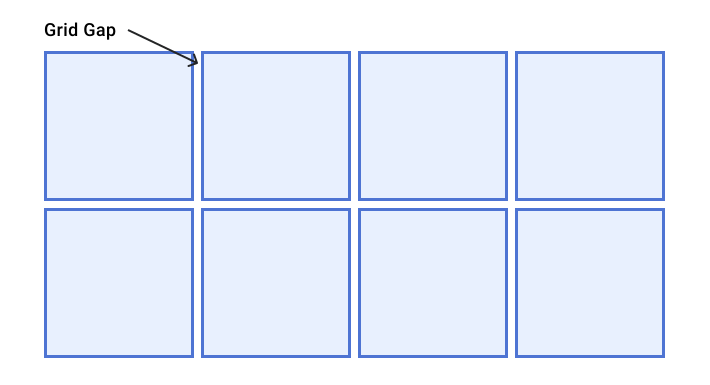

## HCDD 340
### Grid

---


## Recap from last class
* Aligning flex items
* Chrome Dev Tool for flexbox

---

### Aligning flex items
#### Across [cross]{.t-salmon} or main axis

:::{ style="background-color: #fdf6e3"}

{style="max-width: 640px"}

:::

:::{.t-ref}
[Source](https://developer.mozilla.org/en-US/docs/Web/CSS/CSS_flexible_box_layout/Aligning_items_in_a_flex_container)
:::

---

### Aligning flex items on cross axis
#### `align-items`

* applies to all flex items as a group

* `stretch`: fills the parent
* `center`: centers the items
* Other options
    - `flex-start`, `flex-end`, `start`, `end`, ...

---

### Aligning one item
#### `align-self`
* `align-self` applies to a [**single**]{.t-salmon} item
    - values similar to `align-items`
        + `stretch`, `center`, `start`,  `end`, ...

---

### Wrapping
### Distribution of space between lines

* `align-content` determines space **between** flex lines
* [**Only**]{.t-salmon} applicable when wrapping happens
* Options
    - `space-between`, `space-around`, `space-evenly`, `center`, `start`, ...
    - See [here](https://developer.mozilla.org/en-US/docs/Web/CSS/align-content)

---

### Aligning flex items
#### Across cross or [main]{.t-salmon} axis

:::{ style="background-color: #fdf6e3"}
{style="max-width: 640px"}
:::

:::{.t-ref}
[Source](https://developer.mozilla.org/en-US/docs/Web/CSS/CSS_flexible_box_layout/Aligning_items_in_a_flex_container)
:::

---

### Aligning flex items on main axis
#### `justify-content`

* Similar to `align-content`
    - for space distribution [**across main axis**]{.t-salmon}
    - same values


---

### Gaps between rows and columns
#### `gap` property: row-gap column-gap

::::{.columns}

:::{.column width="45%"}
```css{data-line-numbers="5"}
section {
    display: flex;
    flex-flow: row wrap;
    align-items: center;
    gap: 10px 35px;
    justify-content: space-between;
    height: 600px;
}
```
* row gap: 10px
* column gap: 35px
:::

:::{.column width="55%"}

:::
::::

---

### `auto` margins for main axis alignment

* `auto` margin takes up [**as much space as possible**]{.t-salmon}
* you can use it to group elements

---

### `auto` margins for main axis alignment

![[`margin-left: auto`]{.t-salmon} for `d`](images/auto-margin.png)

:::{.t-ref}
[Source](https://developer.mozilla.org/en-US/play?uuid=ed3bcae8-86ee-4465-8645-ca5939f53408&state=bZDNTsMwEIRfZeUTIJL%2BICrqlhx75cLRFyd2bVPHtmynBFV9d2xCIhF62tVo5tPsXpCMrUYY7Zk6Q6NpCK8E1bYnqCIGIMvVm%2BH7RV4m5f3TzhXp%2Bcw14VwXZOIdbOdnqYM6T6FxokfUhJAqlakGXLKXqeA0%2FcJw1LzfZaW2nnGPYe16YDZGzsCL%2Bm67gdXTFlabl%2FtkuxJDzA%2BlgoeB5ChjyogUXLr%2FpGC1ugUaXYWnTHUBw%2FMYps1JeNsZVjRW24T5G4YFLMv1b5cy%2F2Go0VIvlCk0P0YMtIt2cKTTP%2FLlaUbJW55WrYSM6PoN&srcPrefix=%2Fen-US%2Fdocs%2FWeb%2FCSS%2FCSS_flexible_box_layout%2FAligning_items_in_a_flex_container%2F)
:::

---

### Flexbox alignment summary

* `align-items`
    - all items as a group on the cross axis
* `align-self`
    - a single item on the cross axis
* `align-content`
    - space distribution on the cross axis
* `justify-content`
    - space distribution on the main axis

---

## Recap from last class
* Aligning flex items
* [**Chrome Dev Tool for flexbox**]{.t-salmon}

---


### Chrome Dev Tools
#### Flexbox editor

::::{.columns style="align-items: center"}
:::{.column width="45%"}

:::


:::{.column width="45%"}

:::
::::

:::{.t-ref}
[Source](https://developer.chrome.com/docs/devtools/css/flexbox)
:::

---


## Today
### Grid

---

## Grid
* Two dimensional layout
* You can place item to specific location
* Items can be aligned within their area

---

### Grid or flexbox? 🧐

* How to choose between grid or flexbox?
* No specific rules
    - Depends on the tasks
* Comparison between grid or flexbox
    - [Grid](https://developer.mozilla.org/en-US/docs/Web/CSS/CSS_grid_layout/Relationship_of_grid_layout_with_other_layout_methods)
    - [Flexbox](https://developer.mozilla.org/en-US/docs/Web/CSS/CSS_flexible_box_layout/Relationship_of_flexbox_to_other_layout_methods#flexbox_and_grid_layout)

---

### Grid terminologies

* Lines
* Tracks
* Cells
* Gaps

---

### Grid Lines

::::{.columns}

:::{.column width="65%"}
* Horizontal and vertical lines
* Line number starts from **one**
    - follows writing mode
    - script direction
:::

:::{.column width="35%"}

:::

::::

For English, column number is 1 on the **left**

:::{.t-ref}
[Source](https://web.dev/learn/css/grid#grid_terminology)
:::

---

### Tracks


::::{.columns}

:::{.column width="65%"}
* Space between two grid lines
* Row tracks
    - between two row lines
* Column tracks
    - between two column lines
:::

:::{.column width="35%"}

:::

::::

:::{.t-ref}
[Source](https://web.dev/learn/css/grid#grid_terminology)
:::

---

### Cell

::::{.columns}

:::{.column width="65%"}
* Smallest intersection area between rows and columns
* Similar to a table or spreadsheet cell
:::

:::{.column width="35%"}

:::

::::

:::{.t-ref}
[Source](https://web.dev/learn/css/grid#grid_terminology)
:::

---


### Area

::::{.columns}

:::{.column width="65%"}
* Spanned over multiple cells
:::

:::{.column width="35%"}

:::

::::

:::{.t-ref}
[Source](https://web.dev/learn/css/grid#grid_terminology)
:::


---

### Gaps

::::{.columns}

:::{.column width="65%"}
* Gutter or alley
    - between cells
* Can't place an item in a gap
:::

:::{.column width="35%"}

:::

::::

:::{.t-ref}
[Source](https://web.dev/learn/css/grid#grid_terminology)
:::

---


### Grid


```css {data-line-numbers="2"}
.container {
    display: grid;
    grid-template-columns: 5em 100px 30%;
    grid-template-rows: 200px auto;
}
```

Creates a new grid

---

### Grid columns

```css {data-line-numbers="3"}
.container {
    display: grid;
    grid-template-columns: 5em 100px 30%;
    grid-template-rows: 200px auto;
}
```

3 column tracks with different sizes

---

### Grid rows

```css {data-line-numbers="4"}
.container {
    display: grid;
    grid-template-columns: 5em 100px 30%;
    grid-template-rows: 200px auto;
}
```


2 row tracks with different sizes

---


## Todo


* Open [Activity 05](https://github.com/hcdd-340/Activity-Fall-2025/archive/refs/tags/activity-05.0.zip) in a browser
* Dev Tools --> Layout --> Grid
* Select `div.container`


{style="max-width: 300px"}

---


## Todo

* Change `styles.css`
* 2 x 2 grid


{style="max-width: 200px"}

---

### `fr` unit
* One **fraction** of the available space
* Allows flexible sizing

---

### Todo
* Go to [the example](https://developer.mozilla.org/en-US/play?uuid=3bae3f1e-f12d-4c7b-9f4d-d11896459179&state=ZZBBT4QwEIX%2FyqQnNxGFms1qWTl69aBHLoUWGC0taQuy2ex%2Ft0VZEzw0M%2Fn6%2BvpmzqTzvSKMHAVOUCvu3HNJaqM9Ry1tSYpSA8TL4lXL431sruT9y2xJZ%2BVW9WJGu0U4bVVvOG%2BJnKRe2VrJLamdC3krI05wjuImhE0a3qM6MXBcu8RJi01e6kup766jQAFxxOVJZayQNrFc4OgY7Ic5j3jgQqBuGWTpL6l4%2FdlaM2qR1EYZy8C21Q1ND0AfKFCa7vI%2FPwZ0mMEZhWKRHZ4ge9wH1WH3L8wSQ6AbFA%2BpW4tiMYpN4mUfsJfxy7HXIWDW2PX8OIU1fMQthOo72cvQKmw7Ty7f&srcPrefix=%2Fen-US%2Fdocs%2FLearn_web_development%2FCore%2FCSS_layout%2FGrids%2F)
* Change the window size
    - `iPad` and `iPhone`
* What happens?

---


### Todo
* Go to [the example](https://developer.mozilla.org/en-US/play?uuid=3bae3f1e-f12d-4c7b-9f4d-d11896459179&state=ZZBBT4QwEIX%2FyqQnNxGFms1qWTl69aBHLoUWGC0taQuy2ex%2Ft0VZEzw0M%2Fn6%2BvpmzqTzvSKMHAVOUCvu3HNJaqM9Ry1tSYpSA8TL4lXL431sruT9y2xJZ%2BVW9WJGu0U4bVVvOG%2BJnKRe2VrJLamdC3krI05wjuImhE0a3qM6MXBcu8RJi01e6kup766jQAFxxOVJZayQNrFc4OgY7Ic5j3jgQqBuGWTpL6l4%2FdlaM2qR1EYZy8C21Q1ND0AfKFCa7vI%2FPwZ0mMEZhWKRHZ4ge9wH1WH3L8wSQ6AbFA%2BpW4tiMYpN4mUfsJfxy7HXIWDW2PX8OIU1fMQthOo72cvQKmw7Ty7f&srcPrefix=%2Fen-US%2Fdocs%2FLearn_web_development%2FCore%2FCSS_layout%2FGrids%2F)
* Make the first track twice the size
    - What should be the `fr` values?


{style="max-width: 440px"}


---

### `repeat` function

```css
/* equivalent rules */
grid-template-columns: 1fr 1fr 1fr;

grid-template-columns: repeat(3, 1fr);
```

---

### `repeat` function

* Two arguments
    - Number of times to repeat
    - Entity to repeat


---

### How many columns here?

```css
grid-template-columns: 200px repeat(2, 1fr 2fr) 100px;
```

---


### Todo
* Go to [the example](https://developer.mozilla.org/en-US/play?uuid=3bae3f1e-f12d-4c7b-9f4d-d11896459179&state=ZZBBT4QwEIX%2FyqQnNxGFms1qWTl69aBHLoUWGC0taQuy2ex%2Ft0VZEzw0M%2Fn6%2BvpmzqTzvSKMHAVOUCvu3HNJaqM9Ry1tSYpSA8TL4lXL431sruT9y2xJZ%2BVW9WJGu0U4bVVvOG%2BJnKRe2VrJLamdC3krI05wjuImhE0a3qM6MXBcu8RJi01e6kup766jQAFxxOVJZayQNrFc4OgY7Ic5j3jgQqBuGWTpL6l4%2FdlaM2qR1EYZy8C21Q1ND0AfKFCa7vI%2FPwZ0mMEZhWKRHZ4ge9wH1WH3L8wSQ6AbFA%2BpW4tiMYpN4mUfsJfxy7HXIWDW2PX8OIU1fMQthOo72cvQKmw7Ty7f&srcPrefix=%2Fen-US%2Fdocs%2FLearn_web_development%2FCore%2FCSS_layout%2FGrids%2F)
* Change grid columns:

```css
grid-template-columns: 200px repeat(2, 1fr 2fr) 100px;
```

---

### How many columns here?

```css
grid-template-columns: 200px repeat(2, 1fr 2fr) 100px;
```

* 6 columns
    - 200px, 1fr, 2fr, 1fr, 2fr, 100px
* You can mix `repeat` with other sizes

---

### `minmax` function
* Sets a minimum and maximum size for a track
* Adapts to different screen sizes

---

### `minmax` for responsive design
#### `minmax(auto, 1fr);`

Take at least minimum of content width but grow if there is space

---

### Create as many columns as possible
* A common pattern
* Can't pre-specify the number of columns
    - available space is different across devices

* Use `auto-fit`

---

### Create as many columns as possible
#### Using `auto-fit`

```css
.container {
    display: grid;
    grid-template-columns: repeat(auto-fit, minmax(230px, 1fr));
}
```


---

## Todo

* Open [Activity 05](https://github.com/hcdd-340/Activity-Fall-2025/archive/refs/tags/activity-05.0.zip) in a browser
* Update `styles.css`

```css
.container {
    display: grid;
    grid-template-columns: repeat(auto-fit, minmax(230px, 1fr));
    grid-template-rows: 200px auto;
    gap: 10px;
}
```

:::{.fragment .fade-in}
What changes between `iPad` and `iPhone` displays?
:::


