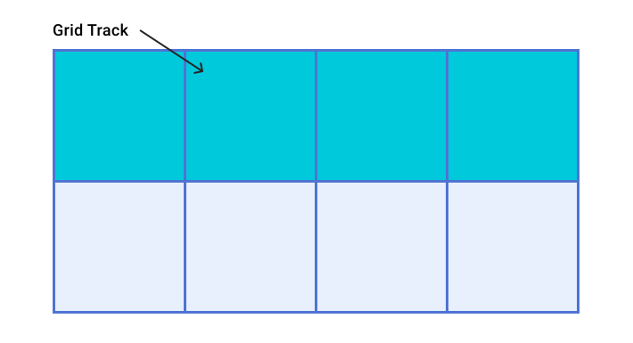
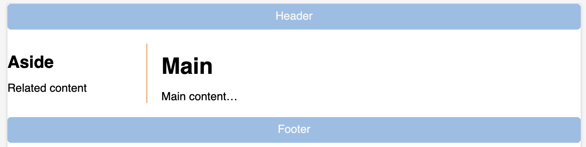

## HCDD 340
### Grid II

---


## Recap from last class
* Grid terminologies

---

## Grid
* Two dimensional layout
* You can place item to specific location
* Items can be aligned within their area

---

### Grid terminologies

* Lines
* Tracks
* Cells
* Gaps

---

### Grid Lines

::::{.columns}

:::{.column width="65%"}
* Horizontal and vertical lines
* Line number starts from **one**
    - follows writing mode
    - script direction
:::

:::{.column width="35%"}

:::

::::

For English, column number is 1 on the **left**

:::{.t-ref}
[Source](https://web.dev/learn/css/grid#grid_terminology)
:::

---

### Tracks


::::{.columns}

:::{.column width="65%"}
* Space between two grid lines
* Row tracks
    - between two row lines
* Column tracks
    - between two column lines
:::

:::{.column width="35%"}

:::

::::

:::{.t-ref}
[Source](https://web.dev/learn/css/grid#grid_terminology)
:::

---

### Cell

::::{.columns}

:::{.column width="65%"}
* Smallest intersection area between rows and columns
* Similar to a table or spreadsheet cell
:::

:::{.column width="35%"}

:::

::::

:::{.t-ref}
[Source](https://web.dev/learn/css/grid#grid_terminology)
:::

---


### Area

::::{.columns}

:::{.column width="65%"}
* Spanned over multiple cells
:::

:::{.column width="35%"}

:::

::::

:::{.t-ref}
[Source](https://web.dev/learn/css/grid#grid_terminology)
:::


---

### Gaps

::::{.columns}

:::{.column width="65%"}
* Gutter or alley
    - between cells
* Can't place an item in a gap
:::

:::{.column width="35%"}

:::

::::

:::{.t-ref}
[Source](https://web.dev/learn/css/grid#grid_terminology)
:::

---


### Grid


```css {data-line-numbers="2"}
.container {
    display: grid;
    grid-template-columns: 5em 100px 30%;
    grid-template-rows: 200px auto;
}
```

Creates a new grid

---

### Grid columns

```css {data-line-numbers="3"}
.container {
    display: grid;
    grid-template-columns: 5em 100px 30%;
    grid-template-rows: 200px auto;
}
```

3 column tracks with different sizes

---

### Grid rows

```css {data-line-numbers="4"}
.container {
    display: grid;
    grid-template-columns: 5em 100px 30%;
    grid-template-rows: 200px auto;
}
```


2 row tracks with different sizes

---

### How many columns here?

```css
grid-template-columns: 200px repeat(2, 1fr 2fr) 100px;
```

* 6 columns
    - 200px, 1fr, 2fr, 1fr, 2fr, 100px
* You can mix `repeat` with other sizes

---

### `minmax` function
* Sets a minimum and maximum size for a track
* Adapts to different screen sizes

---

### `minmax` for responsive design
#### `minmax(auto, 1fr);`

Take at least minimum of content width but grow if there is space

---

### Create as many columns as possible
* A common pattern
* Can't pre-specify the number of columns
    - available space is different across devices

* Use `auto-fit`

---

### Create as many columns as possible
#### Using `auto-fit`

```css
.container {
    display: grid;
    grid-template-columns: repeat(auto-fit, minmax(230px, 1fr));
}
```


---


### `repeat` function

```css
/* equivalent rules */
grid-template-columns: 1fr 1fr 1fr;

grid-template-columns: repeat(3, 1fr);
```

---

### `repeat` function

* Two arguments
    - Number of times to repeat
    - Entity to repeat

---

### `fr` unit
* One **fraction** of the available space
* Allows flexible sizing

---

## Today

* Placing items in grids

---

### Auto placement (default)

* Items are placed one per cell
* In the same order as in the code
* Default placement is along the rows
    - For column placement:
        + `grid-auto-flow: column;`

---

## Todo
* Open [Activity 05](https://github.com/hcdd-340/Activity-Fall-2025/archive/refs/tags/activity-05.0.zip)
* Place items along the column

---

### Line based placement

* Placing items on specific lines
* For English, column number is 1 on the **left**

{style="max-width: 440px"}


:::{.t-ref}
[Source](https://web.dev/learn/css/grid#grid_terminology)
:::

---


### Line based placement
#### Start and end lines for an item

* `grid-column-start`
* `grid-column-end`
* `grid-row-start`
* `grid-row-end`

---

### Line based placement
#### Start and end lines for an item

```css
.item {
/* start at column line 1 */
grid-column-start: 1;

 /* end at column line 4 */
grid-column-end: 4;

 /*start at row line 2 */
grid-row-start: 2;

/* end at row line 4 */
grid-row-end: 4; 
}
```

---


### Shorthand for line placement

* `grid-column`
    + `grid-column-start` **/** `grid-column-end`

* `grid-row`
    + `grid-row-start` **/** `grid-row-end`


---

### Shorthand for line placement


:::{.columns style="align-items: center"}

:::{.column width="48%"}

```css
.item {
    grid-column-start: 1;
    grid-column-end: 4;

    grid-row-start: 2;
    grid-row-end: 4; 
}
```
:::

:::{.column width="4%"}
[**=**]{.t-salmon}
:::

:::{.column width="48%"}
```css
.item {
    grid-column: 1 / 4;
    grid-row: 1 / 4;
}
```
:::
::::

---

## Todo

* Open [Activity 06](https://github.com/hcdd-340/Activity-Fall-2025/archive/refs/tags/activity-06.0.zip)
* Update `grid-column` and `grid-row`

:::{width="50%"}

:::

:::{.t-ref}
[Source](https://developer.mozilla.org/en-US/docs/Learn_web_development/Core/CSS_layout/Grids)
:::

---

#### Negative number for line placement
* You can use negative number
* -1: the end column or row
    - count inwards using negative values

---

## Todo

* Open [Activity 06](https://github.com/hcdd-340/Activity-Fall-2025/archive/refs/tags/activity-06.0.zip)
* Update `grid-column` and `grid-row`
    - using [**negative**]{.t-salmon} values

:::{width="50%"}

:::

:::{.t-ref}
[Source](https://developer.mozilla.org/en-US/docs/Learn_web_development/Core/CSS_layout/Grids)
:::

---

### `grid-template-areas`

* Name areas of the grid
* Place items onto those named areas
* Very useful

---

### `grid-template-areas`

::::{.columns}

:::{.column width="50%"}
```css
.container {
    display: grid;
    grid-template-columns:
        repeat(4,1fr);
    grid-template-areas:
        "h h h h"
        "s c c c"
        "s f f f";
}
```
:::

:::{.column width="50%"}
```css
header {
    grid-area: h;
}

.sidebar {
    grid-area: s;
}

.content {
    grid-area: c;
}

footer {
    grid-area: f;
}
```
:::

::::

---


### `grid-template-areas`

* Every cell must be filled
* repeating name will span cells
* `.` (period) is for empty cell

---

## Todo

* Open [Activity 07](https://github.com/hcdd-340/Activity-Fall-2025/archive/refs/tags/activity-07.0.zip)
* Add `grid-template-areas`

:::{width="50%"}

:::

:::{.t-ref}
[Source](https://developer.mozilla.org/en-US/docs/Learn_web_development/Core/CSS_layout/Grids)
:::

---

## Todo

:::{width="50%"}

:::


`.` (period) is for empty cell

---

### Aligning items in Grid
#### Similar to flexbox!

* Column axis alignment
    - `align-self` and `align-items`
* Row axis alignment
    - `justify-items` and `justify-self`

:::{.t-ref}
[Source](https://developer.mozilla.org/en-US/docs/Web/CSS/CSS_grid_layout/Box_alignment_in_grid_layout#center_an_item_in_the_area)
:::

---

## Nesting grids

* Making a child item a `subgrid`
    - `display: grid`
    - Define other grid properties (columns, rows, ...)

* See an example [here](https://developer.mozilla.org/en-US/play?uuid=bd19e424-151f-436d-b8e8-8af0db8bd168&state=rVNLbtswEL0KwXUUxU67UVUBQTZdZ60NTY4kNhRJkHTtwjCQ0%2FRgPUmHHzl2k6ZF0NVwfm8e%2BYYHOoVZ0Ya2Qn4jXDHvP%2FeUGx2Y1OB62vWakHYCJsB1X5Jp6%2BKm1IyF6YRn5oLkCoob%2B1bdXY4RowEbV885293jGNDh59OPtrYLRn0J8iZm2Jn%2Fjzk5eAfTtj49RMu8FKdZ07q7iz5CrpeY7R5AsQCC8Ay8oCLmqbcdjAn4ytm0dXF73daoFVp6Rbn3qN31SS9yiJ0DutXAZqm%2BN8Qz7SsPTg6fYk5IbxXD%2BOikSJF4qALMNjKquFHbWfuGrAZHbgeXS5htyPrG7tE79jrLf9XrTCkP3RiHwcoxIbfY%2FjEVE2KZEFKPiHdTIhvGH0dntlrEYcY1xMEGOGd266yCVFMSu0kG8LN5zNEA%2B1AxJUfdEI6vBu6cT6aRbsMcsIbkcC5Jz3pJVI5TQFp2T7xRUrzC4gwrtm9YATu%2F9llNDueS3yX527NHBN%2Fk9ehpuVA2PV3ChcSyNM%2BJQiibnr5T1rjALy5VZv3T7jizwwkf8oTLKRJFcjIUMcpXO%2FxhQZJAyOwNaV7dtmP6E1%2Fjl0AbJpgBjyoKTY%2B%2FAA%3D%3D&srcPrefix=%2Fen-US%2Fdocs%2FLearn_web_development%2FCore%2FCSS_layout%2FGrids%2F)

---

## Todo

* Go to [Grid Garden](https://cssgridgarden.com/)
* Complete levels
    + Discuss with your group members

---

## Assignment 2

* Will be published tomorrow
* Due by September 30th

---
