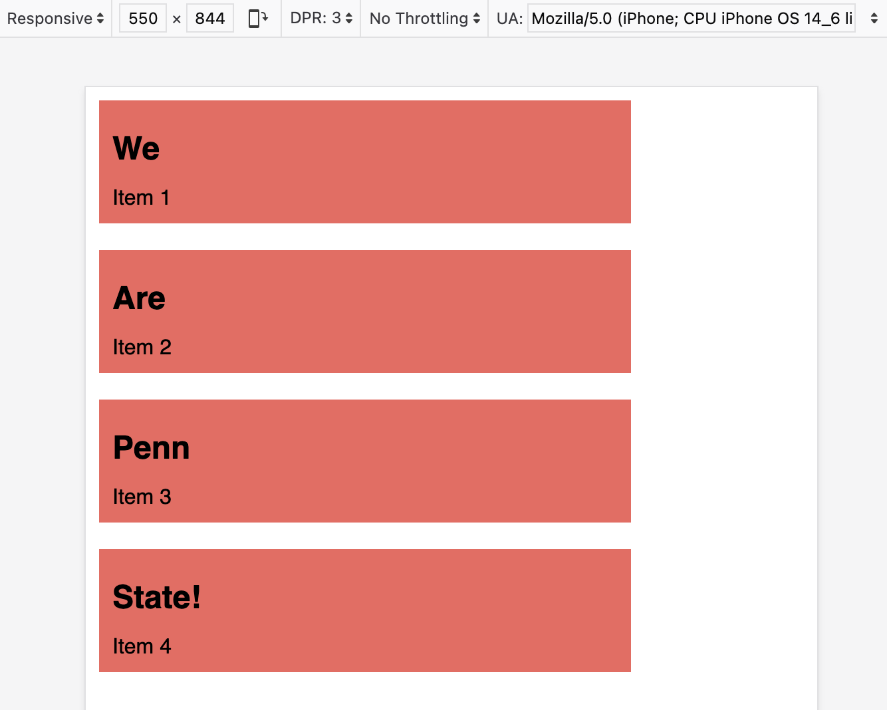
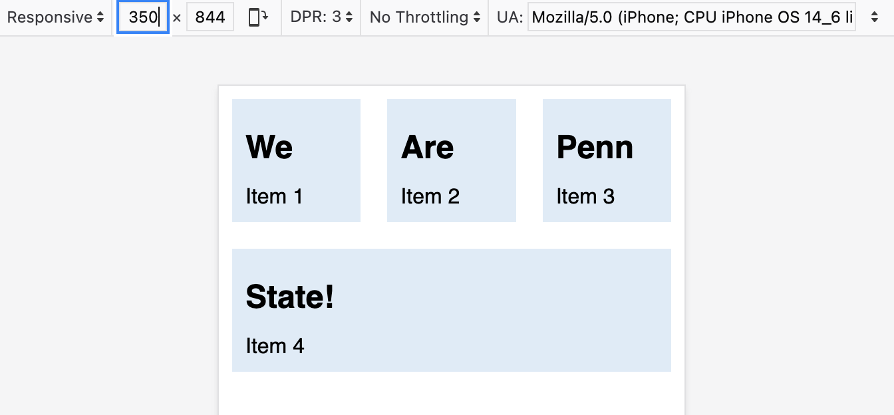
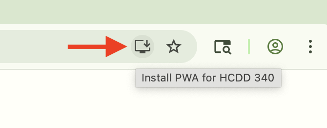
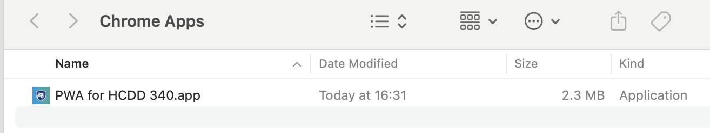
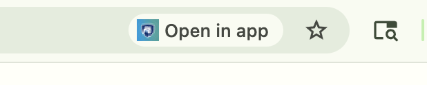
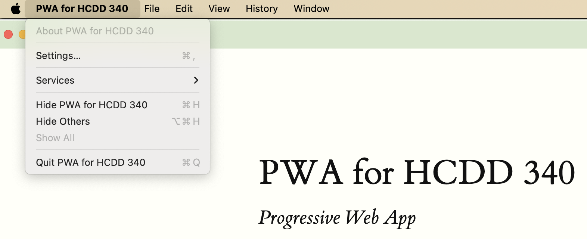
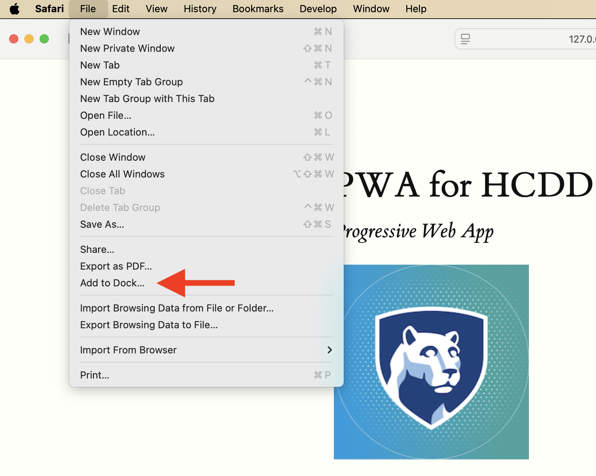

## Responsive Design & PWA Manifest

---

## Recap from last class

* Placing items in grids

---

### Auto placement (default)

* Items are placed one per cell
* In the same order as in the code
* Default placement is along the rows
    - For column placement:
        + `grid-auto-flow: column;`

---

### Line based placement

* Placing items on specific lines
* For English, column number is 1 on the **left**

{style="max-width: 440px"}


:::{.t-ref}
[Source](https://web.dev/learn/css/grid#grid_terminology)
:::

---


### Line based placement
#### Start and end lines for an item

* `grid-column-start`
* `grid-column-end`
* `grid-row-start`
* `grid-row-end`

---

### Line based placement
#### Start and end lines for an item

```css
.item {
/* start at column line 1 */
grid-column-start: 1;

 /* end at column line 4 */
grid-column-end: 4;

 /*start at row line 2 */
grid-row-start: 2;

/* end at row line 4 */
grid-row-end: 4; 
}
```

---


### Shorthand for line placement

* `grid-column`
    + `grid-column-start` **/** `grid-column-end`

* `grid-row`
    + `grid-row-start` **/** `grid-row-end`


---

### Shorthand for line placement


:::{.columns style="align-items: center"}

:::{.column width="48%"}

```css
.item {
    grid-column-start: 1;
    grid-column-end: 4;

    grid-row-start: 2;
    grid-row-end: 4; 
}
```
:::

:::{.column width="4%"}
[**=**]{.t-salmon}
:::

:::{.column width="48%"}
```css
.item {
    grid-column: 1 / 4;
    grid-row: 2 / 4;
}
```
:::
::::

---

#### Negative number for line placement
* You can use negative number
* -1: the end column or row
    - count inwards using negative values

---

### `grid-template-areas`

* Name areas of the grid
* Place items onto those named areas
* Very useful

---

### `grid-template-areas`

::::{.columns}

:::{.column width="50%"}
```css
.container {
    display: grid;
    grid-template-columns:
        repeat(4,1fr);
    grid-template-areas:
        "h h h h"
        "s c c c"
        "s f f f";
}
```
:::

:::{.column width="50%"}
```css
header {
    grid-area: h;
}

.sidebar {
    grid-area: s;
}

.content {
    grid-area: c;
}

footer {
    grid-area: f;
}
```
:::

::::

---


### `grid-template-areas`

* Every cell must be filled
* repeating name will span cells
* `.` (period) is for empty cell

---


### Aligning items in Grid
#### Similar to flexbox!

* Column axis alignment
    - `align-self` and `align-items`
* Row axis alignment
    - `justify-items` and `justify-self`

:::{.t-ref}
[Source](https://developer.mozilla.org/en-US/docs/Web/CSS/CSS_grid_layout/Box_alignment_in_grid_layout#center_an_item_in_the_area)
:::

---

## Nesting grids

* Making a child item a `subgrid`
    - `display: grid`
    - Define other grid properties (columns, rows, ...)

* See an example [here](https://developer.mozilla.org/en-US/play?uuid=bd19e424-151f-436d-b8e8-8af0db8bd168&state=rVNLbtswEL0KwXUUxU67UVUBQTZdZ60NTY4kNhRJkHTtwjCQ0%2FRgPUmHHzl2k6ZF0NVwfm8e%2BYYHOoVZ0Ya2Qn4jXDHvP%2FeUGx2Y1OB62vWakHYCJsB1X5Jp6%2BKm1IyF6YRn5oLkCoob%2B1bdXY4RowEbV885293jGNDh59OPtrYLRn0J8iZm2Jn%2Fjzk5eAfTtj49RMu8FKdZ07q7iz5CrpeY7R5AsQCC8Ay8oCLmqbcdjAn4ytm0dXF73daoFVp6Rbn3qN31SS9yiJ0DutXAZqm%2BN8Qz7SsPTg6fYk5IbxXD%2BOikSJF4qALMNjKquFHbWfuGrAZHbgeXS5htyPrG7tE79jrLf9XrTCkP3RiHwcoxIbfY%2FjEVE2KZEFKPiHdTIhvGH0dntlrEYcY1xMEGOGd266yCVFMSu0kG8LN5zNEA%2B1AxJUfdEI6vBu6cT6aRbsMcsIbkcC5Jz3pJVI5TQFp2T7xRUrzC4gwrtm9YATu%2F9llNDueS3yX527NHBN%2Fk9ehpuVA2PV3ChcSyNM%2BJQiibnr5T1rjALy5VZv3T7jizwwkf8oTLKRJFcjIUMcpXO%2FxhQZJAyOwNaV7dtmP6E1%2Fjl0AbJpgBjyoKTY%2B%2FAA%3D%3D&srcPrefix=%2Fen-US%2Fdocs%2FLearn_web_development%2FCore%2FCSS_layout%2FGrids%2F)

---

## Today
* Responsive design
* PWA manifest
* Assignment 2

---


### Responsive Web Design (RWD)

> "Create a layout that can _respond_ to any device being used"

:::{.t-ref}
[Source](https://developer.mozilla.org/en-US/docs/Learn_web_development/Core/CSS_layout/Responsive_Design)
:::

---

### Responsive Web Design (RWD)

* Devices have different display sizes
    * Phones, tablets, laptops, ultra wide monitors
* Your web app should be *responsive* to different displays

---


### Responsive Web Design (RWD)
* Fluid layout
* Responsive images and  media
* Media queries

:::{.t-ref}
[Source](https://developer.mozilla.org/en-US/docs/Learn_web_development/Core/CSS_layout/Responsive_Design)
:::

---

### Responsive Web Design (RWD)
#### Fluid layout

* Default width in mobile browser: **980 px**
    - Due to historical reasons

* What if the device width [**≠**]{.t-salmon} 980 px?
    - Applies the default width
    - Then, scale down to the actual device width

* Not responsive design

:::{.t-ref}
[Source](https://web.dev/learn/design/intro#a_meta_element_for_viewport)
:::

---

### Responsive Web Design (RWD)
#### `meta` element for `viewport`

```html
<meta name="viewport"
    content="width=device-width, initial-scale=1">
```

* Open [Penn State website](https://www.psu.edu/)
* Open Dev Tools
    - Check `<head> ... </head>`
    - `meta` element for `viewport`?

---

#### `meta` element for `viewport`

```html
<meta name="viewport"
    content="width=device-width, initial-scale=1">
```

Prevents the default scaling

---

#### `meta` element for `viewport`

```html
<meta name="viewport"
    content="width=device-width, initial-scale=1">
```

* `width=device-width`
    + Website width is the same as the device width
    + i.e., not necessarily 980 px
* `initial-scale=1`
    + don't do any scaling
    + not necessary for responsive design


---


#### `meta` element for `viewport`

{style="max-width: 440px"}

:::{.t-ref}
[Source](https://web.dev/learn/design/intro#a_meta_element_for_viewport)
:::

---

### Responsive Web Design (RWD)
#### Fluid layout

* Flexbox
* Grid

---

### Responsive Web Design (RWD)
* Fluid layout
* [**Responsive images and media**]{.t-salmon}
* Media queries

---

### Responsive images and media

```css
img {
    max-inline-size: 100%;
}
```
Should be contained within their container

---

### Responsive images
#### Common pattern

```css
img {
    /* Contained within the parent */
    max-inline-size: 100%;

    /* aspect ratio is maintained */
    block-size: auto;

    /* crop the image if needed to
    preserve aspect ratio */
    object-fit: cover;

    /* How to crop (i.e., where is the
    most important part) */

    object-position: top center;
}
```


:::{.t-ref}
[Source](https://web.dev/learn/design/responsive-images)
:::

---


### Responsive images
#### `srcset`

* Same image but with different sizes
    - Saves data and loading time for small devices

* Resources
    - [Responsive images with `srcset`](https://web.dev/learn/design/responsive-images#srcset)
    - [Resolution switching: Different sizes](https://developer.mozilla.org/en-US/docs/Web/HTML/Guides/Responsive_images#resolution_switching_different_sizes)

---

### Responsive Web Design (RWD)
* Fluid layout
* Responsive images and media
* [**Media queries**]{.t-salmon}

---

## Media queries

* Selectively apply CSS rules
    - For different device properties ("query")

* `@media type and (feature)`
    + type: all (default), print, screen

---

## Media queries

```css

body {
  color: black;
  background-color: grey;
}

@media print {
  body {
    background-color: transparent;
  }
}
```

Transparent background when **printing**

:::{.t-ref}
[Source](https://web.dev/learn/design/media-queries)
:::

---

## Media queries

```css
@media (orientation: landscape) {
   /* Styles for landscape mode. */
}

@media (orientation: portrait) {
   /* Styles for portrait mode. */
}
```

:::{.t-ref}
[Source](https://web.dev/learn/design/media-queries)
:::

---

## Todo 

* Go [here](https://codepen.io/web-dot-dev/pen/qBXVowV)
* Select iPhone mode [Chrome](https://developer.chrome.com/docs/devtools/device-mode/) or [Firefox](https://firefox-source-docs.mozilla.org/devtools-user/responsive_design_mode/index.html)
* Rotate the device (button on the top bar)
* What happens?

---


### Check media query
#### [CSS](https://codepen.io/web-dot-dev/pen/qBXVowV)

```css
@media screen and (orientation: landscape) {
  body::after {
    content: "Landscape";
  }
}

@media screen and (orientation: portrait) {
  body::after {
    content: "Portrait";
  }
}
```

:::{.t-ref}
[Source](https://web.dev/learn/design/media-queries)
:::

---

## Media queries

### `min-width`

```css
@media (min-width: 400px) {
  /* Styles for viewports wider than 400 pixels. */
}
```

:::{.t-ref}
[Source](https://web.dev/learn/design/media-queries)
:::

---

## Media queries
### `<=`

```css
@media (width <= 400px) {
  /* Styles for viewports narrower than 400 pixels. */
}
```

:::{.t-ref}
[Source](https://web.dev/learn/design/media-queries)
:::

---

### Combining media queries
#### `and`

```css
@media (min-width: 50em) and (max-width: 60em) {
  /* Styles for viewports
     wider than 50em
     and narrower than 60em. /*
}
```

:::{.t-ref}
[Source](https://web.dev/learn/design/media-queries)
:::

---

### Combining media queries

```css
@media (50em <= width <=60em) {
  /* Styles for viewports
     wider than 50em
     and narrower than 60em. */
}
```

:::{.t-ref}
[Source](https://web.dev/learn/design/media-queries)
:::

---


### Combining media queries
#### `or` and `not`

```css
@media not ((width >= 30em) or (orientation: landscape)) {
  /* These styles won't be shown
     if the viewport is wider than 30em,
     or if the orientation is landscape. */
  .navlist {
    flex-direction: column;
  }
}
```

:::{.t-ref}
[Source](https://web.dev/learn/design/media-queries)
:::

---

## Todo

* Go to [Activity 08](https://github.com/hcdd-340/Activity-Fall-2025/archive/refs/tags/activity-08.0.zip)
* For devices with width between 500px and 600px
    - Set `article` background to be `#F2665E`


{style="max-width: 440px"}

---

## Todo
* What happens when device width is less than 400px?
* Can you fix that using `media` query?

---

### Strategy

* For device width less than 400px
    - Remove `min-width` (using `unset`)
    - Add `flex: 1` (flexible sizing)


{style="max-width: 440px"}


---

## Todo
* What happens when device width is less than 400px?
* Can you fix that using `media` query?

---

## Today

* Responsive design
* [**PWA manifest**]{.t-salmon}
* Assignment 2

---

## Progressive Web Apps

* User experience like a platform-specific app
* Installable

---

## Manifest in PWA

* A JSON file
* Information about the app
    - name, icons, ...
* Required for installation

---

## Manifest in PWA

```json
{
  "short_name": "CT",
  "start_url": "/",
  "icons": [
    {
      "src": "icon-512.png",
      "sizes": "512x512"
    }
  ],
  "display": "standalone"
}
```

:::{.t-ref}
[Source](https://developer.mozilla.org/en-US/docs/Web/Progressive_web_apps/Tutorials/CycleTracker/Manifest_file)
:::

---

## Todo
* Open [Activity 09](https://github.com/hcdd-340/Activity-Fall-2025/archive/refs/tags/activity-09.0.zip) in VS Code
* Copy the URL from Live Preview
* Open the URL in Chrome

---

## Todo

:::{.columns}
:::{.column}

:::
::::

Install the PWA in Chrome

---

## PWA Installed

:::{.columns}
:::{.column}

:::
::::

---


## Todo

* Copy the URL from Live Preview
* Open the URL in Chrome
* It will prompt to open the app

{style="max-inline-size: 440px"}

---

### Settings similar to native apps

{style="max-inline-size: 440px"}

---

## Uninstall the app
{style="max-inline-size: 440px"}

---

### Edge
* You can install using Safari and Edge as well


* Open [Activity 09](https://github.com/hcdd-340/Activity-Fall-2025/archive/refs/tags/activity-09.0.zip) in VS Code
* Copy the URL from Live Preview
* Edge uses similar steps to Chrome

---

### Safari


{style="max-inline-size: 440px"}

File --> Add to Dock

---

### PWA Installability

* Different browsers can have different requirements


---

### Must have a manifest
```html
<link rel="manifest" href="manifest.json" />
```

Each page must link to a manifest file

:::{.t-ref}
[Source](https://developer.mozilla.org/en-US/docs/Web/Progressive_web_apps/Guides/Making_PWAs_installable#required_manifest_members)
:::

---

### Manifest must have
* For Chromium-based browsers
    * `name` or `short_name`
    * A 192px and a 512px icon
    * `start_url`
    * `display`

:::{.t-ref}
[Source](https://developer.mozilla.org/en-US/docs/Web/Progressive_web_apps/Guides/Making_PWAs_installable#required_manifest_members)
:::


---

### PWA Installability
#### https or localhost

* Must be served:
    - over https
    - or, `localhost` (or `127.0.0.1`)
* If you open `index.html` directly in Chrome, it won't be installable
* That's why we are using Live Preview URLs

---

## Todo

* Open [Activity 09](https://github.com/hcdd-340/Activity-Fall-2025/archive/refs/tags/activity-09.0.zip) in VS Code
* Copy the URL from Live Preview
* Open the URL in Chrome
* DevTools --> Application --> Manifest
* Where are these values coming from?

---


## Todo

* Change the theme color
    - #F2665E
* Install the app

:::{.t-ref}
[Theme color](https://developer.mozilla.org/en-US/docs/Web/Progressive_web_apps/Manifest/Reference/theme_color)
:::

---

## Todo
* Uninstall the app
* Can you change the background color?
    - #96BEE6
 
:::{.t-ref}
[Background color](https://developer.mozilla.org/en-US/docs/Web/Progressive_web_apps/Manifest/Reference/background_color)
:::

---


## Today
* Responsive design
* PWA manifest
* [**Assignment 2**]{.t-salmon}

---

## Assignment 2

[Details](https://hcdd-340.github.io/Fall-2025/assignments/assignment-02/hcdd-340-assignment-02-2025-09-19.html)

---


