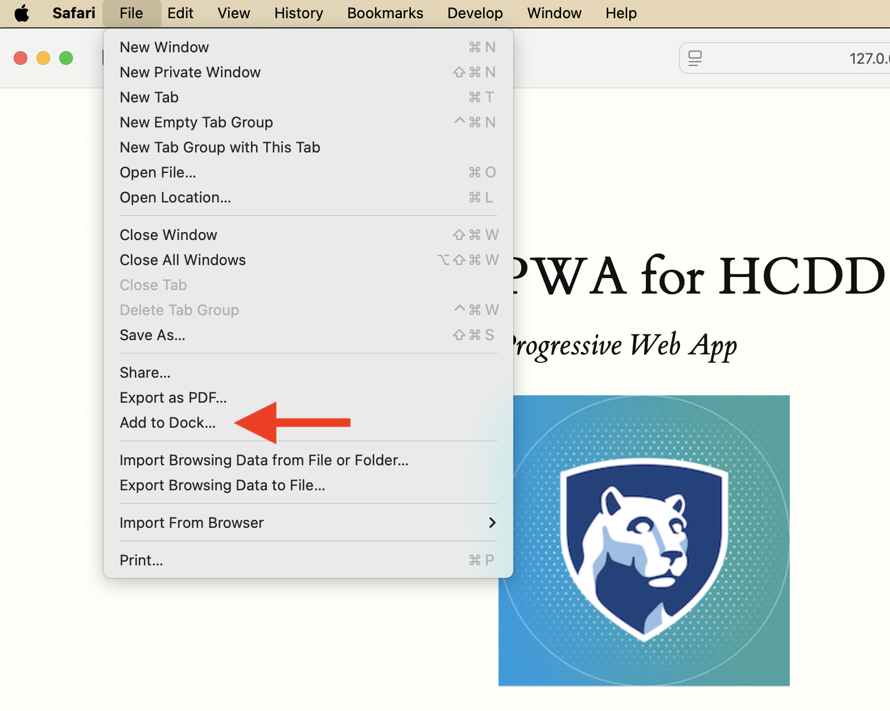

## JS I

---

## Recap from last class
* Responsive design
* PWA manifest

---

### Responsive Web Design (RWD)
* Fluid layout
* Responsive images and  media
* Media queries

:::{.t-ref}
[Source](https://developer.mozilla.org/en-US/docs/Learn_web_development/Core/CSS_layout/Responsive_Design)
:::

---

#### `meta` element for `viewport`

```html
<meta name="viewport"
    content="width=device-width, initial-scale=1">
```

Prevents the default scaling

---

#### `meta` element for `viewport`

```html
<meta name="viewport"
    content="width=device-width, initial-scale=1">
```

* `width=device-width`
    + Website width is the same as the device width
    + i.e., not necessarily 980 px
* `initial-scale=1`
    + don't do any scaling
    + not necessary for responsive design


---


#### `meta` element for `viewport`

{style="max-width: 440px"}

:::{.t-ref}
[Source](https://web.dev/learn/design/intro#a_meta_element_for_viewport)
:::

---

### Responsive Web Design (RWD)
#### Fluid layout

* Flexbox
* Grid

---

### Responsive Web Design (RWD)
* Fluid layout
* [**Responsive images and media**]{.t-salmon}
* Media queries

---

### Responsive images and media

```css
img {
    max-inline-size: 100%;
}
```
Should be contained within their container

---

### Responsive images
#### Common pattern

```css
img {
    /* Contained within the parent */
    max-inline-size: 100%;

    /* aspect ratio is maintained */
    block-size: auto;

    /* crop the image if needed to
    preserve aspect ratio */
    object-fit: cover;

    /* How to crop (i.e., where is the
    most important part) */

    object-position: top center;
}
```


:::{.t-ref}
[Source](https://web.dev/learn/design/responsive-images)
:::

---


### Responsive images
#### `srcset`

* Same image but with different sizes
    - Saves data and loading time for small devices

* Resources
    - [Responsive images with `srcset`](https://web.dev/learn/design/responsive-images#srcset)
    - [Resolution switching: Different sizes](https://developer.mozilla.org/en-US/docs/Web/HTML/Guides/Responsive_images#resolution_switching_different_sizes)

---

### Responsive Web Design (RWD)
* Fluid layout
* Responsive images and media
* [**Media queries**]{.t-salmon}

---

## Media queries

* Selectively apply CSS rules
    - For different device properties ("query")

* `@media type and (feature)`
    + type: all (default), print, screen

---

## Media queries

```css

body {
  color: black;
  background-color: grey;
}

@media print {
  body {
    background-color: transparent;
  }
}
```

Transparent background when **printing**

:::{.t-ref}
[Source](https://web.dev/learn/design/media-queries)
:::

---

## Media queries

```css
@media (orientation: landscape) {
   /* Styles for landscape mode. */
}

@media (orientation: portrait) {
   /* Styles for portrait mode. */
}
```

:::{.t-ref}
[Source](https://web.dev/learn/design/media-queries)
:::

---

## Media queries


### `min-width`

```css
@media (min-width: 400px) {
  /* Styles for viewports wider than 400 pixels. */
}
```

:::{.t-ref}
[Source](https://web.dev/learn/design/media-queries)
:::

---

## Media queries
### `<=`

```css
@media (width <= 400px) {
  /* Styles for viewports narrower than 400 pixels. */
}
```

:::{.t-ref}
[Source](https://web.dev/learn/design/media-queries)
:::

---

### Combining media queries
#### `and`

```css
@media (min-width: 50em) and (max-width: 60em) {
  /* Styles for viewports
     wider than 50em
     and narrower than 60em. /*
}
```

:::{.t-ref}
[Source](https://web.dev/learn/design/media-queries)
:::

---

### Combining media queries

```css
@media (50em <= width <=60em) {
  /* Styles for viewports
     wider than 50em
     and narrower than 60em. */
}
```

:::{.t-ref}
[Source](https://web.dev/learn/design/media-queries)
:::

---


### Combining media queries
#### `or` and `not`

```css
@media not ((width >= 30em) or (orientation: landscape)) {
  /* These styles won't be shown
     if the viewport is wider than 30em,
     or if the orientation is landscape. */
  .navlist {
    flex-direction: column;
  }
}
```

:::{.t-ref}
[Source](https://web.dev/learn/design/media-queries)
:::

---


## Recap from last class
* Responsive design
* [**PWA manifest**]{.t-salmon}

---

## Progressive Web Apps

* User experience like a platform-specific app
* Installable

---

## Manifest in PWA

* A JSON file
* Information about the app
    - name, icons, ...
* Required for installation

---

## Manifest in PWA

```json
{
  "short_name": "CT",
  "start_url": "/",
  "icons": [
    {
      "src": "icon-512.png",
      "sizes": "512x512"
    }
  ],
  "display": "standalone"
}
```

:::{.t-ref}
[Source](https://developer.mozilla.org/en-US/docs/Web/Progressive_web_apps/Tutorials/CycleTracker/Manifest_file)
:::

---

## Installation
* Copy the URL from Live Preview (VS Code)
* Open the URL in Chrome

---

## Installation

:::{.columns}
:::{.column}

:::
::::

Install the PWA in Chrome

---

## PWA Installed

:::{.columns}
:::{.column}

:::
::::

---


### Settings similar to native apps

{style="max-inline-size: 440px"}

---

## Uninstall the app
{style="max-inline-size: 440px"}

---

### Edge
* You can install using Safari and Edge as well
* Copy the URL from Live Preview
* Edge uses similar steps to Chrome

---

### Safari


{style="max-inline-size: 440px"}

File --> Add to Dock

---

### PWA Installability

* Different browsers can have different requirements


---

### Must have a manifest
```html
<link rel="manifest" href="manifest.json" />
```

Each page must link to a manifest file

:::{.t-ref}
[Source](https://developer.mozilla.org/en-US/docs/Web/Progressive_web_apps/Guides/Making_PWAs_installable#required_manifest_members)
:::

---

### Manifest must have
* For Chromium-based browsers
    * `name` or `short_name`
    * A 192px and a 512px icon
    * `start_url`
    * `display`

:::{.t-ref}
[Source](https://developer.mozilla.org/en-US/docs/Web/Progressive_web_apps/Guides/Making_PWAs_installable#required_manifest_members)
:::


---

### PWA Installability
#### https or localhost

* Must be served:
    - over https
    - or, `localhost` (or `127.0.0.1`)
* If you open `index.html` directly in Chrome, it won't be installable
* That's why we are using Live Preview URLs

---

## Todo

* Open [Activity 09](https://github.com/hcdd-340/Activity-Fall-2025/archive/refs/tags/activity-09.0.zip) in VS Code
* Copy the URL from Live Preview
* Open the URL in Chrome
* DevTools --> Application --> Manifest

---

## Todo

* How does the app change for different `display` values?
    - `standalone`
    - `minimal-ui`
    - `fullscreen`
    - `browser`

:::{.t-ref}
[Display](https://developer.mozilla.org/en-US/docs/Web/Progressive_web_apps/Manifest/Reference/display)
:::

---

### Media query for display mode

```css
/* app within the browser only */
@media (display-mode: browser) {
}

/* app in standalone mode */
@media (display-mode: standalone) {
}

```

---

### Media query for display mode
```css
/* All app modes */

@media (display-mode: standalone),
       (display-mode: fullscreen),
       (display-mode: minimal-ui) {
}
```

---

### Todo
#### Different UI for app vs browser

::::{.columns}
:::{.column}

:::
:::{.column}

:::
::::

---

## Hints
* `::after` the image ([example](https://codepen.io/web-dot-dev/pen/qBXVowV))
* `\A` in `content` for [a new line](https://css-tricks.com/injecting-line-break/#aa-you-can-insert-line-breaks-via-pseudo-element)


---

## Today
### JS
- Variables
- Conditionals
- Loops
- Strings
- Arrays
- Functions


---

## JS

* We will use "modern"-ish version (ES6)

---

## Great resource

[{style="max-inline-size: 240px;"}](https://eloquentjavascript.net/)

[Eloquent JavaScript](https://eloquentjavascript.net/)

---

### Variables
#### `const`, `let`, `var`
```js
const x = 1;

let y = 2;

var z = 3;
```

---

### `var`
#### Global variable

```js
var x = 1;

if (x === 1) {
  var x = 2;
  console.log(x);
  // expected output: 2
}  

console.log(x); // expected output: 2
```

---

### `let`

```js
let y = 1;

if (y === 1) {
  let y = 2;
  console.log(y);
  // expected output: 2
}  

console.log(y); // expected output: 1
```

Local variable (within the block)

---

### `const`

Once assigned, can't change values

---

### Todo

```js
const z = 1;

if (z === 1) {
  z = 2;
  console.log(z);
}  

console.log(z);
```

* Run in the DevTool Console
* What happens here?

---

## Today
### JS

- Variables
- [**Conditionals**]{.t-salmon}
- Loops
- Strings
- Arrays
- Functions

---

### Conditionals

```js
if (condition) {
  /* code to run if condition is true */
} else {
  /* run some other code instead */
}
```

---

### Equality check in JS 😬

{style="max-inline-size: 30%"}

---


### Equality check in JS

* Prefer **===** and **!==**
    - Instead of `==` and `!=`
    - [why](https://developer.mozilla.org/en-US/docs/Learn_web_development/Core/Scripting/Conditionals#a_note_on_comparison_operators)

---

### `if`-`else`

```js
if (choice === "sunny") {
    s = "Wear shorts!";
} else if (choice === "rainy") {
    s = "Take umbrella";
} else {
    s = "";
}
```

---

### Nesting `if`-`else`

```js
if (choice === "sunny") {
    if (temp >= 70) {
        s = "Wear shorts!";
    } else if (temp <= 40) {
        s = "Pants!";
    } else {
        s = "Your choice!"
    }
}
```
---

### Logical operators

* `&&` (and)
    - all conditions must be true
* `||` (or)
    - at least one condition is true
* `!` (not)
    - negate the value

:::{.t-ref}
[Source](https://developer.mozilla.org/en-US/docs/Learn_web_development/Core/Scripting/Conditionals#logical_operators_and_or_and_not)
:::

---

### Logical operators

```js
if ((choice === "sunny") && (temp >= 70)) {
    s = "Wear shorts!";
}

```
:::{.t-ref}
[Source](https://developer.mozilla.org/en-US/docs/Learn_web_development/Core/Scripting/Conditionals#logical_operators_and_or_and_not)
:::

---

## Today
### JS
- Variables
- Conditionals
- [**Loops**]{.t-salmon}
- Strings
- Arrays
- Functions

---

### Loops
#### `for`

```js
for (initializer; condition; final-expression) {
  // code to run
}
```

:::{.t-ref}
[Source](https://developer.mozilla.org/en-US/docs/Learn_web_development/Core/Scripting/Loops#the_standard_for_loop)
:::

---

### Loops
#### `for`

```js
for (let i = 1; i < 10; i++) {
  // code to run
}
```

:::{.t-ref}
[Source](https://developer.mozilla.org/en-US/docs/Learn_web_development/Core/Scripting/Loops#the_standard_for_loop)
:::

---

#### `while`

```js
initializer
while (condition) {
  // code to run

  final-expression
}
```

:::{.t-ref}
[Source](https://developer.mozilla.org/en-US/docs/Learn_web_development/Core/Scripting/Loops#while_and_do...while)
:::

---

#### `while`

```js
let N = 10;
let i = 0;

while (i < N) {
  // code to run

  i++;
}
```

:::{.t-ref}
[Source](https://developer.mozilla.org/en-US/docs/Learn_web_development/Core/Scripting/Loops#while_and_do...while)
:::

---

#### `do-while`
```js

initializer
do {
  // code to run

  final-expression
} while (condition)
```

---

#### `do-while`

```js
let N = 10;
let i = 0;

do {
  // code to run

  i++;

} while (i < N);
```

:::{.t-ref}
[Source](https://developer.mozilla.org/en-US/docs/Learn_web_development/Core/Scripting/Loops#while_and_do...while)
:::

---

## Todo

* Open [Activity 10](https://github.com/hcdd-340/Activity-Fall-2025/archive/refs/tags/activity-10.0.zip) in VS Code
    * View --> Output --> Embedded Live Preview Console
* Change `main.js`
    - Print numbers from 1 to 20; except for
    - numbers divisible by 3, print "IST!"
    - numbers divisible by 5, print "HCDD!"

:::{.t-ref}
[Source](https://eloquentjavascript.net/02_program_structure.html)
:::


---

### Hints
* You can use `for` loop
* `console.log` will print values
* `remainder` (%) operator can check for divisibility:
```js
if (X % 3 === 0){
    // divisible by 3;
}
```

---

## Todo

* What happens for **15**?

---


## Today
### JS
- Variables
- Conditionals
- Loops
- [**Strings**]{.t-salmon}
- Arrays
- Functions

---

### Strings
#### Handling text in JS

```js
const single = 'Single quotes';
const double = "Double quotes";
const backtick = `Backtick`;

console.log(single);
console.log(double);
console.log(backtick);
```

:::{.t-ref}
[Source](https://developer.mozilla.org/en-US/docs/Learn_web_development/Core/Scripting/Strings)
:::

---

## Concat strings

```js
const greeting2 = "Hello";
const name2 = "HCDD 340!";
console.log(greeting2 + ", " + name2); // "Hello, HCDD340!"
```

:::{.t-ref}
[Source](https://developer.mozilla.org/en-US/docs/Learn_web_development/Core/Scripting/Strings)
:::

---


### Template literal
* Strings declared using backticks
    * Can embed JavaScript 
    * Can span multiple lines

:::{.t-ref}
[Source](https://developer.mozilla.org/en-US/docs/Learn_web_development/Core/Scripting/Strings)
:::


---


### Template literal
#### Embed JS

* Variables or expression within `${ }`
    - Result will replace `${ }`

---

### Template literal

```js
const name = "HCDD 340";
const greeting = `Hello, ${name}`;
console.log(greeting);
```

:::{.t-ref}
[Source](https://developer.mozilla.org/en-US/docs/Learn_web_development/Core/Scripting/Strings)
:::

---

### Todo

```js
const one = "Hello, ";
const two = "how are you?";
const joined = `${one}${two}`;
console.log(joined);
```

:::{.t-ref}
[Source](https://developer.mozilla.org/en-US/docs/Learn_web_development/Core/Scripting/Strings)
:::

---

### Template literal
#### Multiline strings

```js
const newline = `One day you finally knew
what you had to do, and began,`;
console.log(newline);

/*
One day you finally knew
what you had to do, and began,
*/

```

Line breaks are maintained

:::{.t-ref}
[Source](https://developer.mozilla.org/en-US/docs/Learn_web_development/Core/Scripting/Strings)
:::


---

### Todo
```js
const college = "IST";
const score = 9;
const highestScore = 10;
const output = `I like my experience in ${college}.
    I gave it a score of ${
  (score / highestScore) * 100
}%.`;
console.log(output);
```

:::{.t-ref}
[Source](https://developer.mozilla.org/en-US/docs/Learn_web_development/Core/Scripting/Strings)
:::

---

### Strings

[Useful String methods](https://developer.mozilla.org/en-US/docs/Learn_web_development/Core/Scripting/Useful_string_methods)

---

## Today
### JS
- Variables
- Conditionals
- Loops
- Strings
- [**Arrays**]{.t-salmon}
- Functions

---

### Arrays
#### List of values

```js
const sequence = [1, 1, 2, 3, 5, 8, 13];
```

:::{.t-ref}
[Source](https://developer.mozilla.org/en-US/docs/Learn_web_development/Core/Scripting/Arrays)
:::

---

### Length

```js
const sequence = [1, 1, 2, 3, 5, 8, 13];
console.log(sequence.length);
```

:::{.t-ref}
[Source](https://developer.mozilla.org/en-US/docs/Learn_web_development/Core/Scripting/Arrays)
:::

---


### Todo
```js
const random = ["tree", 795, [0, 1, 2]];
console.log(random.length);
```

What's the output?

:::{.t-ref}
[Source](https://developer.mozilla.org/en-US/docs/Learn_web_development/Core/Scripting/Arrays)
:::


---

### Accessing items

```js
const shopping = ["bread", "milk", "cheese",
    "hummus", "noodles"];
console.log(shopping[0]);
```

Index starts at Zero

:::{.t-ref}
[Source](https://developer.mozilla.org/en-US/docs/Learn_web_development/Core/Scripting/Arrays)
:::


---

### Change items

```js
const shopping = ["bread", "milk", "cheese",
    "hummus", "noodles"];
shopping[0] = "tahini";
console.log(shopping[0]);
```


:::{.t-ref}
[Source](https://developer.mozilla.org/en-US/docs/Learn_web_development/Core/Scripting/Arrays)
:::


---

### Todo

```
const random = ["tree", 795, [0, 1, 2]];
```


Change the last item (2) to -2

---

### Adding items

* `push` --> adds at the end
* `unshift` --> add at the front

```js
const cities = ["Manchester", "Liverpool"];
cities.push("Cardiff");
console.log(cities); 
// [ "Manchester", "Liverpool", "Cardiff" ]

cities.push("Bradford", "Brighton");
console.log(cities);
// [ "Manchester", "Liverpool", "Cardiff", "Bradford", "Brighton" ]
```
:::{.t-ref}
[Source](https://developer.mozilla.org/en-US/docs/Learn_web_development/Core/Scripting/Arrays)
:::


---

### Adding items
#### `unshift`

```js
const cities = ["Manchester", "Liverpool"];
cities.unshift("Edinburgh");
console.log(cities);
// [ "Edinburgh", "Manchester", "Liverpool" ]
```

`unshift` --> add at the front

:::{.t-ref}
[Source](https://developer.mozilla.org/en-US/docs/Learn_web_development/Core/Scripting/Arrays)
:::

---

### Removing items

* `pop` --> from the end
* `shift` --> from the front

```js
const cities = ["Manchester", "Liverpool"];
const removedCity = cities.pop();
console.log(removedCity); // "Liverpool"
```

:::{.t-ref}
[Source](https://developer.mozilla.org/en-US/docs/Learn_web_development/Core/Scripting/Arrays)
:::

---

### Removing items
#### `shift`


```js
const cities = ["Manchester", "Liverpool"];
cities.shift();
console.log(cities); // [ "Liverpool" ]
```

`shift` --> from the front

:::{.t-ref}
[Source](https://developer.mozilla.org/en-US/docs/Learn_web_development/Core/Scripting/Arrays)
:::

---

### Iterating array values
#### `for` loop

```
const arr = [1, 2, 3, 4];

for (let i = 0; i < arr.length; i++) {
    console.log(arr[i]);
}

```

---

### Iterating array values
#### `for`-`of` loop

```js
for (let element of arr) {
    console.log(element);
}


```

---

### Arrays

[Useful Array methods](https://developer.mozilla.org/en-US/docs/Learn_web_development/Core/Scripting/Arrays)

---

## Today
### JS
- Variables
- Conditionals
- Loops
- Strings
- Arrays
- [**Functions**]{.t-salmon}

---

### Functions

```js
function myFunction() {
  alert("hello");
}

myFunction();
// calls the function once
```

:::{.t-ref}
[Source](https://developer.mozilla.org/en-US/docs/Learn_web_development/Core/Scripting/Functions)
:::

---

### Parameters

```js
function addition(a, b) {
    return a + b;
}

console.log(addition(1, 2));
```

---


#### Default parameters
```js
function addition(a, b=10) {
    return a + b;
}

console.log(addition(9));
console.log(addition(9, 3));
```

---

### Arrow function

```js
const myAddition = (a, b = 10) => {
    return a + b;
}

console.log(myAddition(9));

```

---

### Arrow function

```js
const oneLiner = (a, b) => a + b;
console.log(oneLiner(12, 5));
```

---


### Arrow function

```js
const noParam = () => {
    console.log("hello");
}
```
---


### Todo
* Open [Activity 11](https://github.com/hcdd-340/Activity-Fall-2025/archive/refs/tags/activity-11.0.zip) in VS Code
* Update `main.js` (see hints on line 23–27)

---

### Todo

* Add a function called `chooseCollege`
    - using arrow syntax
* When called  the function
    - it should select a random item from `colleges`
    - update the `<h4>` with the selected items

{style="max-width: 340px"}

---

## Assignment 2
### Questions?

[Details](https://hcdd-340.github.io/Fall-2025/assignments/assignment-02/hcdd-340-assignment-02-2025-09-19.html)

---


