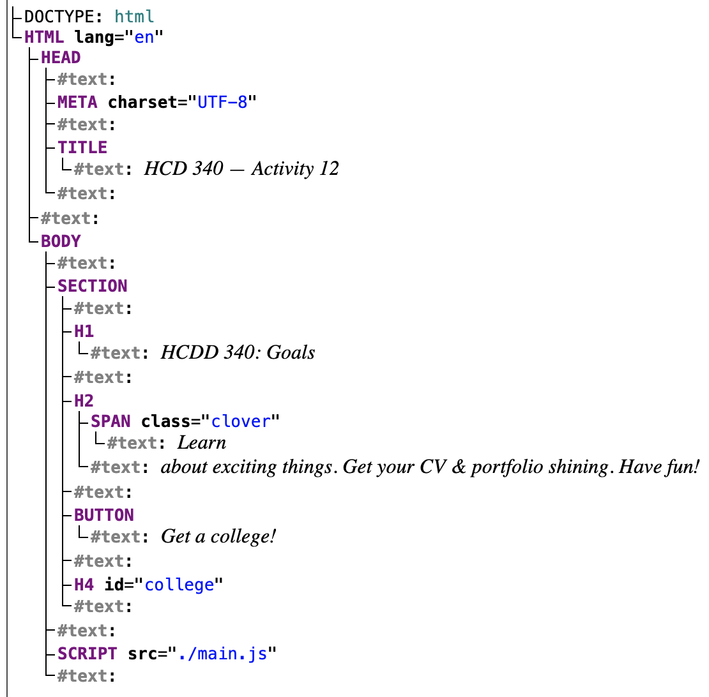
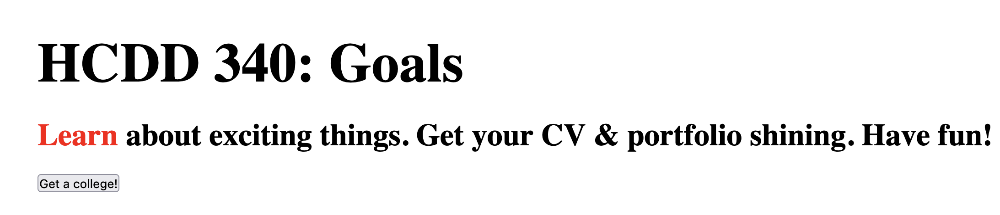

## JS II

---

## Today
* Function
* Objects
* Document Object Model (DOM)
* Events

---

## Recap from last class
- Variables
- Conditionals
- Loops
- Strings
- Arrays


---

### Variables
#### `const`, `let`, `var`
```js
const x = 1;

let y = 2;

var z = 3;
```

---

### `var`
#### Global variable

```js
var x = 1;

if (x === 1) {
  var x = 2;
  console.log(x);
  // expected output: 2
}  

console.log(x); // expected output: 2
```

---

### `let`

```js
let y = 1;

if (y === 1) {
  let y = 2;
  console.log(y);
  // expected output: 2
}  

console.log(y); // expected output: 1
```

Local variable (within the block)

---

### `const`

Once assigned, can't change values

---

### Conditionals

```js
if (condition) {
  /* code to run if condition is true */
} else {
  /* run some other code instead */
}
```

---

### Equality check in JS 😬

{style="max-inline-size: 30%"}

---


### Equality check in JS

* Prefer **===** and **!==**
    - Instead of `==` and `!=`
    - [why](https://developer.mozilla.org/en-US/docs/Learn_web_development/Core/Scripting/Conditionals#a_note_on_comparison_operators)

---

### `if`-`else`

```js
if (choice === "sunny") {
    s = "Wear shorts!";
} else if (choice === "rainy") {
    s = "Take umbrella";
} else {
    s = "";
}
```

---

### Nesting `if`-`else`

```js
if (choice === "sunny") {
    if (temp >= 70) {
        s = "Wear shorts!";
    } else if (temp <= 40) {
        s = "Pants!";
    } else {
        s = "Your choice!"
    }
}
```
---

### Logical operators

* `&&` (and)
    - all conditions must be true
* `||` (or)
    - at least one condition is true
* `!` (not)
    - negate the value

:::{.t-ref}
[Source](https://developer.mozilla.org/en-US/docs/Learn_web_development/Core/Scripting/Conditionals#logical_operators_and_or_and_not)
:::

---

### Logical operators

```js
if ((choice === "sunny") && (temp >= 70)) {
    s = "Wear shorts!";
}

```
:::{.t-ref}
[Source](https://developer.mozilla.org/en-US/docs/Learn_web_development/Core/Scripting/Conditionals#logical_operators_and_or_and_not)
:::

---

### Loops
#### `for`

```js
for (initializer; condition; final-expression) {
  // code to run
}
```

:::{.t-ref}
[Source](https://developer.mozilla.org/en-US/docs/Learn_web_development/Core/Scripting/Loops#the_standard_for_loop)
:::

---

### Loops
#### `for`

```js
for (let i = 1; i < 10; i++) {
  // code to run
}
```

:::{.t-ref}
[Source](https://developer.mozilla.org/en-US/docs/Learn_web_development/Core/Scripting/Loops#the_standard_for_loop)
:::

---

#### `while`

```js
initializer
while (condition) {
  // code to run

  final-expression
}
```

:::{.t-ref}
[Source](https://developer.mozilla.org/en-US/docs/Learn_web_development/Core/Scripting/Loops#while_and_do...while)
:::

---

#### `while`

```js
let N = 10;
let i = 0;

while (i < N) {
  // code to run

  i++;
}
```

:::{.t-ref}
[Source](https://developer.mozilla.org/en-US/docs/Learn_web_development/Core/Scripting/Loops#while_and_do...while)
:::

---

#### `do-while`
```js

initializer
do {
  // code to run

  final-expression
} while (condition)
```

---

#### `do-while`

```js
let N = 10;
let i = 0;

do {
  // code to run

  i++;

} while (i < N);
```

:::{.t-ref}
[Source](https://developer.mozilla.org/en-US/docs/Learn_web_development/Core/Scripting/Loops#while_and_do...while)
:::

---

### Strings
#### Handling text in JS

```js
const single = 'Single quotes';
const double = "Double quotes";
const backtick = `Backtick`;

console.log(single);
console.log(double);
console.log(backtick);
```

:::{.t-ref}
[Source](https://developer.mozilla.org/en-US/docs/Learn_web_development/Core/Scripting/Strings)
:::

---

## Concat strings

```js
const greeting2 = "Hello";
const name2 = "HCDD 340!";
console.log(greeting2 + ", " + name2); // "Hello, HCDD340!"
```

:::{.t-ref}
[Source](https://developer.mozilla.org/en-US/docs/Learn_web_development/Core/Scripting/Strings)
:::

---


### Template literal
* Strings declared using backticks
    * Can embed JavaScript 
    * Can span multiple lines

:::{.t-ref}
[Source](https://developer.mozilla.org/en-US/docs/Learn_web_development/Core/Scripting/Strings)
:::


---


### Template literal
#### Embed JS

* Variables or expression within `${ }`
    - Result will replace `${ }`

---

### Template literal

```js
const name = "HCDD 340";
const greeting = `Hello, ${name}`;
console.log(greeting);
```

:::{.t-ref}
[Source](https://developer.mozilla.org/en-US/docs/Learn_web_development/Core/Scripting/Strings)
:::

---

### Template literal
#### Multiline strings

```js
const newline = `One day you finally knew
what you had to do, and began,`;
console.log(newline);

/*
One day you finally knew
what you had to do, and began,
*/

```

Line breaks are maintained

:::{.t-ref}
[Source](https://developer.mozilla.org/en-US/docs/Learn_web_development/Core/Scripting/Strings)
:::


---

### Strings

[Useful String methods](https://developer.mozilla.org/en-US/docs/Learn_web_development/Core/Scripting/Useful_string_methods)

---

### Arrays
#### List of values

```js
const sequence = [1, 1, 2, 3, 5, 8, 13];
```

:::{.t-ref}
[Source](https://developer.mozilla.org/en-US/docs/Learn_web_development/Core/Scripting/Arrays)
:::

---

### Length

```js
const sequence = [1, 1, 2, 3, 5, 8, 13];
console.log(sequence.length);
```

:::{.t-ref}
[Source](https://developer.mozilla.org/en-US/docs/Learn_web_development/Core/Scripting/Arrays)
:::

---


### Accessing items

```js
const shopping = ["bread", "milk", "cheese",
    "hummus", "noodles"];
console.log(shopping[0]);
```

Index starts at Zero

:::{.t-ref}
[Source](https://developer.mozilla.org/en-US/docs/Learn_web_development/Core/Scripting/Arrays)
:::


---

### Change items

```js
const shopping = ["bread", "milk", "cheese",
    "hummus", "noodles"];
shopping[0] = "tahini";
console.log(shopping[0]);
```


:::{.t-ref}
[Source](https://developer.mozilla.org/en-US/docs/Learn_web_development/Core/Scripting/Arrays)
:::


---

### Adding items

* `push` --> adds at the end
* `unshift` --> adds at the front

```js
const cities = ["Manchester", "Liverpool"];
cities.push("Cardiff");
console.log(cities); 
// [ "Manchester", "Liverpool", "Cardiff" ]

cities.push("Bradford", "Brighton");
console.log(cities);
// [ "Manchester", "Liverpool", "Cardiff", "Bradford", "Brighton" ]
```
:::{.t-ref}
[Source](https://developer.mozilla.org/en-US/docs/Learn_web_development/Core/Scripting/Arrays)
:::


---

### Adding items
#### `unshift`

```js
const cities = ["Manchester", "Liverpool"];
cities.unshift("Edinburgh");
console.log(cities);
// [ "Edinburgh", "Manchester", "Liverpool" ]
```

`unshift` --> adds at the front

:::{.t-ref}
[Source](https://developer.mozilla.org/en-US/docs/Learn_web_development/Core/Scripting/Arrays)
:::

---

### Removing items

* `pop` --> from the end
* `shift` --> from the front

```js
const cities = ["Manchester", "Liverpool"];
const removedCity = cities.pop();
console.log(removedCity); // "Liverpool"
```

:::{.t-ref}
[Source](https://developer.mozilla.org/en-US/docs/Learn_web_development/Core/Scripting/Arrays)
:::

---

### Removing items
#### `shift`


```js
const cities = ["Manchester", "Liverpool"];
cities.shift();
console.log(cities); // [ "Liverpool" ]
```

`shift` --> from the front

:::{.t-ref}
[Source](https://developer.mozilla.org/en-US/docs/Learn_web_development/Core/Scripting/Arrays)
:::

---

### Iterating array values
#### `for` loop

```
const arr = [1, 2, 3, 4];

for (let i = 0; i < arr.length; i++) {
    console.log(arr[i]);
}

```

---

### Iterating array values
#### `for`-`of` loop

```js
for (let element of arr) {
    console.log(element);
}


```

---

### Arrays

[Useful Array methods](https://developer.mozilla.org/en-US/docs/Learn_web_development/Core/Scripting/Arrays)

---

## Today
* [**Function**]{.t-salmon}
* Object
* Document Object Model (DOM)
* Events

---

## Great resource

[{style="max-inline-size: 240px;"}](https://eloquentjavascript.net/)

[Eloquent JavaScript](https://eloquentjavascript.net/)

---

### Functions

```js
function myFunction() {
  alert("hello");
}

myFunction();
// calls the function once
```

:::{.t-ref}
[Source](https://developer.mozilla.org/en-US/docs/Learn_web_development/Core/Scripting/Functions)
:::

---

### Parameters

```js
function addition(a, b) {
    return a + b;
}

console.log(addition(1, 2));
```

---


#### Default parameters
```js
function addition(a, b=10) {
    return a + b;
}

console.log(addition(9));
console.log(addition(9, 3));
```

---

### Arrow function

```js
const myAddition = (a, b = 10) => {
    return a + b;
}

console.log(myAddition(9));

```

---

### Arrow function

```js
const oneLiner = (a, b) => a + b;
console.log(oneLiner(12, 5));
```

---


### Arrow function

```js
const noParam = () => {
    console.log("hello");
}
```

---

## Todo
* In Dev Tool --> Console
* Copy/paste `noParam` function definition
* Call the function

---

### Higher-order functions
#### Functions are regular 'values'

* Assign functions to variables
* Pass a function as an argument to another function
* Return a function from another function

---

### Higher-order functions

* Functions that
    * take other functions as arguments
    * or, return other functions

---

### Higher-order functions

```js
function repeat(n, action) {
  for (let i = 0; i < n; i++) {
    action(i);
  }
}

// Note console.log is a function
repeat(3, console.log);
```

:::{.t-ref}
[Source](https://eloquentjavascript.net/05_higher_order.html)
::::


---

### Higher-order functions

```js
function greaterThan(n) {
  return m => m > n;
}
let greaterThan10 = greaterThan(10);
console.log(greaterThan10(11));
```

:::{.t-ref}
[Source](https://eloquentjavascript.net/05_higher_order.html)
::::

---


### Todo

* Use the `repeat` function
* Add 5 elements in the `labels` array
* You can use `push` or `unshift`

```js
let labels = [];

// Add your code here
// repeat( ... )

console.log(labels);
// [ 0, 1, 2, 3, 4 ]
```

---

```js
let labels = [];

// Add your code here
repeat(5, i => {
    labels.push(i);
});

console.log(labels);
// [ 0, 1, 2, 3, 4 ]
```

---


## Today
* Function
* [**Objects**]{.t-salmon}
* Document Object Model (DOM)
* Events

---

### Objects
#### Collection of data and functions


```js
const objectName = {
  member1Name: member1Value,
  member2Name: member2Value,
  member3Name: member3Value,
};
```

:::{.t-ref}
[Source](https://developer.mozilla.org/en-US/docs/Learn_web_development/Core/Scripting/Object_basics)
:::

---

### Creating Objects


```js
const person = {
  name: ["Bob", "Smith"],
  age: 32,
  bio() {
    console.log(`${this.name[0]} is ${this.age} years old.`);
  },
  introduceSelf() {
    console.log(`Hi! I'm ${this.name[0]}.`);
  },
};
```

:::{.t-ref}
[Source](https://developer.mozilla.org/en-US/docs/Learn_web_development/Core/Scripting/Object_basics)
:::

---

#### Accessing object properties and methods

```js
person.age;
person.bio();

```

Using `dot`

:::{.t-ref}
[Source](https://developer.mozilla.org/en-US/docs/Learn_web_development/Core/Scripting/Object_basics)
:::


---

#### Accessing object properties and methods

```js

person["age"];
person["name"]["first"];
```

Using bracket


:::{.t-ref}
[Source](https://developer.mozilla.org/en-US/docs/Learn_web_development/Core/Scripting/Object_basics)
:::

---

### Todo
#### Run this code in Console
```js
const person = {
  name: ["Bob", "Smith"],
  age: 32,
  bio() {
    console.log(`${this.name[0]} is ${this.age} years old.`);
  },
  introduceSelf() {
    console.log(`Hi! I'm ${this.name[0]}.`);
  },
};
```

:::{.t-ref}
[Source](https://developer.mozilla.org/en-US/docs/Learn_web_development/Core/Scripting/Object_basics)
:::

---


### Todo
#### Run this code in Console


```js
person.name;
person.name[0];
person.age;
person.bio();
// "Bob is 32 years old."
person.introduceSelf();
// "Hi! I'm Bob."
```

:::{.t-ref}
[Source](https://developer.mozilla.org/en-US/docs/Learn_web_development/Core/Scripting/Object_basics)
:::

---

### What's `this`?

#### `this` points to current object

```js{data-line-numbers="4"}
const person = {
  // …
  introduceSelf() {
    console.log(`Hi! I'm ${this.name[0]}.`);
  },
};
```

:::{.t-ref}
[Source](https://developer.mozilla.org/en-US/docs/Learn_web_development/Core/Scripting/Object_basics)
:::

---

#### `this` points to current object
```js
const person1 = {
  name: "Chris",
  introduceSelf() {
    console.log(`Hi! I'm ${this.name}.`);
  },
};

const person2 = {
  name: "Deepti",
  introduceSelf() {
    console.log(`Hi! I'm ${this.name}.`);
  },
};
```


What will happen for `person1.introduceSelf()`?

:::{.t-ref}
[Source](https://developer.mozilla.org/en-US/docs/Learn_web_development/Core/Scripting/Object_basics)
:::

---

### Setting values
#### dot or bracket notation

```js
person.age = 45;
person["name"]["last"] = "Cratchit";
```

:::{.t-ref}
[Source](https://developer.mozilla.org/en-US/docs/Learn_web_development/Core/Scripting/Object_basics)
:::

---

### Todo
* Download [Activity 12](https://github.com/hcdd-340/Activity-Fall-2025/releases/tag/activity-12.0)
* Change `main.js`:
* `college` should be an array of objects with property `name`


---

## Today
* Function
* Objects
* [**Document Object Model (DOM)**]{.t-salmon}
* Events

---


### DOM
#### Document Object Model

* Documents are represented by DOM
* "Tree" structure
* We can select and update items in DOM


---

### DOM
#### `index.html` from the last class activity

{style="max-inline-size: 400px;"}

[Live DOM Viewer](https://software.hixie.ch/utilities/js/live-dom-viewer/?saved=14086)

---

### DOM
#### Each entry in the tree is a `node`
* Root node
    * Top node (`HTML`)
* Parent node
* Child node
* Descendant node
* Sibling node

---

### Selecting nodes
#### Using CSS selectors
* `document.querySelector` returns 
    * the first element that matches the selector
    * or, `null` if no match

---

### Selecting nodes
#### Using CSS selectors
```js
// first element matching a class
document.querySelector(".myclass");

// by id
document.querySelector("#log");

```

:::{.t-ref}
[Source](https://developer.mozilla.org/en-US/docs/Learn_web_development/Core/Scripting/DOM_scripting)
:::
---

### Selecting nodes
#### Using CSS selectors
```js
/* first element with
    - with the name "login"
    - located inside a `<div>`
    - with the class `user-panel main`
*/

document.querySelector(
    "div.user-panel.main input[name='login']"
);

```

:::{.t-ref}
[Source](https://developer.mozilla.org/en-US/docs/Learn_web_development/Core/Scripting/DOM_scripting)
:::

---

### Selecting nodes
#### `querySelectorAll()` returns all matching nodes as an array


---

### Updating nodes
#### Text or link

```js
const link = document.querySelector("a");
link.textContent = "HCDD 340";

link.href = "https://hcdd-340.github.io/"
```

:::{.t-ref}
[Source](https://developer.mozilla.org/en-US/docs/Learn_web_development/Core/Scripting/DOM_scripting)
:::

---

### Updating nodes
* [Create new nodes](https://developer.mozilla.org/en-US/docs/Learn_web_development/Core/Scripting/DOM_scripting#creating_and_placing_new_nodes)
* [Remove nodes](https://developer.mozilla.org/en-US/docs/Learn_web_development/Core/Scripting/DOM_scripting#moving_and_removing_elements)

---

### Updating nodes
#### Manipulating styles

```js
para.style.color = "white";
para.style.backgroundColor = "black";
para.style.padding = "10px";
para.style.width = "250px";
para.style.textAlign = "center";
```

---

### Todo
* Open [Activity 12](https://github.com/hcdd-340/Activity-Fall-2025/releases/tag/activity-12.0) in Firefox/Chrome
* Change the color of `Learn` to `red`
    * Using JS in Dev Tools --> Console


{style="max-inline-size: 400px"}

---

### Todo
#### Hints
* First select the node
    - using `document.querySelector`
* Change color using `style.color`

---

## Today
* Function
* Objects
* Document Object Model (DOM)
* [**Events**]{.t-salmon}

---


### Handling events
* Events
    * Selection, Clicking, Typing
    * [Many events are possible!](https://developer.mozilla.org/en-US/docs/Web/API/Document_Object_Model/Events#event_index)

---

### Handling events
* To handle an event
    * Attach an **event listener** to an element
        * Using `addEventListener()`
    * When an event is **fired**
        * The event listener will be called

---

### Handling events

```js
const button = document.querySelector("button");

button.addEventListener("click", (event) => {
  console.log("clicked!")
  console.log(event);

});
```

:::{.t-ref}
[Source](https://developer.mozilla.org/en-US/docs/Learn_web_development/Core/Scripting/Events)
:::

---

### The event object
#### Contains useful information

```js {data-line-numbers="3"}
const button = document.querySelector("button");

button.addEventListener("click", (event) => {
  console.log("clicked!")
  console.log(event);

});
```

:::{.t-ref}
[Source](https://developer.mozilla.org/en-US/docs/Learn_web_development/Core/Scripting/Events)
:::

---

### Todo

* Open [Activity 12](https://github.com/hcdd-340/Activity-Fall-2025/releases/tag/activity-12.0) in Firefox/Chrome
* Run the following code in Dev Tools --> Console
* Click on the button

```js
const button = document.querySelector("button");

button.addEventListener("click", (event) => {
  console.log("clicked!")
  console.log(event);

});
```

What do you see in Console?

:::{.t-ref}
[Source](https://developer.mozilla.org/en-US/docs/Learn_web_development/Core/Scripting/Events)
:::


---
