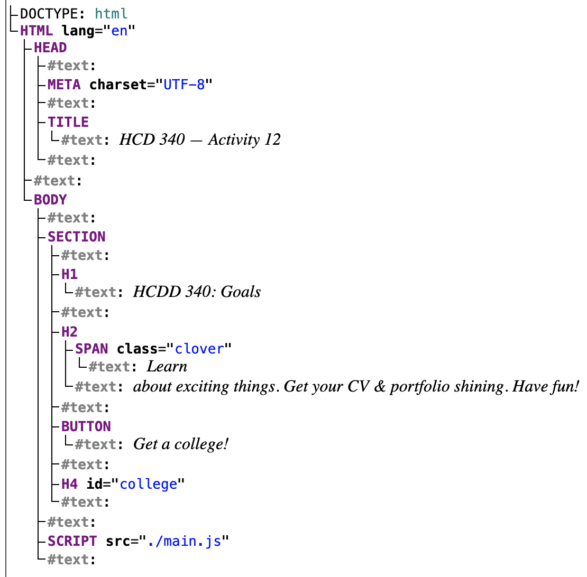

## JS III

---

## Today

* Event handling
* Asynchronous JS
* Fetching resources

---

## Recap from last class
* Function
* Objects
* Document Object Model (DOM)
* Events

---

### Functions

```js
function myFunction() {
  alert("hello");
}

myFunction();
// calls the function once
```

:::{.t-ref}
[Source](https://developer.mozilla.org/en-US/docs/Learn_web_development/Core/Scripting/Functions)
:::

---

### Parameters

```js
function addition(a, b) {
    return a + b;
}

console.log(addition(1, 2));
```

---


#### Default parameters
```js
function addition(a, b=10) {
    return a + b;
}

console.log(addition(9));
console.log(addition(9, 3));
```

---

### Arrow function

```js
const myAddition = (a, b = 10) => {
    return a + b;
}

console.log(myAddition(9));

```

---

### Arrow function

```js
const oneLiner = (a, b) => a + b;
console.log(oneLiner(12, 5));
```

---


### Arrow function

```js
const noParam = () => {
    console.log("hello");
}
```

---


### Higher-order functions
#### Functions are regular 'values'

* Assign functions to variables
* Pass a function as an argument to another function
* Return a function from another function

---

### Higher-order functions

* Functions that
    * take other functions as arguments
    * or, return other functions

---

### Higher-order functions

```js
function repeat(n, action) {
  for (let i = 0; i < n; i++) {
    action(i);
  }
}

// Note console.log is a function
repeat(3, console.log);
```

:::{.t-ref}
[Source](https://eloquentjavascript.net/05_higher_order.html)
::::


---

### Higher-order functions

```js
function greaterThan(n) {
  return m => m > n;
}
let greaterThan10 = greaterThan(10);
console.log(greaterThan10(11));
```

:::{.t-ref}
[Source](https://eloquentjavascript.net/05_higher_order.html)
::::

---

### Anonymous function

```js
function repeat(n, action) {
  for (let i = 0; i < n; i++) {
    action(i);
  }
}


let labels = [];
repeat(5, i => {
    labels.push(i);
});

console.log(labels);
// [ 0, 1, 2, 3, 4 ]
```

---

### DOM
#### Document Object Model

* Documents are represented by DOM
* "Tree" structure
* We can select and update items in DOM


---

### DOM
#### `index.html` from the last class activity

{style="max-inline-size: 400px;"}

[Live DOM Viewer](https://software.hixie.ch/utilities/js/live-dom-viewer/?saved=14086)

---

### DOM
#### Each entry in the tree is a `node`
* Root node
    * Top node (`HTML`)
* Parent node
* Child node
* Descendant node
* Sibling node

---

### Selecting nodes
#### Using CSS selectors
* `document.querySelector` returns 
    * the first element that matches the selector
    * or, `null` if no match

---

### Selecting nodes
#### Using CSS selectors
```js
// first element matching a class
document.querySelector(".myclass");

// by id
document.querySelector("#log");

```

:::{.t-ref}
[Source](https://developer.mozilla.org/en-US/docs/Learn_web_development/Core/Scripting/DOM_scripting)
:::
---

### Selecting nodes
#### Using CSS selectors
```js
/* first element with
    - with the name "login"
    - located inside a `<div>`
    - with the class `user-panel main`
*/

document.querySelector(
    "div.user-panel.main input[name='login']"
);

```

:::{.t-ref}
[Source](https://developer.mozilla.org/en-US/docs/Learn_web_development/Core/Scripting/DOM_scripting)
:::

---

### Selecting nodes
#### `querySelectorAll()` returns all matching nodes as an array


---

### Updating nodes
#### Text or link

```js
const link = document.querySelector("a");
link.textContent = "HCDD 340";

link.href = "https://hcdd-340.github.io/"
```

:::{.t-ref}
[Source](https://developer.mozilla.org/en-US/docs/Learn_web_development/Core/Scripting/DOM_scripting)
:::

---

### Updating nodes
* [Create new nodes](https://developer.mozilla.org/en-US/docs/Learn_web_development/Core/Scripting/DOM_scripting#creating_and_placing_new_nodes)
* [Remove nodes](https://developer.mozilla.org/en-US/docs/Learn_web_development/Core/Scripting/DOM_scripting#moving_and_removing_elements)

---

### Updating nodes
#### Manipulating styles

```js
para.style.color = "white";
para.style.backgroundColor = "black";
para.style.padding = "10px";
para.style.width = "250px";
para.style.textAlign = "center";
```

---


### What's `this`?

#### `this` points to current object

```js{data-line-numbers="4"}
const person = {
  // …
  introduceSelf() {
    console.log(`Hi! I'm ${this.name[0]}.`);
  },
};
```

:::{.t-ref}
[Source](https://developer.mozilla.org/en-US/docs/Learn_web_development/Core/Scripting/Object_basics)
:::

---

#### `this` points to current object
```js
const person1 = {
  name: "Chris",
  introduceSelf() {
    console.log(`Hi! I'm ${this.name}.`);
  },
};

const person2 = {
  name: "Deepti",
  introduceSelf() {
    console.log(`Hi! I'm ${this.name}.`);
  },
};
```


What will happen for `person1.introduceSelf()`?

:::{.t-ref}
[Source](https://developer.mozilla.org/en-US/docs/Learn_web_development/Core/Scripting/Object_basics)
:::

---

### Setting values
#### dot or bracket notation

```js
person.age = 45;
person["name"]["last"] = "Cratchit";
```

:::{.t-ref}
[Source](https://developer.mozilla.org/en-US/docs/Learn_web_development/Core/Scripting/Object_basics)
:::

---

#
### Objects
#### Collection of data and functions


```js
const objectName = {
  member1Name: member1Value,
  member2Name: member2Value,
  member3Name: member3Value,
};
```

:::{.t-ref}
[Source](https://developer.mozilla.org/en-US/docs/Learn_web_development/Core/Scripting/Object_basics)
:::

---

### Creating Objects


```js
const person = {
  name: ["Bob", "Smith"],
  age: 32,
  bio() {
    console.log(`${this.name[0]} is ${this.age} years old.`);
  },
  introduceSelf() {
    console.log(`Hi! I'm ${this.name[0]}.`);
  },
};
```

:::{.t-ref}
[Source](https://developer.mozilla.org/en-US/docs/Learn_web_development/Core/Scripting/Object_basics)
:::

---

#### Accessing object properties and methods

```js
person.age;
person.bio();

```

Using `dot`

:::{.t-ref}
[Source](https://developer.mozilla.org/en-US/docs/Learn_web_development/Core/Scripting/Object_basics)
:::


---

#### Accessing object properties and methods

```js

person["age"];
person["name"]["first"];
```

Using bracket


:::{.t-ref}
[Source](https://developer.mozilla.org/en-US/docs/Learn_web_development/Core/Scripting/Object_basics)
:::

---

### Handling events
* Events
    * Selection, Clicking, Typing
    * [Many events are possible!](https://developer.mozilla.org/en-US/docs/Web/API/Document_Object_Model/Events#event_index)

---

## Today

* [**Event handling**]{.t-salmon}
* Fetching resources
* Asynchronous JS

---


### Handling events
* To handle an event
    * Attach an **event listener** to an element
        * Using `addEventListener()`
    * When an event is **fired**
        * The event listener will be called

---

### Handling events

```js
const button = document.querySelector("button");

button.addEventListener("click", (event) => {
  console.log("clicked!")
  console.log(event);

});
```

:::{.t-ref}
[Source](https://developer.mozilla.org/en-US/docs/Learn_web_development/Core/Scripting/Events)
:::

---

### Todo
* Open [Activity 11](https://github.com/hcdd-340/Activity-Fall-2025/archive/refs/tags/activity-11.0.zip) in VS Code
* Update `main.js` (see hints on line 23–27)

{style="max-width: 340px"}

---

### Hints

* Add a function called `chooseCollege`
    - using arrow syntax
* When called  the function
    - it should select a random item from `colleges`
    - update the `<h4>` with the selected items


---

### The event object
#### Contains useful information

```js {data-line-numbers="3"}
const button = document.querySelector("button");

button.addEventListener("click", (event) => {
  console.log("clicked!")
  console.log(event);

});
```

:::{.t-ref}
[Source](https://developer.mozilla.org/en-US/docs/Learn_web_development/Core/Scripting/Events)
:::

---

### Todo

* Open [Activity 12](https://github.com/hcdd-340/Activity-Fall-2025/releases/tag/activity-12.0) in Firefox/Chrome
* Run the following code in Dev Tools --> Console
* Click on the button

```js
const button = document.querySelector("button");

button.addEventListener("click", (event) => {
  console.log("clicked!")
  console.log(event);

});
```

What do you see in Console?

:::{.t-ref}
[Source](https://developer.mozilla.org/en-US/docs/Learn_web_development/Core/Scripting/Events)
:::


----

### The event object

```js
button.addEventListener("click", (event) => {
    event.target.style.color = "purple";
    console.log(event);
});

```

`target` points to source of the event

:::{.t-ref}
[Source](https://developer.mozilla.org/en-US/docs/Learn_web_development/Core/Scripting/Events)
:::

---


### Todo
* Download [Activity 13](https://github.com/hcdd-340/Activity-Fall-2025/releases/tag/activity-13.0)
* Add two event handlers for "HCDD 340: Goals"
* [mouseenter](https://developer.mozilla.org/en-US/docs/Web/API/Element/mouseenter_event) event: 
    * print: "Entered"
    * change color to red
* [mouseleave](https://developer.mozilla.org/en-US/docs/Web/API/Element/mouseleave_event)
    * print: "Left"
    * change color to black


---

### Todo

:::{style="max-width: 90%;"}
<video
data-autoplay
src="./images/activity-13.mp4"></video>
:::

---

## Today

* Event handling
* [**Asynchronous JS**]{.t-salmon}
* Fetching resources

---

### Asynchronous JS
#### Resources
* [Introducing asynchronous JavaScript](https://developer.mozilla.org/en-US/docs/Learn_web_development/Extensions/Async_JS/Introducing)
* [Asynchronous Programming](https://eloquentjavascript.net/11_async.html)

---

#### JS is single-threaded
* Programs can only do **one-thing at a time**

* Long-running tasks will block interactions
    - [See example](https://developer.mozilla.org/en-US/play?uuid=a8f4d1af-5564-401e-84cc-98852b0d2897&state=jVTRbtMwFP2ViwEpYSPdJsFDm1RCaCAkhqbBAxJBzE1uGjPH7mxnWzX137m2k66bNqAPjXN9zj3Hx3ZuWes6yaYsl3yBEhptipJd9trxks2%2F9N0CDegGVkZ0aKf5JMDmpcqFWvUO3HqFRHB440oGor4jg%2BId7rxecdn798OD8KPKhNpQo0XvnFaRu0SFhjsk7Y%2FDcJDOJxE3f8AwKDWvCX8WBjswAnpb3CCP0N6ieR1sk7jR15Zqb2hYaemHb4%2BoS6m%2BmbVflVBLEApaNAii67AW5EWugTeOElkZtNZDSvbAZ8lIdzIKRxu1uIoOdO%2BC%2BjyfUI0m2T6rrKX4t05vSwVQC7uSfD2FhdTVxcyXOm6WQk3h0GAHB1TaBPZvT660sg5O3n3%2FdXr26eQYChhCnnn5pleVEz4ve%2BotJiqNKrTXkEh0IIhxNKNHXsAJd21mL40jGJX29gYwgGggUfDSo4sCDrZ1AIOuNwoaLi3OYnHjH%2BFvmFQwh8Nou1TRsOGq1h1pJx2%2FSaGYR%2FFGam2SMIyIJIVX4CH3lzOelbAom4RzNpiK%2FeOGUP8fP4Or61ZIhCSWM4lq6VrIYZc4UisSFrXf1WKwmWzjTWd3eYyRbvHpTiyD0Kq37Q7gqYAi%2Bn5CwRpZqHXVd6hcdtmjWX9FiZWjjEr2fLhdvmukxCP2V854CmOeT%2BPuLmOa8bo%2BviLUZ2GdL9N8JUV1UbJ9SMLePRb8Y1uUhQ9BjCE6yfzhf68VNfbGzz8IJWyL9Uj39%2BzF7Q55Myg8O%2Fdx%2FWsZ4xfivxexbUWXj%2FujlsUWSTrK0cVzLXZId0%2BKZevY5g8%3D&srcPrefix=%2Fen-US%2Fdocs%2FLearn_web_development%2FExtensions%2FAsync_JS%2FIntroducing%2F)

---

### Asynchronous programming

* Don't wait for a long-running task to complete
    - synchronous

* Instead, provide a callback function
    - When the task is completed, it will be called with the result

    - Conceptually, similar to event handling
        + 'callback' function to click event


---

### `Promise`
#### For asynchronous JS programming
* Proxy for values not necessarily known yet
 
* 3 possible states in a `Promise`
    - **pending**: initial state, neither fulfilled nor rejected.
    - **fulfilled**: completed successfully
    - **rejected**: failed
   

:::{.t-ref}
[Source](https://developer.mozilla.org/en-US/docs/Web/JavaScript/Reference/Global_Objects/Promise)
:::

---

### `Promise`

* It has a [`then`]{.t-salmon} method, which allows attaching functions
* These functions will be called after the task has completed
    + when it reaches "fulfilled" or "rejected" states
* You can provide functions for different states
    - `onSuccess`
    - `onError`

:::{.t-ref}
[Promise](https://developer.mozilla.org/en-US/docs/Learn_web_development/Extensions/Async_JS/Promises)
:::

---


### Fetching resources
#### Needs asynchronous programming

* Retrieving data from server can take time
    * We don't want to block everything in the mean time

* `fetch` API streamlines these steps
    - Uses `Promise`
    - [Documentation](https://developer.mozilla.org/en-US/docs/Web/API/Fetch_API)

---

### `fetch`

* Takes an argument
    - Path to resource
* Returns a `Promise`
* Use [`then`]{.t-salmon} function to:
    - Attach a function to process the data
    - Optionally, attach a function to handle errors

---

### `fetch`

```js
function onSuccess(response) {
  console.log("Success!" + response.status);
}

function onError(error) {
  console.log('Oh no! Error: ' + error);
}

fetch('hcdd-340.txt')
    .then(onSuccess, onError)

```

---


### Todo
* Open [Activity 14](https://github.com/hcdd-340/Activity-Fall-2025/archive/refs/tags/activity-14.0.zip) in Firefox/Chrome
* Open Dev Tools --> Console
* Copy and paste code from the last slide

---

### Todo
* Open [Activity 14](https://github.com/hcdd-340/Activity-Fall-2025/archive/refs/tags/activity-14.0.zip) in [**VS Code**]{.t-salmon}
* Open Live Preview and copy the URL to Firefox/Chrome
* Open Dev Tools --> Console
* Copy and paste code from the last slide
* Error or Success?

---

### `fetch`

* Considers a success if there is a response from the server
    - Even if there is an `HTTP` error code (e.g., 402)

* In our first case:
    - `file:///` protocol does not allow network access
    - `onError` is called

---

### `fetch`

* Considers a success if there is a response from the server
    - Even if there is an `HTTP` error code (e.g., 402)


* **In the second case**:
    - Got a response from a server
    - `onSuccess` is called (even when it is HTTP error code)

---

### Promises for asynchronous programming
#### Shorthand using an anonymous function

```js
const url = "colleges.json"
const fetchPromise = fetch(url);

console.log(fetchPromise);

fetchPromise.then((response) => {
    console.log(`Received response: ${response.status}`);
});
```

---

#### "Asynchronicity is contagious"

* A function must be asynchronous, if
    - it calls an asynchronous function
    - uses return values from an asynchronous function

---

#### You can chain Promises to process data

```js
fetchPromise
   // if successful, then get `json` data
  .then((response) => response.json())
  .then((data) => {
    console.log(data[0].name); // `then` for second promise
  });
```

---

### Error handling in Promise
#### Handling HTTP error codes

```js {data-line-numbers="3,4,11-13"}
fetchPromise
  .then((response) => {
    if (!response.ok) {
      throw new Error(`HTTP error: ${response.status}`);
    }
    return response.json();
  })
  .then((data) => {
    console.log(data[0].name);
  })
  .catch((error) => {
    console.error(`Unable to fetch: ${error}`);
  });

```

----


### Todo
* Open [Activity 14](https://github.com/hcdd-340/Activity-Fall-2025/archive/refs/tags/activity-14.0.zip) in VS Code
* Open Live Preview and copy the URL to Firefox/Chrome
* Open Dev Tools --> Network
* Click on 'Get a college!'
    - What happens?

* Check Dev Tools --> Console

---

### Todo

* `main.js` handles error (`.catch ...`)
* Make a change so that it prints an error
    - i.e., cause an error

---

### Todo

* Open [Activity 15](https://github.com/hcdd-340/Activity-Fall-2025/archive/refs/tags/activity-15.0.zip)
* Update `main.js`
* We are trying to access Camera
    - You will have to attach success and error functions in `main.js`

---

### Hints
* [`then`]{.t-salmon} in a `Promise` takes two functions

---

### `async` and `await`
Instead of using `then()` method

```js
async function getData() {
    const url = "colleges.json"
    const response  = await fetch(url);
    console.log(`Received response: ${response.status}`);

}
```

---

### `async` and `await`
```js{data-line-numbers="1"}
async function getData() {
    const url = "colleges.json"
    const response  = await fetch(url);
    console.log(`Received response: ${response.status}`);

}
```

`async` marks that it is an asynchronous function

---


### `async` and `await`
```js{data-line-numbers="3"}
async function getData() {
    const url = "colleges.json"
    const response  = await fetch(url);
    console.log(`Received response: ${response.status}`);

}
```

`await` will cause the function to 'freeze' till the `Promise` is resolved

---


### `async` and `await`

```js
const url = "colleges.json"
const fetchPromise = fetch(url);
fetchPromise
  .then((response) => response.json())
  .then((data) => {
    console.log(data[0].name);
  });
```
[**==**]{.t-salmon}

```js
const getData = async () => {
    const url = "colleges.json"
    const response = await fetch(url);
    const data = await response.json()
    console.log(data[0].name)
}
```

---

### `async` and `await`

```js
const getJson = async (url) => {
    const response = await fetch(url);
    if (!response.ok) {
        throw new Error(`Error! ${response}`)
    }
    const data = await response.json()
    console.log(data[0].name)
    return data;
}
```
```js
// Calling it from another `async` function
try {
    let colleges = await getJson("colleges.json");
} catch(error) {
    console.error(error);
}
```

---

### Todo

* Open [Activity 15](https://github.com/hcdd-340/Activity-Fall-2025/archive/refs/tags/activity-15.0.zip)
* Update `main.js`
* We are trying to access Camera
    - ~~You will have to attach success and error functions in `main.js`~~
    - Use `async` and `await`


