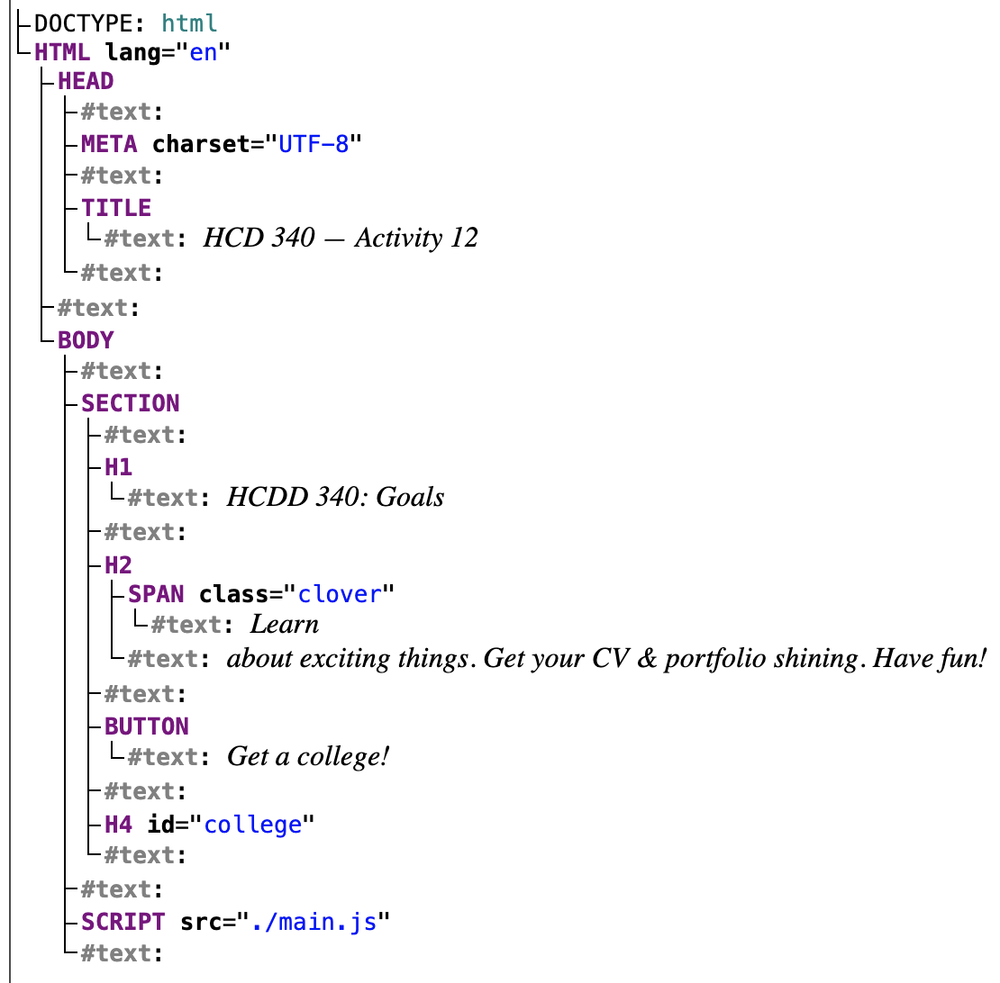
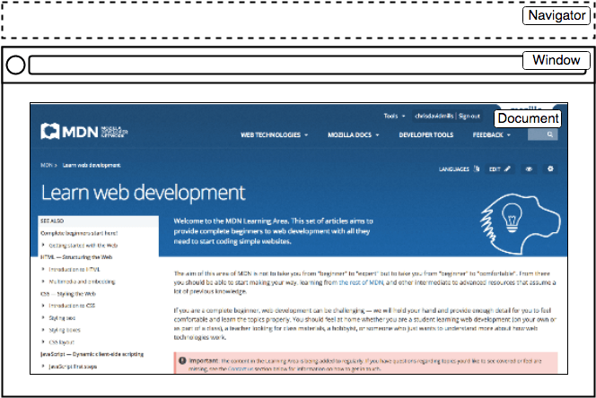

## JS IV

---

## Today

* Asynchronous JS (`async` and `await`)
* Adding and removing DOM nodes
* Keyboard events
* Assignment 3

---


### Recap from last class

* Event handling
* Asynchronous JS
* Fetching resources

---

### Handling events
* To handle an event
    * Attach an **event listener** to an element
        * Using `addEventListener()`
    * When an event is **fired**
        * The event listener will be called

---

### Handling events

```js
const button = document.querySelector("button");

button.addEventListener("click", (event) => {
  console.log("clicked!")
  console.log(event);

});
```

:::{.t-ref}
[Source](https://developer.mozilla.org/en-US/docs/Learn_web_development/Core/Scripting/Events)
:::

---

### The event object
#### Contains useful information

```js {data-line-numbers="3"}
const button = document.querySelector("button");

button.addEventListener("click", (event) => {
  console.log("clicked!")
  console.log(event);

});
```

:::{.t-ref}
[Source](https://developer.mozilla.org/en-US/docs/Learn_web_development/Core/Scripting/Events)
:::

---

### The event object

```js
button.addEventListener("click", (event) => {
    event.target.style.color = "purple";
    console.log(event);
});

```

`target` points to source of the event

:::{.t-ref}
[Source](https://developer.mozilla.org/en-US/docs/Learn_web_development/Core/Scripting/Events)
:::

---


### Asynchronous JS
#### Resources
* [Introducing asynchronous JavaScript](https://developer.mozilla.org/en-US/docs/Learn_web_development/Extensions/Async_JS/Introducing)
* [Asynchronous Programming](https://eloquentjavascript.net/11_async.html)

---

#### JS is single-threaded
* Programs can only do **one-thing at a time**

* Long-running tasks will block interactions
    - [See example](https://developer.mozilla.org/en-US/play?uuid=a8f4d1af-5564-401e-84cc-98852b0d2897&state=jVTRbtMwFP2ViwEpYSPdJsFDm1RCaCAkhqbBAxJBzE1uGjPH7mxnWzX137m2k66bNqAPjXN9zj3Hx3ZuWes6yaYsl3yBEhptipJd9trxks2%2F9N0CDegGVkZ0aKf5JMDmpcqFWvUO3HqFRHB440oGor4jg%2BId7rxecdn798OD8KPKhNpQo0XvnFaRu0SFhjsk7Y%2FDcJDOJxE3f8AwKDWvCX8WBjswAnpb3CCP0N6ieR1sk7jR15Zqb2hYaemHb4%2BoS6m%2BmbVflVBLEApaNAii67AW5EWugTeOElkZtNZDSvbAZ8lIdzIKRxu1uIoOdO%2BC%2BjyfUI0m2T6rrKX4t05vSwVQC7uSfD2FhdTVxcyXOm6WQk3h0GAHB1TaBPZvT660sg5O3n3%2FdXr26eQYChhCnnn5pleVEz4ve%2BotJiqNKrTXkEh0IIhxNKNHXsAJd21mL40jGJX29gYwgGggUfDSo4sCDrZ1AIOuNwoaLi3OYnHjH%2BFvmFQwh8Nou1TRsOGq1h1pJx2%2FSaGYR%2FFGam2SMIyIJIVX4CH3lzOelbAom4RzNpiK%2FeOGUP8fP4Or61ZIhCSWM4lq6VrIYZc4UisSFrXf1WKwmWzjTWd3eYyRbvHpTiyD0Kq37Q7gqYAi%2Bn5CwRpZqHXVd6hcdtmjWX9FiZWjjEr2fLhdvmukxCP2V854CmOeT%2BPuLmOa8bo%2BviLUZ2GdL9N8JUV1UbJ9SMLePRb8Y1uUhQ9BjCE6yfzhf68VNfbGzz8IJWyL9Uj39%2BzF7Q55Myg8O%2Fdx%2FWsZ4xfivxexbUWXj%2FujlsUWSTrK0cVzLXZId0%2BKZevY5g8%3D&srcPrefix=%2Fen-US%2Fdocs%2FLearn_web_development%2FExtensions%2FAsync_JS%2FIntroducing%2F)

---

### Asynchronous programming

* Don't wait for a long-running task to complete unlike synchronous programming

* Instead, provide a callback function
    - When the task is completed, it will be called with the result

    - Conceptually, similar to event handling
        + 'callback' function to click event


---

### `Promise`
#### For asynchronous JS programming
* Proxy for values not necessarily known yet
 
* 3 possible states in a `Promise`
    - **pending**: initial state, neither fulfilled nor rejected.
    - **fulfilled**: completed successfully
    - **rejected**: failed
   

:::{.t-ref}
[Source](https://developer.mozilla.org/en-US/docs/Web/JavaScript/Reference/Global_Objects/Promise)
:::

---

### `Promise`

* It has a [`then`]{.t-salmon} method, which allows attaching functions
* These functions will be called after the task has completed
    + when it reaches "fulfilled" or "rejected" states
* You can provide functions for different states
    - `onSuccess`
    - `onError`

:::{.t-ref}
[Promise](https://developer.mozilla.org/en-US/docs/Learn_web_development/Extensions/Async_JS/Promises)
:::

---


### Fetching resources
#### Needs asynchronous programming

* Retrieving data from server can take time
    * We don't want to block everything in the mean time

* `fetch` API streamlines these steps
    - Uses `Promise`
    - [Documentation](https://developer.mozilla.org/en-US/docs/Web/API/Fetch_API)

---

### `fetch`

* Takes an argument
    - Path to resource
* Returns a `Promise`
* Use [`then`]{.t-salmon} function to:
    - Attach a function to process the data
    - Optionally, attach a function to handle errors

---

### `fetch`

```js
function onSuccess(response) {
  console.log("Success!" + response.status);
}

function onError(error) {
  console.log('Oh no! Error: ' + error);
}

fetch('hcdd-340.txt')
    .then(onSuccess, onError)

```

---

### Promises for asynchronous programming
#### Shorthand using an anonymous function

```js
const url = "colleges.json"
const fetchPromise = fetch(url);

console.log(fetchPromise);

fetchPromise.then((response) => {
    console.log(`Received response: ${response.status}`);
});
```

---

#### "Asynchronicity is contagious"

* A function must be asynchronous, if
    - it calls an asynchronous function
    - uses return values from an asynchronous function

---

#### You can chain Promises to process data

```js
fetchPromise
   // if successful, then get `json` data
  .then((response) => response.json())
  .then((data) => {
    console.log(data[0].name); // `then` for second promise
  });
```

---

### Error handling in Promise
#### Handling HTTP error codes

```js {data-line-numbers="3,4,11-13"}
fetchPromise
  .then((response) => {
    if (!response.ok) {
      throw new Error(`HTTP error: ${response.status}`);
    }
    return response.json();
  })
  .then((data) => {
    console.log(data[0].name);
  })
  .catch((error) => {
    console.error(`Unable to fetch: ${error}`);
  });

```

----

## Today

* Asynchronous JS (`async` and `await`)
* Adding and removing DOM nodes
* Keyboard events
* Assignment 3

---

### Todo

* Open [Activity 15](https://github.com/hcdd-340/Activity-Fall-2025/archive/refs/tags/activity-15.0.zip)
* Update `main.js`
* We are trying to access Camera
    - You will have to attach success and error functions in `main.js`

---

### Hints
* [`then`]{.t-salmon} in a `Promise` takes two functions

---

## Today

* [**Asynchronous JS (`async` and `await`)**]{.t-salmon}
* Adding and removing DOM nodes
* Keyboard events
* Assignment 3

---


### `async` and `await`
Instead of using `then()` method

```js
async function getData() {
    const url = "colleges.json"
    const response  = await fetch(url);
    console.log(`Received response: ${response.status}`);

}
```


---

### `async` and `await`
```js{data-line-numbers="1"}
async function getData() {
    const url = "colleges.json"
    const response  = await fetch(url);
    console.log(`Received response: ${response.status}`);

}
```

`async` marks that it is an asynchronous function

---


### `async` and `await`
```js{data-line-numbers="3"}
async function getData() {
    const url = "colleges.json"
    const response  = await fetch(url);
    console.log(`Received response: ${response.status}`);

}
```

`await` will cause the function to 'freeze' till the `Promise` is resolved

---


### `async` and `await`

```js
const url = "colleges.json"
const fetchPromise = fetch(url);
fetchPromise
  .then((response) => response.json())
  .then((data) => {
    console.log(data[0].name);
  });
```
[**==**]{.t-salmon}

```js
const getData = async () => {
    const url = "colleges.json"
    const response = await fetch(url);
    const data = await response.json()
    console.log(data[0].name)
}
```

---

### `async` and `await`

```js
const getJson = async (url) => {
    const response = await fetch(url);
    if (!response.ok) {
        throw new Error(`Error! ${response}`)
    }
    const data = await response.json()
    console.log(data[0].name)
    return data;
}
```
```js
// Calling it from another `async` function
try {
    let colleges = await getJson("colleges.json");
} catch(error) {
    console.error(error);
}
```

---

### Todo

* Open [Activity 15](https://github.com/hcdd-340/Activity-Fall-2025/archive/refs/tags/activity-15.0.zip)
* Update `main.js`
* We are trying to access Camera
    - ~~You will have to attach success and error functions in `main.js`~~
    - Use `async` and `await`

---

## Today

* Asynchronous JS (`async` and `await`)
* [**Adding and removing DOM nodes**]{.t-salmon}
* Keyboard events
* Assignment 3

---

### DOM
#### `index.html` from the last class activity

{style="max-inline-size: 400px;"}

[Live DOM Viewer](https://software.hixie.ch/utilities/js/live-dom-viewer/?saved=14086)

---

### DOM
#### Each entry in the tree is a `node`
* Root node
    * Top node (`HTML`)
* Parent node
* Child node
* Descendant node
* Sibling node

---

### We can add and remove nodes using JS

---

### Adding a new node
#### 3 steps

* Create a node
* Set values and attributes
* Attach it to the DOM tree

---

### Creating a node
#### `createElement()`

```js
const newDiv = document.createElement("div");
const p = document.createElement("p");
```

String argument specifying the types of element

---

### Creating a text node
#### `createTextNode()`

```js
const newText = document.createTextNode("HCDD 340");
```

String argument for the text

---

### Adding a new node
#### 3 steps

* Create a node
* **Set values and attributes**
* Attach it to the DOM tree

---

### Setting attributes
#### `setAttribute()`


```js

const p = document.createElement("p");
// set id
p.setAttribute("id", "new-id");

// setting css class
p.setAttribute("class", "large-text");

```

Two arguments: `name` and `value`

---

### Setting `class` attribute
#### Multiple options ([examples](https://developer.mozilla.org/en-US/docs/Web/API/Element/classList#examples))

```
const div = document.createElement("div");

div.className = "foo";
// <div class="foo"></div>

// add 3 classes
div.classList.add("foo", "bar", "baz");

// removes two classes
div.classList.remove("foo", "bar");

// if visible is set remove it, otherwise add it
div.classList.toggle("visible");
```

---


### Adding a new node
#### 3 steps

* Create a node
* Set values and attributes
* **Attach it to the DOM tree**

---

#### `appendChild()`


```js
const sect = document.querySelector("section");
const para = document.createElement("p");

// add at the end of the section
sect.appendChild(para);
```

Appends a node to the parent

:::{.t-ref}
[Source](https://developer.mozilla.org/en-US/docs/Web/API/Node/appendChild)
:::

---


#### `insertBefore()`


```html
<div id="parent">
  <span id="child">foo</span>
</div>
```


```js
// Create a new, plain <span> element
const sp1 = document.createElement("span");

// Get the reference element
const sp2 = document.getElementById("child");
// Get the parent element
const parentDiv = sp2.parentNode;

// Insert the new element into before sp2
parentDiv.insertBefore(sp1, sp2);
```

The new node will be placed before a _reference_ node

---

#### `after()`

```js
let container = document.createElement("div");
let p = document.createElement("p");
container.appendChild(p);
let span = document.createElement("span");

p.after(span);

// "<div><p></p><span></span></div>"

```

Insert the node after a given node

:::{.t-ref}
[Source](https://developer.mozilla.org/en-US/docs/Web/API/Element/after)
:::

---

#### `after()` for `text` node

```js
let container = document.createElement("div");
let p = document.createElement("p");
container.appendChild(p);

p.after("Text");
// "<div><p></p>Text</div>"
```

"Strings are inserted as equivalent Text nodes"

:::{.t-ref}
[Source](https://developer.mozilla.org/en-US/docs/Web/API/Element/after)
:::


---

### Removing elements
#### `removeChild()`

```html
<div id="parent">
  <div id="child"></div>
</div>
```

```js
const parent = document.getElementById("parent");
const child = document.getElementById("child");
const throwawayNode = parent.removeChild(child);
```

Removes the child node from the parent

---

### Removing elements

```js
const node = document.getElementById("child");
node.parentNode.removeChild(node);
```

`parentNode` points to the parent

---

## Todo

::::{.columns style="justify-content: center; align-items: center;"}

:::{.column width="50%"}
* Open [Activity 16](https://github.com/hcdd-340/Activity-Fall-2025/releases/tag/activity-16.0)
* Update `main.js`
:::

:::{.column width="50%"}
<video
data-autoplay
src="./images/hcdd-340-activity-16.mp4"></video>
:::
::::

---

### Hints
#### Focus on adding elements first
* We are adding `li` elements
    + What are the components?

---

### Hints II
#### Enable deletion

* Which element should have the `click` event handler?

---


## Todo
* Open [Activity 17](https://github.com/hcdd-340/Activity-Fall-2025/releases/tag/activity-17.0)
* Update `main.js`
    + Add nodes when a button is clicked
    + see `output.html` for the final outcome

---

### Hints
#### Start with `Overview` section
* Update `addOverviewContent` in `main.js`
* 3 elements
    + Image
    + `H2`
    + Text

* What's the parent root for these elements?

---

### Hints II
#### Header
* Update `addHeaderContent` in `main.js`
* What are the components?

---


### Hints III
#### Objective
* Update `addObjectiveContent` in `main.js`
* Two components
    + `H2`
    + `list`
* What's the parent element?
* How would you add the new parent element?

---


## Today

* Asynchronous JS (`async` and `await`)
* Adding and removing DOM nodes
* [**Keyboard events**]{.t-salmon}
* Assignment 3

---

### Keyboard events

* To get text entered by your user, we usually rely on button clicks (e.g., "Submit")
* Button click indicates user is done with text entering
* Then, we can extract the text

```html
<input type="text" name="module" id="module">
<button id="btn_add">Add a module!</button>
```

```js
const addModule = (event) => {
    const input = document.querySelector('input');
    const moduleName = input.value;

};
```

:::{.t-ref}
[Source](https://eloquentjavascript.net/15_event.html#h-974t15Z9oa)
:::

---

#### However, some use cases require handling keyboard events directly (e.g., games, shortcuts)

---


### Keyboard events

* [keydown](https://developer.mozilla.org/en-US/docs/Web/API/Element/keydown_event)
* [keyup](https://developer.mozilla.org/en-US/docs/Web/API/Element/keyup_event)
* The [`event` object](https://developer.mozilla.org/en-US/docs/Web/API/KeyboardEvent) contains:
    + `key`: value of the key pressed
    + `ctrlKey`: `true`, if `Ctrl` was active
    + `shiftKey`: `true`, if the `Shift` key was active
    + `metaKey`: `true`, if the meta key was active (⌘ in Mac, ⊞ in Windows)
    
---

## Todo

* Open [Activity 18](https://github.com/hcdd-340/Activity-Fall-2025/releases/tag/activity-18.0)
* What happens if you press the "v" key?

---

### Keyboard events

```js
window.addEventListener("keydown", event => {
    if (event.key == "v") {
        document.body.style.background = "violet";
    }
});
window.addEventListener("keyup", event => {
    if (event.key == "v") {
        document.body.style.background = "";
    }
});

```

"Page turns violet when you hold the V key"

:::{.t-ref}
[Source](https://eloquentjavascript.net/15_event.html#h-974t15Z9oa)
:::

---

#### Which element is the event listener?

```js {data-line-numbers="1,6"}
window.addEventListener("keydown", event => {
    if (event.key == "v") {
        document.body.style.background = "violet";
    }
});
window.addEventListener("keyup", event => {
    if (event.key == "v") {
        document.body.style.background = "";
    }
});

```


:::{.t-ref}
[Source](https://eloquentjavascript.net/15_event.html#h-974t15Z9oa)
:::

---

#### `window` contains the `DOM` document

{style="max-width: 440px;"}

`window` makes items globally available (functions, event handlers, objects)

---


## Todo
* Log the key pressed down
* What happens when you press 'Enter', 'Delete', 'Tab'?

---

## Todo
::::{.columns style="justify-content: center;"}

:::{.column width="60%"}
* Open [Activity 18](https://github.com/hcdd-340/Activity-Fall-2025/releases/tag/activity-18.0)
* The balloon should:
    - Inflate 20% when ⬆️  is pressed
    - Deflate 20% when ⬇️  is pressed

::::
:::{.column width="40%"}
<video
data-autoplay
src="./images/hcdd-340-activity-18.mp4"></video>
:::
::::

:::{.t-ref}
[Source](https://eloquentjavascript.net/15_event.html#h-974t15Z9oa)
:::

---

### Hints
* What does the console show when ⬆️  and  ⬇️   is pressed?
* `style.fontSize` will change font for a given element
    - Remember to include the unit (e..g, `px`, `rem`, `em`)

---

## Assignment 3
* Due next Thursday (10/16)
* [Details](https://hcdd-340.github.io/Fall-2025/assignments/assignment-03/hcdd-340-assignment-03-2025-10-03.html)

---


