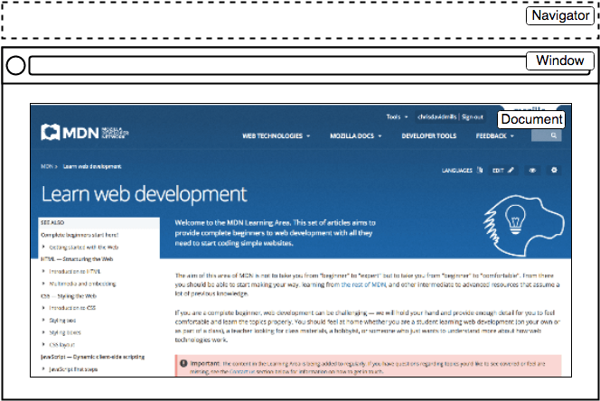

## JS VI

---

## Today

* Keyboard events
* Data storage
* Final Project

---


## Recap from last class

* Adding and removing DOM nodes
* Keyboard events


----

### Keyboard events

* To get text entered by your user, we usually rely on button clicks (e.g., "Submit")
* Button click indicates user is done with text entering
* Then, we can extract the text

```html
<input type="text" name="module" id="module">
<button id="btn_add">Add a module!</button>
```

```js
const addModule = (event) => {
    const input = document.querySelector('input');
    const moduleName = input.value;

};
```

:::{.t-ref}
[Source](https://eloquentjavascript.net/15_event.html#h-974t15Z9oa)
:::

---

#### However, some use cases require handling keyboard events directly (e.g., games, shortcuts)

---


### Keyboard events

* Key is pressed — [keydown](https://developer.mozilla.org/en-US/docs/Web/API/Element/keydown_event) event
* Key is released — [keyup](https://developer.mozilla.org/en-US/docs/Web/API/Element/keyup_event) event

```js

target.addEventListener("keydown", (event) => { 
    /* Key pressed */
});

target.addEventListener("keyup", (event) => { 
    /* Key released */
});

```

---

### Keyboard events
#### The [`event` object](https://developer.mozilla.org/en-US/docs/Web/API/KeyboardEvent) contains key information

* `key`: value of the key pressed
* `ctrlKey`: was `Ctrl` key active?
* `shiftKey`: was `Shift` key active?
* `metaKey`: was the meta key active?
    - ⌘ in Mac, ⊞ in Windows

---

### Keyboard events

```js
window.addEventListener("keydown", event => {
    if (event.key == "v") {
        document.body.style.background = "violet";
    }
});
window.addEventListener("keyup", event => {
    if (event.key == "v") {
        document.body.style.background = "";
    }
});

```

"Page turns violet when you hold the V key"

:::{.t-ref}
[Source](https://eloquentjavascript.net/15_event.html#h-974t15Z9oa)
:::

---

#### Which element is the event listener?

```js {data-line-numbers="1,6"}
window.addEventListener("keydown", event => {
    if (event.key == "v") {
        document.body.style.background = "violet";
    }
});
window.addEventListener("keyup", event => {
    if (event.key == "v") {
        document.body.style.background = "";
    }
});

```


:::{.t-ref}
[Source](https://eloquentjavascript.net/15_event.html#h-974t15Z9oa)
:::

---

#### `window` contains the `DOM` document

{style="max-width: 440px;"}

`window` makes items globally available (functions, event handlers, objects)

---

## Today

* [**Keyboard events**]{.t-salmon}
* Data storage
* Final Project

---


## Todo
::::{.columns style="justify-content: center;"}

:::{.column width="60%"}
* Open [Activity 18](https://github.com/hcdd-340/Activity-Fall-2025/releases/tag/activity-18.0)
* The balloon should:
    - Inflate 20% when ⬆️  is pressed
    - Deflate 20% when ⬇️  is pressed

::::
:::{.column width="40%"}
<video
data-autoplay
src="./images/hcdd-340-activity-18.mp4"></video>
:::
::::

:::{.t-ref}
[Source](https://eloquentjavascript.net/15_event.html#h-974t15Z9oa)
:::

---

### Hints
* What does the console show when ⬆️  and  ⬇️   is pressed?
* `style.fontSize` will change font for a given element
    - Remember to include the unit (e..g, `px`, `rem`, `em`)

---

## Today

* Keyboard events
* [**Data storage**]{.t-salmon}
* Final Project

---

### Data storage
#### Client side storage

* JS enables data storage in users' machines 
    - browser, app

* Cookies
    - Simple data
* Web Storage
    - Simple data
* IndexedDB
    - Complex data

---

### Client side storage
#### We will focus on Web Storage in this class

* ~~Cookies~~
* Web Storage
* ~~IndexedDB~~
    - Complex data


---

### Web Storage

* Storing data for different origins (e.g., hostname)
* You can't access data for other origins
    - Security

* There is a limit
    - Around 5 MiB of local storage _per origin_

:::{.t-ref}
[Source](https://developer.mozilla.org/en-US/docs/Web/API/Storage_API/Storage_quotas_and_eviction_criteria#web_storage)
::::

---

### Web Storage
#### Use cases

* Saving preferences (e.g., color scheme, font size)
* Previous site activity (e.g., shopping cart, login info)
* Saving documents for offline use

---


### Web Storage
* [`sessionStorage`]{.t-salmon}
    + Persists data for as long as the browser is open
    + Data is lost when browser is closed
* [`localStorage`]{.t-salmon}
    + Persists data [**even after**]{.t-clover} the browser is closed

:::{.t-ref}
[Source](https://developer.mozilla.org/en-US/docs/Learn_web_development/Extensions/Client-side_APIs/Client-side_storage#storing_simple_data_%E2%80%94_web_storage)
:::

---

### Saving data in `localStorage`
* `setItem(key, value)`
    + Save a data item
    + Both `key` and `value` must be strings

```js
localStorage.setItem("bgcolor", "red");
localStorage.setItem("font", "Helvetica");
localStorage.setItem("image", "myCat.png");
```

:::{.t-ref}
[Source](https://developer.mozilla.org/en-US/docs/Web/API/Storage/setItem)
:::

---

### Getting data from `localStorage`
* `getItem(key)`
    + Return the string data for a given key
    + `null`, if the key doesn't exist

```js
const currentColor = localStorage.getItem("bgcolor");
const currentFont = localStorage.getItem("font");
const currentImage = localStorage.getItem("image");
```

:::{.t-ref}
[Source](https://developer.mozilla.org/en-US/docs/Web/API/Storage/getItem)
:::

---

#### Removing data from `localStorage`
* `removeItem(key)`
    + Deletes the data item for a given key

```js
localStorage.removeItem("image");
```

:::{.t-ref}
[Source](https://developer.mozilla.org/en-US/docs/Web/API/Storage/removeItem)
:::


---

### Todo
#### Adding data item to local storage

* Open [Activity 19](https://github.com/hcdd-340/Activity-Fall-2025/releases/tag/activity-19.0) in Chrome/Firefox
* Go to Dev Tools --> Console

```js
localStorage.setItem("button_label", "Add a module!");
localStorage.setItem("name", "YOUR NAME");

sessionStorage.setItem("session_key_1", "Session Value 1");
sessionStorage.setItem("session_key_2", "Session Value 2");
```

---

### Todo
* Go to:
    + Firefox: Dev Tools --> Storage
    + Chrome: Dev Tools --> Application --> Storage

* Do you see the stored values?

---

## Todo
* Restart the browser and reopen `index.html`
* Go to:
    + Firefox: Dev Tools --> Storage
    + Chrome: Dev Tools --> Application --> Storage

* Which values persisted?

---

## Todo
* Open [Activity 19](https://github.com/hcdd-340/Activity-Fall-2025/releases/tag/activity-19.0) in **VS Code**
* Copy the url and open it in Firefox/Chrome
* Go to:
    + Firefox: Dev Tools --> Storage
    + Chrome: Dev Tools --> Application --> Storage

* Do you see the stored values?
    + Why?

---

### Web Storage

* Storing data for different origins (e.g., hostname)
* You can't access data for other origins
    - Security

---

#### How can we store non-string data in `localStorage`?

We will use `JSON`


---

## JSON
### Structured data as a string

* Standard text-based format (string)
* Follows JavaScript object syntax

---

## JSON

```json
{
  "orderId": "12345",
  "customer": {
    "firstName": "Jane",
    "lastName": "Doe",
    "address": "123 Main St"
  },
  "items": [
    {
      "product": "Laptop",
      "quantity": 1,
      "price": 1200.50
    }
  ]
}
```

---

### Converting between objects and text
* `JSON.parse`
    + String --> JS Object (or value)

* `JSON.stringify`
    + JS Object (or value) --> String

---

### `JSON.parse`
#### String --> JS Object (or value)

```js
const json = '{"result":true, "count":42}';
const obj = JSON.parse(json);

console.log(obj.count);
// Expected output: 42

console.log(obj.result);
// Expected output: true
```

:::{.t-ref}
[Source](https://developer.mozilla.org/en-US/docs/Web/JavaScript/Reference/Global_Objects/JSON/parse)
:::

---

### `JSON.parse`
#### String --> JS Object (or value)

```js
JSON.parse('[1, 5, "false"]');
```

What's the outcome?

:::{.t-ref}
[Source](https://developer.mozilla.org/en-US/docs/Web/JavaScript/Reference/Global_Objects/JSON/parse)
:::


---

### Todo
* Open Dev Tools --> Console
* Fix the error here:

```js
JSON.parse("[1, 2, 3, 4, ]");
```
:::{.t-ref}
[Source](https://developer.mozilla.org/en-US/docs/Web/JavaScript/Reference/Global_Objects/JSON/parse)
:::


---

### `JSON.stringify`
#### JS Object (or value) --> String

```js
console.log(JSON.stringify({ x: 5, y: 6 }));
// Expected output: '{"x":5,"y":6}'

const a = ["foo", "bar"];
JSON.stringify(a);
// '["foo","bar"]'
```

:::{.t-ref}
[Source](https://developer.mozilla.org/en-US/docs/Web/JavaScript/Reference/Global_Objects/JSON/stringify)
:::

---

#### How can we store non-string data in `localStorage`?

We will use `JSON`

---

### Saving `session` 

```js
const session = {
  screens: [],
  state: true,
};
session.screens.push({ name: "screenA", width: 450, height: 250 });

// Converting the JSON string with JSON.stringify()
// then saving with localStorage in the name of session

localStorage.setItem("session", JSON.stringify(session));
```

---


#### Restoring saved `session` from `localStorage`

```js
const restoredSession = JSON.parse(
    localStorage.getItem("session"));
```

---

### Todo
* Open [Activity 20](https://github.com/hcdd-340/Activity-Fall-2025/releases/tag/activity-20.0)
* Save modules

---

### Hints
* One option is to add all module names to an array and then save it as an `json` object
* You can use [`.children`](https://developer.mozilla.org/en-US/docs/Web/API/Element/children) for a given parent node
* You can see saved values (also edit them)
    + Firefox: Dev Tools --> Storage
    + Chrome: Dev Tools --> Application --> Storage

---

### Todo
* Open [Activity 20](https://github.com/hcdd-340/Activity-Fall-2025/releases/tag/activity-20.0)
* [**Retrieve previously saved modules**]{.t-salmon}

---

### Hints
* You can use `getItem` and then `JSON.parse` to extract the array
* Take a look at the `addAListItem` function in `main.js`

---

## Today

* Keyboard events
* Data storage
* [**Final Project**]{.t-salmon}

---

### Final project — 2 presentations & 3 submissions
+ Proposal submission:  5 points
+ Proposal Presentation: 8 points
+ Final presentation: 10 point
+ Code and documentation: 20 point
+ Mandatory group review: 2 points

---

### Final project — 2 presentations & 3 submissions
+ Proposal submission:  5 points
+ Proposal Presentation: 8 points
+ Final presentation: 10 point
+ [**Code and documentation: 20 point**]{.t-salmon}
+ Mandatory group review: 2 points

---


### Grading rubric for final submission (see syllabus)

+ The app must be installable using Chrome — **1.5 points**
+ The app (and the browser version) should work for different devices — **4.5 points**
+ At least 3 non-trivial pages with user interaction support — **3 points**

---

### Grading rubric for final submission (see syllabus) — contd.

+ Stores and retrieves persistent data — **3 points**
+ Includes icon and consistent theme — **3 points**
+ Ensures accessibility — **3 points**
+ Documentation for the code and the system — **2 points**

---

### Bonus Features (maximum 5 points)
- 5 non-trivial pages or more — **1 point**

- Use of camera — **1.5 points**

- Use of microphone — **1.5 points**

- Use of location — **2 points**

- Integrates user facing generative AI features — **3 points**

---

## Final Project
* Considerable flexibility in terms of topic
	* develop a chatbot interface?
	* redesign an existing app (e.g., Penn State Go app, Apple Music)?
	
---

### Final project topic
* Focus on your portfolio
	* Showcasing it in your job/internship applications?
* Maybe prototype for broader reach?
	* [Nittany AI Challenge](https://nittanyai.psu.edu/alliance-programs/nittany-ai-challenge/)
	* [IdeaMakers Challenge](https://pennstateideamakers.weebly.com/)

---


### Next todos: Check Canvas
+ [Proposal Submission](https://psu.instructure.com/courses/2416260/assignments/17578979)
+ [Proposal Presentation](https://psu.instructure.com/courses/2416260/assignments/17578978)

What questions do you have?

---

#### We will work on final project during our class from next week
* Thursday (10/23): Selecting topics and sketching UI/user-flow
* Tuesday (10/28): Proposal and presentation

---

### We will take attendance on those days

---

### Mandatory group review
* Due at the end of the class
* Report evaluating performance of each group member (including yourself)
* Will also be used to [**adjust project grades**]{.t-salmon}
* **Be fair, courteous, and respectful** to your group member

---


