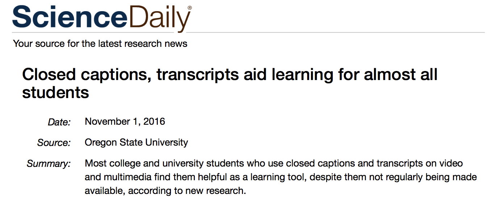
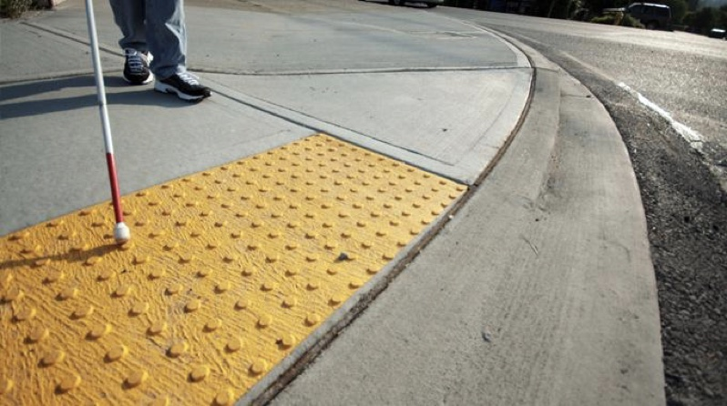
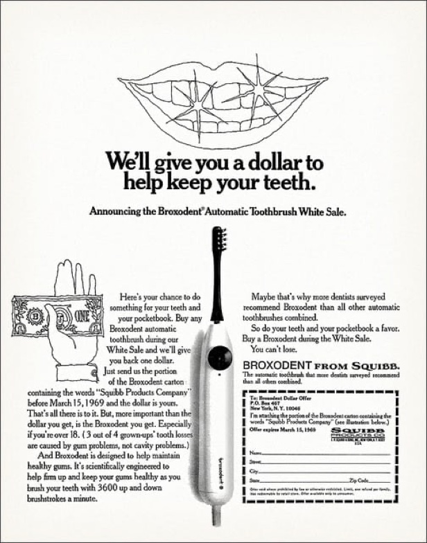
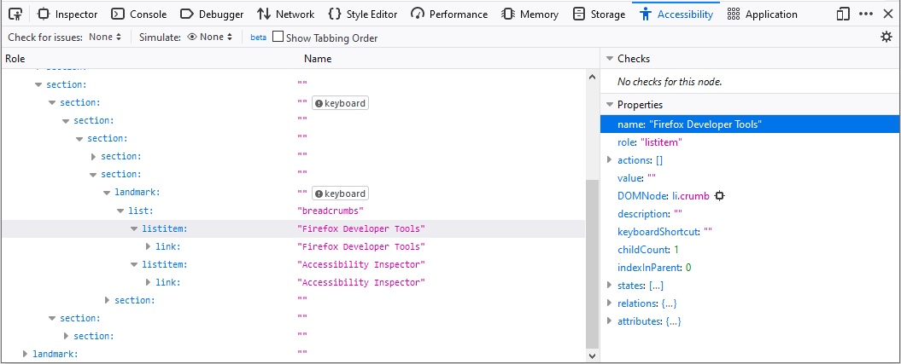
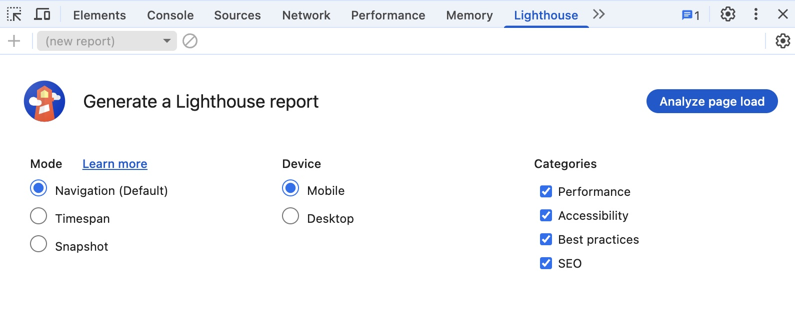

## Accessibility

---

## Today
* JS Modules
* Accessibility

---

## Recap from last class
* JS Modules

---

### JS Modules

* We can split JS functionalities across modules
* You can then `import` modules as necessary
* Allows better code management

---

### A module is a separate JS file

* Other modules then can use features from a given module
    - Variables, functions, ...

---

### JS Modules

* Open [Activity 21](https://github.com/hcdd-340/Activity-Fall-2025/releases/tag/activity-21.0) in VS Code
* Two modules
    - `main.js`
    - `dayname.js`

---

#### Making features available to other modules
#### in `dayname.js`


```js
const names = ["Sunday", "Monday", "Tuesday"]

export function dayName(number) {
  return names[number];
}
export function dayNumber(name) {
  return names.indexOf(name);
}

```

`export` in front of features will make them available to other modules

:::{.t-ref}
[Source](https://eloquentjavascript.net/10_modules.html)
:::

---

#### You can use a single `export` statement

```js{data-line-numbers="4"}
const draw = () => {};
const reportArea = 16.5;

export { draw, reportArea };

```

a single `export` statement at the end of the module with a comma-separated list of the features 

:::{.t-ref}
[Source](https://developer.mozilla.org/en-US/docs/Web/JavaScript/Guide/Modules)
:::

---

#### Importing features from a module
#### in `main.js`

```js
import {dayName} from "./dayname.js";
```

The dot (`.`) in `"./dayname.js"` indicates current folder

---

#### You can also rename imported features


```js
import { name as squareNameOne } from "shapes";
```

:::{.t-ref}
[Source](https://developer.mozilla.org/en-US/docs/Web/JavaScript/Guide/Modules)
:::


---

#### You can import all features as well

```js
import * as Module from "./modules/module.js";

Module.function1();
Module.function2();
```
:::{.t-ref}
[Source](https://developer.mozilla.org/en-US/docs/Web/JavaScript/Guide/Modules)
:::


---

#### Applying the module to your HTML
#### `index.html`

```html
<script type="module" src="main.js"></script>
```

Must include `type="module"`

:::{.t-ref}
[Source](https://developer.mozilla.org/en-US/docs/Web/JavaScript/Guide/Modules)
:::

---

## Today
* [**JS Modules**]{.t-salmon}
* Accessibility

---

### Todo

* Open [Activity 21](https://github.com/hcdd-340/Activity-Fall-2025/releases/tag/activity-21.0) in VS Code
* Two modules
* Try to access the [**names**]{.t-salmon} variable from `dayname.js` in `main.js`
    - e.g., print using `console.log`
* What happens?

---

### Todo
* Rewrite `dayname.js` to use a single `export` statement
* `names` should also be exported

---

### Todo
* Rewrite `main.js` to use `import * as ...` syntax

---


## Todo

* Open [Activity 22](https://github.com/hcdd-340/Activity-Fall-2025/releases/tag/activity-22.0) in VS Code
* Check Dev Tools --> Console
* Can you fix the errors?

---

### Hints
* Export features
* `canvas.js`
    - `create`, `createReportList`
* `square.js`
    - `draw`, `reportArea`, `reportPerimeter`, `randomSquare`

---

### Hints
* Import those features in `main.js` from `canvas.js` and `square.js`

---

## Today
* JS Modules
* [**Accessibility**]{.t-salmon}

---


## Accessibility
Commonly abbreviated as [a11y](https://www.a11yproject.com/posts/a11y-and-other-numeronyms/)

---

## Accessibility

- Nearly [**20% of individuals**]{.t-salmon} in the US have some form of disability
    - 1 billion people around the world


---

#### Users might have specific requirements and constraints

- Visual impairment
- Hearing impairment
- Physical impairment
- Speech impairment
- Seizures
- Cognitive and learning disabilities


---

### Visual impairment

[Screen Reader Demo for Digital Accessibility](https://www.youtube.com/watch?v=dEbl5jvLKGQ)


---

## Accessibility

As a designer and developer, it is [**our responsibility**]{.t-salmon} to provide ways for these users to engage with our system

---

#### Better accessibility results in improved usability for everyone

---

#### Better accessibility === Improved usability for all
#### Closed captioning and transcripts

::::{.columns}
::::{.column width="60%"}
- Initially designed for deaf users
- [Almost every college student]{.t-salmon} has used captioning and transcripts
::::
::::{.column width="40%"}

::::

:::
:::{.t-ref}
[Source](https://www.sciencedaily.com/releases/2016/11/161101102535.htm)
:::

---

#### Better accessibility === Improved usability for all
#### Curb cuts

::::{.columns}
::::{.column width="60%"}
* Initially for wheelchair users
* Improves experience for all (pedestrians, cyclists, …)
::::

::::{.column width="40%"}

::::

:::

---

#### Better accessibility === Improved usability for all
#### Electric toothbrush

::::{.columns}
::::{.column width="70%"}
* Initially designed for
    - Patients with limited motor skills
    - Orthodontic patients (e.g., with braces)
::::

::::{.column width="30%"}

::::
:::

:::{.t-ref}
[Source](https://pmc.ncbi.nlm.nih.gov/articles/PMC7148448/)
:::

---

#### We all can benefit from better accessibility

* Temporarily disabled
    * Broken wrist

* Situationally disabled
    * Unable to play audio in public for a video message

:::{.t-ref}
[Source](https://web.dev/learn/accessibility/why#additional_beneficiaries_of_accessibility)
:::

---

#### Accessibility is about enabling [all]{.t-salmon} of your users

* Failing to make your product accessible means potentially excluding a significant number of users
    - Business implications

---

#### Accessibility might be legally required for some products

* Requirement for public sector entities
    * Government funded programs, nonprofits, ...

* Might be required for some private sector companies

---


#### Accessibility might be legally required for some products

"In the US, Over ten lawsuits are filed daily focused on digital accessibility"

:::{.t-ref}
[Source](https://web.dev/learn/accessibility/why#legal_impact)
:::

---

### Accessibility
* Principles
* Guidelines 
* Tools

---

### Accessibility principles
#### Perceivable, Operable, Understandable, and Robust ([POUR](https://www.w3.org/WAI/fundamentals/accessibility-principles/))


[{style="max-width: 400px;"}](https://web.dev/learn/accessibility/measure#accessibility_principles)

:::{.t-ref}
[Source](https://web.dev/learn/accessibility/measure#accessibility_principles)
:::

---

### Perceivable

* All essential information must be perceivable to **all** users
    * For different types of disabilities (e.g., visual, mobility, ...)

---

#### Making information perceivable to all users

* Examples
    * Text alternatives to essential icons and images
    * Captions
    * Not relying on only color to convey meaning

:::{.t-ref}
[Source](https://web.dev/learn/accessibility/measure#perceivable)
:::

---

### Operable

* Users must be able to operate the interface
    * Can't require interaction that a user is unable to perform

---


#### Operable by all users

* Examples
    * Keyboard and touchscreen support to all active elements
    * Giving users enough time to fill out a form

:::{.t-ref}
[Source](https://web.dev/learn/accessibility/measure#operable)
:::

---

### Understandable

* Information and the interface operation must be understandable
* Examples
    * Has predictable navigation
    * Error messages are clear and easy to resolve

:::{.t-ref}
[Source](https://web.dev/learn/accessibility/measure#understandable)
:::

---

### Robust

* Accessible to  users using both older and future technologies
* Examples
    * Works for different screen reader technologies
    * Content and functions work for different device sizes

:::{.t-ref}
[Source](https://web.dev/learn/accessibility/measure#robust)
:::

---

### Accessibility
* Principles
* [**Guidelines**]{.t-salmon}
* Tools


---

#### Semantic html leads to better accessibility


:::{.columns style="align-items: center;"}

:::{.column width="50%"}
```html
<div>Play video</div>
```

**👎🏾 Don't**
:::

:::{.column width="50%"}
```
<button>Play video</button>
```
**👍🏾 Do**
:::
::::


Use the correct HTML elements

:::{.t-ref}
[Source](https://developer.mozilla.org/en-US/docs/Learn_web_development/Core/Accessibility/HTML)
:::

---

#### Structure page sections logically

* `<header>`
* `<nav>`
* `<main>`
* `<article>`
* `<aside>`
* `<footer>`
* ...

:::{.t-ref}
[Source](https://developer.mozilla.org/en-US/docs/Learn_web_development/Core/Accessibility/HTML#structure_page_sections_logically)
:::

---

#### Structure page sections logically

```html
<header>
  <h1>Header</h1>
</header>

<nav>
  <!-- main navigation in here -->
</nav>

<!-- Here is our page's main content -->
<main>
  <!-- It contains an article -->
  <article>
    <h2>Article heading</h2>
  </article>

  <aside>
    <!-- aside content in here -->
  </aside>
</main>


<footer>
  <!-- footer content in here -->
</footer>

```

:::{.t-ref}
[Source](https://developer.mozilla.org/en-US/docs/Learn_web_development/Core/Accessibility/HTML#structure_page_sections_logically)
:::

---

#### Use semantic UI controls whenever possible

* Use buttons, links, and form controls
    * Provides default keyboard accessibility

---

#### Use semantic UI controls whenever possible
```html
<!-- Using <div> for buttons -->
<div data-message="First button">Click me!</div>
<div data-message="Second button">Click me too!</div>
```
**👎🏾 Don't. Use buttons instead**

:::{.t-ref}
[Source](https://developer.mozilla.org/en-US/docs/Learn_web_development/Core/Accessibility/HTML#use_semantic_ui_controls_where_possible)
:::

---

### Use meaningful text labels

* Button and link text labels should be understandable and distinctive
* Try to avoid using "Click here"
    * Context might be lost for screen reader users


:::{.t-ref}
[Source](https://developer.mozilla.org/en-US/docs/Learn_web_development/Core/Accessibility/HTML)
:::

---

#### Make sure your labels make sense out of context
##### Try to avoid using "Click here"

```html{data-line-numbers="3"}
Whales are really awesome creatures.
To find out more about whales,
<a href="whales.html">click here</a>.

```

**👎🏾 Don't**

<br>
<br>

```html{data-line-numbers="2"}
Whales are really awesome creatures. 
<a href="whales.html">Find out more about whales</a>.
```

**👍🏾 Do**

:::{.t-ref}
[Source](https://developer.mozilla.org/en-US/docs/Learn_web_development/Core/Accessibility/HTML)
:::

---

#### Use [Form label](https://developer.mozilla.org/en-US/docs/Web/HTML/Reference/Elements/label) to provide context


```html
Fill in your name: <input type="text" id="name" name="name" />
```
**👎🏾 Don't**

<br>
<br>

```html
<label for="name">Fill in your name:</label>
<input type="text" id="name" name="name" />
```

**👍🏾 Do**

:::{.t-ref}
[Source](https://developer.mozilla.org/en-US/docs/Learn_web_development/Core/Accessibility/HTML)
:::

---

### Text alternatives

* Images can't be seen by people with visual impairment
* We should provide `alt` description for the screen reader

:::{.t-ref}
[Source](https://developer.mozilla.org/en-US/docs/Learn_web_development/Core/Accessibility/HTML#text_alternatives)
:::

---

#### Provide `alt` description for non-decorative images

```html

```

**👎🏾 Don't**

<br>
<br>


```html

```

**👍🏾 Do**

---


#### Provide `alt` description for non-decorative images

* Describe the image and what it conveys visually
* Should be brief and concise
* Do not duplicate the surrounding text


:::{.t-ref}
[Source](https://developer.mozilla.org/en-US/docs/Learn_web_development/Core/Accessibility/HTML#text_alternatives)
:::

---

#### Empty `alt` is ok for decorative images

```html

```

When the image is only for visual decoration

---

### Color
#### Don't rely on only color to convey information

```html
Click the green button for next item
```

**👎🏾 Don't**

---


### Color contrast

* The foreground and background color contrast is important
* Make sure that people with color blindness can read the content

---

### Accessibility
* Principles
* Guidelines 
* [**Tools**]{.t-salmon}

---

#### Firefox (Dev Tools --> Accessibility)



:::{.t-ref}
[Firefox Accessibility Inspector](https://firefox-source-docs.mozilla.org/devtools-user/accessibility_inspector/index.html)
:::

---

#### Chrome (Dev Tools --> Lighthouse)



---

#### Todo

* Open [Activity 23](https://github.com/hcdd-340/Activity-Fall-2025/releases/tag/activity-23.0) in Chrome
* Run an accessibility audit
    - Dev Tools --> Lighthouse
* Fix the issues

---


## Accessibility and gaming

[Making Games Better for the Deaf and Hard of Hearing](https://www.youtube.com/watch?v=4NGe4dzlukc)

---

#### Have you started thinking about the final project topic?

---


