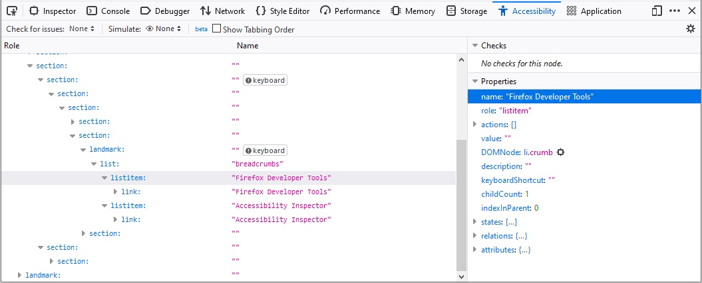
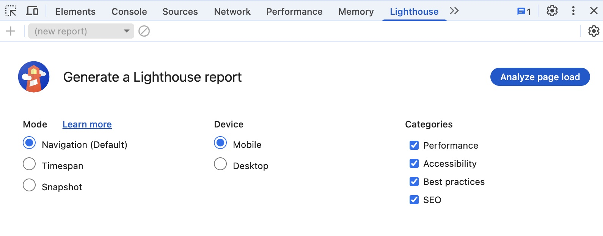

## Final project I

---

## Today
* Accessibility
* Final project

---

## Recap from last class

* Accessibility
    - Principles
    - Guidelines
    - Tools

---


## Accessibility
Commonly abbreviated as [a11y](https://www.a11yproject.com/posts/a11y-and-other-numeronyms/)

---

### Accessibility principles
#### Perceivable, Operable, Understandable, and Robust ([POUR](https://www.w3.org/WAI/fundamentals/accessibility-principles/))


[{style="max-width: 400px;"}](https://web.dev/learn/accessibility/measure#accessibility_principles)

:::{.t-ref}
[Source](https://web.dev/learn/accessibility/measure#accessibility_principles)
:::

---

### Perceivable

* All essential information must be perceivable to **all** users
    * For different types of disabilities (e.g., visual, mobility, ...)

---

#### Making information perceivable to all users

* Examples
    * Text alternatives to essential icons and images
    * Captions
    * Not relying on only color to convey meaning

:::{.t-ref}
[Source](https://web.dev/learn/accessibility/measure#perceivable)
:::

---

### Operable

* Users must be able to operate the interface
    * Can't require interaction that a user is unable to perform

---


#### Operable by all users

* Examples
    * Keyboard and touchscreen support to all active elements
    * Giving users enough time to fill out a form

:::{.t-ref}
[Source](https://web.dev/learn/accessibility/measure#operable)
:::

---

### Understandable

* Information and the interface operation must be understandable
* Examples
    * Has predictable navigation
    * Error messages are clear and easy to resolve

:::{.t-ref}
[Source](https://web.dev/learn/accessibility/measure#understandable)
:::

---

### Robust

* Accessible to  users using both older and future technologies
* Examples
    * Works for different screen reader technologies
    * Content and functions work for different device sizes

:::{.t-ref}
[Source](https://web.dev/learn/accessibility/measure#robust)
:::

---

### Accessibility
* Principles
* [**Guidelines**]{.t-salmon}
* Tools


---

#### Semantic html leads to better accessibility


:::{.columns style="align-items: center;"}

:::{.column width="50%"}
```html
<div>Play video</div>
```

**👎🏾 Don't**
:::

:::{.column width="50%"}
```
<button>Play video</button>
```
**👍🏾 Do**
:::
::::


Use the correct HTML elements

:::{.t-ref}
[Source](https://developer.mozilla.org/en-US/docs/Learn_web_development/Core/Accessibility/HTML)
:::

---

#### Structure page sections logically

* `<header>`
* `<nav>`
* `<main>`
* `<article>`
* `<aside>`
* `<footer>`
* ...

:::{.t-ref}
[Source](https://developer.mozilla.org/en-US/docs/Learn_web_development/Core/Accessibility/HTML#structure_page_sections_logically)
:::

---

#### Structure page sections logically

```html
<header>
  <h1>Header</h1>
</header>

<nav>
  <!-- main navigation in here -->
</nav>

<!-- Here is our page's main content -->
<main>
  <!-- It contains an article -->
  <article>
    <h2>Article heading</h2>
  </article>

  <aside>
    <!-- aside content in here -->
  </aside>
</main>


<footer>
  <!-- footer content in here -->
</footer>

```

:::{.t-ref}
[Source](https://developer.mozilla.org/en-US/docs/Learn_web_development/Core/Accessibility/HTML#structure_page_sections_logically)
:::

---

#### Use semantic UI controls whenever possible

* Use buttons, links, and form controls
    * Provides default keyboard accessibility

---

#### Use semantic UI controls whenever possible
```html
<!-- Using <div> for buttons -->
<div data-message="First button">Click me!</div>
<div data-message="Second button">Click me too!</div>
```
**👎🏾 Don't. Use buttons instead**

:::{.t-ref}
[Source](https://developer.mozilla.org/en-US/docs/Learn_web_development/Core/Accessibility/HTML#use_semantic_ui_controls_where_possible)
:::

---

### Use meaningful text labels

* Button and link text labels should be understandable and distinctive
* Try to avoid using "Click here"
    * Context might be lost for screen reader users


:::{.t-ref}
[Source](https://developer.mozilla.org/en-US/docs/Learn_web_development/Core/Accessibility/HTML)
:::

---

#### Make sure your labels make sense out of context
##### Try to avoid using "Click here"

```html{data-line-numbers="3"}
Whales are really awesome creatures.
To find out more about whales,
<a href="whales.html">click here</a>.

```

**👎🏾 Don't**

<br>
<br>

```html{data-line-numbers="2"}
Whales are really awesome creatures. 
<a href="whales.html">Find out more about whales</a>.
```

**👍🏾 Do**

:::{.t-ref}
[Source](https://developer.mozilla.org/en-US/docs/Learn_web_development/Core/Accessibility/HTML)
:::

---

#### Use [Form label](https://developer.mozilla.org/en-US/docs/Web/HTML/Reference/Elements/label) to provide context


```html
Fill in your name: <input type="text" id="name" name="name" />
```
**👎🏾 Don't**

<br>
<br>

```html
<label for="name">Fill in your name:</label>
<input type="text" id="name" name="name" />
```

**👍🏾 Do**

:::{.t-ref}
[Source](https://developer.mozilla.org/en-US/docs/Learn_web_development/Core/Accessibility/HTML)
:::

---

### Text alternatives

* Images can't be seen by people with visual impairment
* We should provide `alt` description for the screen reader

:::{.t-ref}
[Source](https://developer.mozilla.org/en-US/docs/Learn_web_development/Core/Accessibility/HTML#text_alternatives)
:::

---

#### Provide `alt` description for non-decorative images

```html

```

**👎🏾 Don't**

<br>
<br>


```html

```

**👍🏾 Do**

---


#### Provide `alt` description for non-decorative images

* Describe the image and what it conveys visually
* Should be brief and concise
* Do not duplicate the surrounding text


:::{.t-ref}
[Source](https://developer.mozilla.org/en-US/docs/Learn_web_development/Core/Accessibility/HTML#text_alternatives)
:::

---

#### Empty `alt` is ok for decorative images

```html

```

When the image is only for visual decoration

---

### Color
#### Don't rely on only color to convey information

```html
Click the green button for next item
```

**👎🏾 Don't**

---


### Color contrast

* The foreground and background color contrast is important
* Make sure that people with color blindness can read the content

---

### Accessibility
* Principles
* Guidelines 
* [**Tools**]{.t-salmon}

---

#### Firefox (Dev Tools --> Accessibility)



:::{.t-ref}
[Firefox Accessibility Inspector](https://firefox-source-docs.mozilla.org/devtools-user/accessibility_inspector/index.html)
:::

---

#### Chrome (Dev Tools --> Lighthouse)



---

#### Todo

* Open [Activity 23](https://github.com/hcdd-340/Activity-Fall-2025/releases/tag/activity-23.0) in Chrome
* Run an accessibility audit
    - Dev Tools --> Lighthouse
* Fix the issues

---


## Today

* Accessibility
* [**Final project**]{.t-salmon}

---

### Final project

+ Proposal submission:  5 points
+ Proposal presentation: 8 points
+ Final presentation: 10 point
+ Code and documentation: 20 point
+ Mandatory group review: 2 points

---

### Next todos — 10/30
* Proposal submission
* Proposal presentation

---

### Proposal submission
#### Outline of plan and timeline — around 2 pages

Check syllabus for details

---

#### Presentation Rubric (Files --> Final Project)

{style="max-width: 60%;"}


---

### Proposal presentation
* No in-person presentation
* You will upload links for video and slides
* We will talk about presentation next Tuesday

---

## Today
* Selecting project topic
* Sketching out UI and interaction

---

#### Grading rubric for final submission (see syllabus)

+ The app must be installable using Chrome — **1.5 points**
+ The app (and the browser version) should work for different devices — **4.5 points**
+ At least 3 non-trivial pages with user interaction support — **3 points**

---

#### Grading rubric for final submission (see syllabus) — contd.

+ Stores and retrieves persistent data — **3 points**
+ Includes icon and consistent theme — **3 points**
+ Ensures accessibility — **3 points**
+ Documentation for the code and the system — **2 points**

---

### Bonus Features (maximum 5 points)
- 5 non-trivial pages or more — **1 point**

- Use of camera — **1.5 points**

- Use of microphone — **1.5 points**

- Use of location — **2 points**

- Integrates [user facing generative AI features](https://developer.chrome.com/docs/ai/built-in-apis) — **3 points**

---

### Examples from previous classes

::::{.columns}
:::{.column width="50%"}

* Fitness app
* Music sharing
* Cooking/Recipe
* IST Career Solution
* Athlete profile
:::

:::{.column width="50%"}
* Public Transit/CATA
* TV recommendation
* Fashion
* Sustainability
* Budgeting
:::
:::

---

### Group activity
#### Select project topic — Create a doc

* Describe the app
* What problem are you trying to address?
* Who are the potential users?
* What are the features?

---

### Group activity
#### Sketch out at least three screens of the app

---


### Group activity
* Post the doc and screen images to the [discussion forum](https://psu.instructure.com/courses/2416260/discussion_topics/16912697)

---

