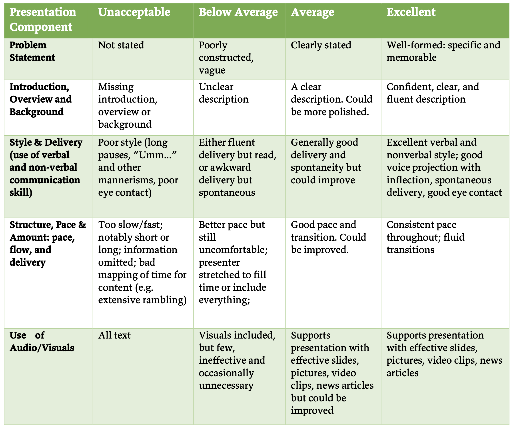
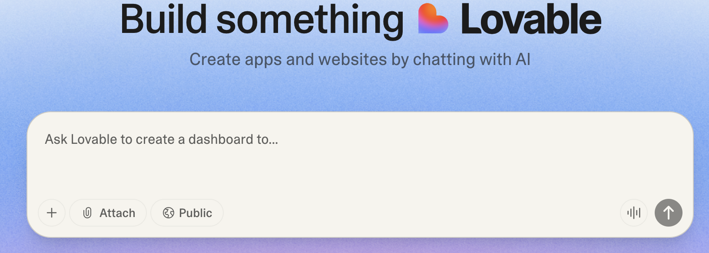

## Final project II

---

## Today
* Final project

---

### Next todos — 10/30
* Proposal submission
* Proposal presentation

---

### No class on Thursday (10/30)

* You will upload links for video and slides
* You can use this class time to record a video
    - You can also record a Zoom session

---

#### Presentation Rubric (Files --> Final Project)

{style="max-width: 60%;"}

---

## Today
* Final project

---

### Todo: Complete the slides

* What are the major presentation components?
    - Follow the presentation rubric
* Create the slides
    - Content
    - Visuals
* Draft the script: what will you say for different slides?
    - Note the time limit (3-minute presentation)

How can [**generative AI**]{.t-clover} help with your slides?

---

#### Todo: Complete the proposal submission

Check syllabus for details

---

### [Lovable](https://lovable.dev/) for your final project?

---

## Todo

* Explore [Lovable](https://lovable.dev/) 
* Can it implement one of the features from your final project?
    + What's the prompt you are using?

---

